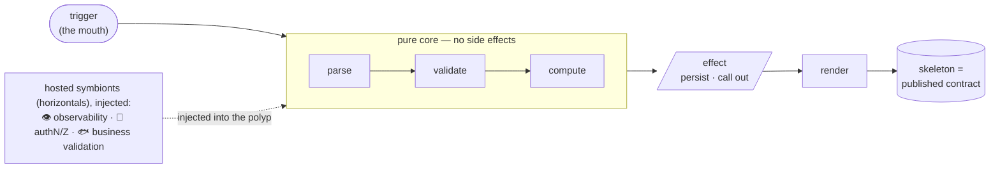

# Coral Architecture — the App (one Colony)

*A fractal, capability-first architecture for systems where **agents write the code and humans review
and orchestrate**.*

> **Read [`CONVENTIONS.md`](./CONVENTIONS.md) first** — it paints the Coral model (how a coral lives,
> and the polyp/symbiont/colony/reef glossary every document uses). This document assumes that
> picture. In short: a **slice is a polyp**, a **horizontal is a hosted symbiont**, and this whole
> document describes **one colony** — a single app.

This is the **single-app spine**: how to build one polyp-shaped app — a CLI, backend, web app,
library, or tool. App-type specifics live in the appendices under [`appendix/`](#appendix-index);
shared meta-conventions and the Coral model live in [`CONVENTIONS.md`](./CONVENTIONS.md); how colonies
compose into a reef (a system) lives in [`SYSTEM.md`](./SYSTEM.md). See the [Document Set](#document-set).

---

## How to read this document

The rule-ID format, enforcement classes (`[auto]`/`[review]`/`[guide]`), and the agents-write/
humans-review operating model are shared by every document in this set and defined once in
**[`CONVENTIONS.md`](./CONVENTIONS.md)** — read it first.

This document is the **single-app spine**: how to build *one* CLI, backend, web app, library, or
tool. Its prose sections explain *why*; the [Agent Execution Contract](#agent-execution-contract) at
the end is the condensed, normative checklist. They must not contradict each other. How separate apps
compose into a *system* lives in [`SYSTEM.md`](./SYSTEM.md).

---

## 1. Purpose, Scope & Breakage Boundary  `[SCOPE-*]`

This architecture optimizes for:

1. predictable placement of new code
2. strong locality between behavior and its tests
3. low abstraction overhead
4. self-verifiable, observable contracts
5. bounded blast radius per change
6. readability at scale for both agents and humans

**`[SCOPE-1]` `[guide]`** — This architecture covers **command/request-shaped apps with
loosely-coupled features**: each feature is largely its own world. CLIs, CRUD-shaped backends, web
apps, libraries, and action/tool runners fit naturally.

**`[SCOPE-2]` `[guide]`** — It is **weak for dense, deeply-coupled domains** where every feature
reaches into one large central concept (e.g. a tax engine, a scheduler, a simulation core). This is
not a defect to patch — no architecture is universal.

**`[SCOPE-3]` `[review]`** — When features stop being independent and all converge on one large
shared concept, **bud a new colony** — split into another bounded app/harness — rather than growing a
shared core. The density then belongs to the *orchestration layer* (a reef-scale topology problem —
which colonies talk to which), and each app stays polyp-shaped and within agent competence. A slice
getting dense is a **split signal**, not a refactor-into-a-shared-core signal. See also
[`[GROW-*]`](#19-file-growth--split-signals-grow-).

**`[SCOPE-4]` `[guide]`** — *What happens after the split lives in a different document.* How the
resulting apps relate — the bus between them, orchestration, and cross-app contract testing — is
**not** part of this single-app spine. It is the **system architecture**, defined in
[`SYSTEM.md`](./SYSTEM.md) (families `[BUS-*]`, `[ORCH-*]`, `[SYS-TEST-*]`). This document publishes
the split *signal* (`[SCOPE-3]`); `SYSTEM.md` consumes it. The dependency points one way: `SYSTEM.md`
builds on these app rules; this document never cites a system rule.

---

## 2. The Operating Model: Agents Write, Humans Review

The operating model and the `[AGENT-*]` rules (`[AGENT-1]`; `[AGENT-2]` flag-don't-guess; `[AGENT-3]`
intent-over-letter) are cross-cutting to every document in this set, so they are defined once in
[`CONVENTIONS.md`](./CONVENTIONS.md#the-operating-model-agents-write-humans-review) and referenced
throughout this spine. In one line: deterministic placement, bounded blast radius, slice-sized
context, and self-verifiable contracts exist because **agents write and humans review**.

---

## 3. Core Model: Verticals and Horizontals (the polyp and its symbionts)  `[MODEL-*]`

There are exactly two kinds of code. Knowing which kind you are writing answers most placement
questions. (See the [Coral model](./CONVENTIONS.md#the-coral-model) for the picture.)

**Verticals (slices) — the polyp's body.** A vertical owns one user-facing capability end to end.
Everything it needs — definition, input parsing, validation, behavior, state access, output
formatting, tests — lives *inside* it, the way a polyp is a complete, self-contained animal.

**Horizontals (cross-cutting concerns) — the hosted symbionts.** A horizontal is a concern many
verticals share — logging, configuration, the error taxonomy, connection management, **and genuine
domain entities/invariants**. Like the algae a polyp hosts but does not build, a horizontal is
**defined once, precisely named, and injected** into the verticals that consume it.

**`[MODEL-1]` `[review]`** — Every unit of code is either a vertical (owns a capability) or a
horizontal (a named cross-cutting concern injected into verticals). There is no third category. If
something is neither, it is a [forbidden bucket](#7-forbidden-buckets-bucket-).

**`[MODEL-2]` `[review]`** — Organize by capability, never by technical layer. Do not split a
capability's parsing, validation, behavior, state access, and output into global `services`,
`repositories`, `models`, or `utils` modules.

**`[MODEL-3]` `[guide]`** — A horizontal is a *hosted symbiont*, not a vertical. The decisive
property is **defined once, injected many** — the *same* species of algae lives in thousands of
polyps; the polyp hosts it rather than building its own. So a horizontal is not "a helper each slice
copies" (that is the forbidden-bucket failure, like every burger carrying its own lettuce) — it is
one organism, injected. This is what distinguishes a horizontal from a forbidden bucket: a precise
name, a real invariant or convention, and an injection discipline. A horizontal you reach into or
re-implement per slice is a broken symbiosis — the slice bleaches.

**Anatomy of one polyp.** The body runs a pure core (parse → validate → compute), pushes effects to
the edge (persist / render), secretes a stable skeleton (its published contract), and *hosts* its
cross-cutting concerns as injected symbionts:



---

## 4. The Slice Boundary  `[BOUND-*]`

**`[BOUND-1]` `[guide]`** — A slice (polyp) handles **one inbound request/trigger, end to end**. This
is the universal boundary; each app type (each species of polyp) names its concrete form:

| App type            | The request/trigger (slice boundary) | Observable contract to assert against        |
| ------------------- | ------------------------------------ | -------------------------------------------- |
| CLI                 | a command invocation                 | exit code + `stdout`/`stderr` + `--json`     |
| Backend / web       | an HTTP route / use-case             | status code + response body + side effects   |
| Queue/event worker  | a message handler                    | ack/nack + emitted events                    |
| GitHub Action / tool| one action run                       | outputs + exit status + annotations          |
| Library / package   | a public API function                | return value + raised errors + types         |

**`[BOUND-2]` `[review]`** — Each request/trigger, or a very tight pair of related ones, forms a
slice. A slice owns its behavior end to end.

**`[BOUND-3]` `[review]`** — The concrete boundary form is fixed by the relevant appendix. Do not
invent a new boundary kind for an app type that already has one.

**`[BOUND-4]` `[guide]`** — "Continuous" or "real-time" work is **not** a new boundary kind. Model it
as an on-demand read trigger (recompute when asked), an event/message handler (recompute per event,
idempotently — `[IDEM-5]`), or a **scheduled/timer tick** (cron-shaped — itself a trigger, handled
like an event handler). A genuinely long-running reconciler that owns evolving cross-domain rules is a
`[SCOPE-3]` split into its own app, not a slice — and that app's slices are still triggered by reads,
events, or ticks, never by an ambient loop.

---

## 5. Composition Root / Edge Wiring  `[ROOT-*]`

**`[ROOT-1]` `[review]`** — The root/entry point is **thin**. Its only jobs: register slices,
compose sub-capabilities, construct horizontals and inject them into slices, and configure top-level
bootstrap.

**`[ROOT-2]` `[auto]`** — The root must not contain business logic, state-access calls, or
slice-specific validation. (Statically: the root module imports no persistence/domain internals and
stays under a small size budget.)

**`[ROOT-3]` `[guide]`** — For a library, the *consumer* is the composition root; the package itself
exposes capabilities and lets the consumer wire them. Each appendix names its root form.

---

## 6. Directory Structure & Naming  `[STRUCT-*]`

Language-neutral pattern (names are shown without file extensions or a fixed language **by design** —
the language binding fixes whether a slice is a file or a directory, the extension, and whether tests
colocate or mirror; see `[STRUCT-1]`):

```
<app>/
  main              entry point
  app               bootstrap and composition root
  <horizontals>     precisely named: db, config, errors, logging, <domain>
  category/
    add             definition + behavior
    list
    add_test        tests for add (colocated, or mirrored if the language forbids colocation)
    list_test
  expense/
    add
    add_test
  summary/
    month
    month_test
```

**`[STRUCT-1]` `[auto]`** — Tests live beside the code they verify where the language/framework
allows; otherwise mirror the package/namespace structure exactly so the association is preserved.

**`[STRUCT-2]` `[review]`** — Slices live in feature packages whose names are concrete and
domain-oriented (`expense`, `summary`), never technical layers.

**`[STRUCT-3]` `[auto]`** — Root-level/horizontal modules are rare and precisely named (`db`,
`errors`, `config`), never generic.

---

## 7. Forbidden Buckets  `[BUCKET-*]`

**`[BUCKET-1]` `[auto]`** — Do not create or expand generic catch-all packages or modules:
`shared`, `common`, `utils`, `helpers`, `services`, `repository`, or generic `models`. Do not
introduce `core` as a home for "stuff that feels central" — if a module is genuinely a domain engine,
name it for the domain (`pricing`, `scoring`), never `core`. (A pre-existing `core` whose name
already denotes one specific bounded concept is grandfathered, but never grow it as a catch-all.)

**`[BUCKET-2]` `[guide]`** — These names destroy locality and predictability. A forbidden bucket is
simply a would-be horizontal with **no precise name and no injection discipline** — a pile. The cure
is not "ban all sharing"; it is to make the shared thing a real horizontal ([`[XCUT-*]`](#8-cross-cutting-concerns-horizontals-xcut-))
or to leave it duplicated ([`[DUP-*]`](#9-duplication-policy--extraction-test-dup-)).

---

## 8. Cross-Cutting Concerns (Horizontals)  `[XCUT-*]`

A horizontal is the *legitimate* form of sharing. It is not an exception to "no shared buckets"; it
is a different category with its own discipline.

**`[XCUT-1]` `[review]`** — Promote something to a horizontal **only if** it is *both*:
1. **genuinely cross-cutting** — consumed by two or more verticals (the count is not the test; a
   thing consumed by exactly two verticals still qualifies), and
2. **enforces an invariant or convention that must not diverge** — money parsing, period/date
   format, the error taxonomy, connection management, a domain entity's identity and rules.

The second prong is the real gate: shared *similarity* is not enough (`[DUP-2]`) — the thing must
enforce something that would be a bug if it diverged. The moment a *second* consumer appears for logic
currently inline in one slice is the normal trigger to promote it; extracting then (and touching the
first slice) is expected, not a violation — flag the change per `[AGENT-2]`.

**`[XCUT-2]` `[auto]`** — A horizontal has a **precise, domain- or infrastructure-oriented name**
(`money`, `period`, `errors`, `db`), never a generic bucket name (which would trip `[BUCKET-1]`).

**`[XCUT-3]` `[review]`** — A horizontal is **injected/consumed**, not reached into. Verticals depend
on its published surface, not its internals.

**`[XCUT-4]` `[guide]`** — A horizontal is the *first line* of drift control: if money formatting is
a horizontal, there is structurally one copy and nothing to drift. Static/LLM drift checks are the
backstop for what slips past this, not a substitute for it. Beware making `[XCUT]` the new escape
hatch — `[XCUT-1]` is a gate, not a license.

---

## 9. Duplication Policy + Extraction Test  `[DUP-*]`

**`[DUP-1]` `[guide]`** — Small duplication across slices is acceptable and often preferred. Do not
extract merely to save lines.

**`[DUP-2]` `[review]`** — **Similarity is not a shared concept.** Two slices with similar-looking
code today live in different contexts and may diverge under different pressures. Extracting on
similarity alone couples them permanently to an abstraction one may later need to escape. Duplicate
*incidental* similarity inside each polyp; promote to a shared symbiont only when `[XCUT-1]` is met.

**`[DUP-3]` `[review]`** — Extract (promote to a horizontal per `[XCUT-1]`) only when the extraction
does at least one of:
1. enforces a business invariant
2. enforces a CLI/API/persistence convention that must not diverge
3. provides stable infrastructure with a precise name
4. materially clarifies a real domain calculation

**`[DUP-4]` `[review]` — The Extraction Test.** Before extracting, ask: is this a real domain or
infrastructure concept? Are we protecting an invariant or enforcing a convention that must stay
consistent everywhere? Would duplication be cheaper than a permanent abstraction? If the answer is
mostly *no*, do not extract. **Bad reasons:** "two slices repeat lines," "might be reused later,"
"looks tidier." **Good reasons:** "monetary values must always parse/store under one invariant,"
"dates must follow one validated format," "connection/bootstrap must be consistent."

---

## 10. Slice-to-Slice Composition  `[COMPOSE-*]`

Some capabilities compose others (place order → reserve inventory → charge payment). Without a rule,
agents either copy whole workflows or quietly resurrect a `services` layer.

**`[COMPOSE-1]` `[review]`** — A slice may depend on another slice's **published capability**, never
reach into its internals (its parsing, queries, or private helpers).

**`[COMPOSE-2]` `[review]`** — Prefer inverting composition through the composition root (inject the
needed capability) over slice-to-slice imports, so the dependency is visible at the edge.

**`[COMPOSE-3]` `[review]`** — If two slices need to share a multi-step workflow, that workflow is a
candidate **horizontal** (`[XCUT-1]`) — not a reason to create a generic `services` bucket.

**`[COMPOSE-4]` `[review]`** — Composition includes **read fan-in**, not just sequential workflows: a
slice that aggregates several other slices' *published read* capabilities (a dashboard, a score) is a
legitimate slice, provided it depends on published capabilities (`[COMPOSE-1]`) and adds no shared
core. The same idea extends across a process boundary, where it becomes a system-level concern
(`[SCOPE-4]` → `SYSTEM.md`). If a set-only slice exposes no read capability the aggregator needs, the
owning slice publishes one — the aggregator never reaches into its state. (When the fan-in starts
carrying its own growing cross-domain rules, that is the `[GROW-3]` split signal.)

---

## 11. Pure Core, Effects at the Edge  `[EFFECT-*]`

**`[EFFECT-1]` `[review]`** — Prefer **pure functions** for parsing, validation, normalization,
calculation, and output shaping.

**`[EFFECT-2]` `[review]`** — Keep side effects at the edges: the request boundary, state writes,
filesystem, environment, and external process/network calls.

**`[EFFECT-3]` `[guide]`** — Preferred slice flow: **parse → validate → compute → persist/effect →
render**. Do not intermingle calculation and side effects unnecessarily.

**`[EFFECT-4]` `[review]`** — Do not extract a function *only* to make it pure or testable. Extract
only when it enforces a rule, clarifies a real calculation, or deserves a precise name (`[DUP-3]`).

---

## 12. State & Effects  `[STATE-*]`

(Generalizes "persistence." State may be a database, the filesystem, a remote API, or nothing.)

**`[STATE-1]` `[review]`** — Keep state-access logic **local to the slice** that needs it. Prefer
direct queries/calls for small and medium tools. A slice owning its own queries is the architecture
working, not a problem to solve. Repeated patterns across slices are cheap to generate consistently.

**`[STATE-2]` `[auto]`** — Do not create a shared repository/data-access layer (a `[BUCKET-1]`
violation). Connection management and schema bootstrap may be a small, precisely-named **horizontal**
(`db`); it must not grow into a generic data-access layer.

**`[STATE-3]` `[guide]`** — A shared persistence layer accumulates special cases and forces
cross-slice reasoning on every change. Local ownership keeps each slice independently changeable.

**`[STATE-4]` `[review]`** — **Derived/computed state is owned by the slice (or app) that computes
it**, even when every input belongs to other slices. It is not "shared state" and does not justify a
shared layer. Persisting a derived value (e.g. a cached score) is an idempotent-set effect
(`[IDEM-1]`); on a redelivering platform it must be idempotent (`[IDEM-5]`). Because writing the cache
is a *set* effect, it belongs to a set-/event-named handler (a `refresh`/`recompute` slice or an
`on_change` handler), **not** a read-named slice: a `show`/`GET` reads the cached value and never
writes it, which keeps `[IDEM-2]` satisfied.

---

## 13. Idempotency & Effect Semantics  `[IDEM-*]`

**`[IDEM-1]` `[review]`** — The request/trigger's **name or method signals its effect semantics**,
and the implementation must match. Generalized mapping:

| Semantic        | CLI verb                              | HTTP method    | Library naming                   |
| --------------- | ------------------------------------- | -------------- | -------------------------------- |
| read-only       | `show`/`list`/`summary`               | `GET`/`HEAD`   | `get`/`find`/`list`              |
| idempotent set  | `set`/`edit`/`update`/`init`/`ensure` | `PUT`/`DELETE` | `set`/`update`/`ensure`/`upsert` |
| non-idempotent  | `add`/`create`/`import`               | `POST`         | `add`/`create`                   |

An update that **sets a field to a caller-supplied value** is idempotent (`edit`/`update`/`set`,
`PUT`). An update that **changes state relative to its current value** (increment, append) is
non-idempotent — name it accordingly and do not classify it as `set`.

**`[IDEM-6]` `[review]`** — If a needed verb is not in the table, classify it by its *effect*
(read-only / idempotent-set / non-idempotent), pick a name that signals that effect (`[IDEM-3]`), and
proceed. Do not invent a name whose effect is ambiguous; if the effect itself is unclear, flag it
(`[AGENT-2]`).

**`[IDEM-2]` `[auto]`** — A read-named slice (`show`/`list`/`GET`) must not call a mutation path —
including writing a cache; route a derived-state write to a set-/event-named handler (`[STATE-4]`).

**`[IDEM-3]` `[review]`** — Do not make a non-idempotent operation behave idempotently without
renaming it accordingly. Command/method names must signal behavior truthfully.

**`[IDEM-4]` `[review]`** — Non-idempotent mutations must not be retried automatically.

**`[IDEM-5]` `[review]` — At-least-once platforms make idempotency mandatory.** When the platform
itself redelivers (queues, webhooks, GitHub Action reruns, cron retries), a handler with mutating
effects **must** be idempotent (e.g. via an idempotency key or natural dedupe), because you do not
control the retry. This is a hard requirement, not advice, for those app types.

---

## 14. Error Model  `[ERR-*]`

**`[ERR-1]` `[review]`** — Use one small, stable error taxonomy, defined once as a horizontal:
1. `usage` — invalid invocation, malformed arguments, bad flag/parameter combinations
2. `validation` — syntactically valid input that fails business rules
3. `not_found` — required resource does not exist
4. `conflict` — current state conflicts with the request's intent
5. `infrastructure` — database, filesystem, permissions, environment, or OS failure
6. `internal` — unexpected bug

**`[ERR-2]` `[auto]`** — Errors carry a structured shape: `{ category (one of the six), code (stable
string id, e.g. "invalid_month"), message (human-readable) }`. Raised errors use the taxonomy enum,
not ad-hoc strings. The `category` enum and the error type are the `errors` horizontal's published
surface; the `code` strings are **owned by the slice that raises them** (minted locally, kept stable),
so a slice stays self-contained and adding a code never edits a shared registry.

**`[ERR-3]` `[review]`** — **Slices raise. The root renders. Nothing else renders.** Validate at the
boundary, fail fast, do not swallow errors, do not partially succeed silently. Unexpected errors are
caught once at the root.

**`[ERR-4]` `[review]`** — **Batch/bulk operations default to all-or-nothing** (one transaction; one
bad item aborts and rolls back). A command may offer a partial mode, but only if it **reports per-item
outcomes explicitly** in its observable contract — partial success must never be *silent* (`[ERR-3]`).
State which mode a command is in; never leave it implicit.

---

## 15. Observability  `[OBS-*]`

**`[OBS-1]` `[guide]`** — Diagnostics are **opt-in, off the data path, and never pollute the machine
contract**. This principle is universal; the mechanism is per-appendix (a `--debug` flag to `stderr`
for CLIs; structured logs, metrics, and correlation/trace IDs for backends).

**`[OBS-2]` `[review]`** — Observability is configured globally at the root, not reinvented per
slice. Slices emit through the injected logging/tracing horizontal.

**`[OBS-3]` `[auto]`** — Diagnostic output must not appear on the machine-readable contract channel
(e.g. must not pollute `--json` on `stdout`, or the response body).

---

## 16. Public & Observable Contracts  `[CONTRACT-*]`

**`[CONTRACT-1]` `[review]`** — The thing the outside world depends on (machine-readable output, HTTP
API shape, library public API) must be **stable, explicit, fully typed, and free of decoration**.

**`[CONTRACT-2]` `[review]`** — Changes to a public contract follow that app type's versioning
discipline (semver for libraries; API versioning for backends; documented stability for `--json`).
The concrete rule lives in the appendix.

---

## 17. Trust Boundary  `[TRUST-*]`

**`[TRUST-1]` `[review]`** — Treat the request boundary as the **trust boundary**: validate and
authorize untrusted input at the edge before it reaches behavior.

**`[TRUST-2]` `[guide]`** — Authentication, authorization, secret handling, and tenant isolation are
first-class for networked app types (web/backend) and are specified in those appendices. A local CLI
or pure library may have a minimal trust boundary; it is still named, not ignored.

---

## 18. Testing Philosophy  `[TEST-*]`

**`[TEST-1]` `[review]`** — Testing is **behavior-first**: exercise the slice's entry point, assert
its **observable contract** (`[BOUND-1]`), use real or realistic temporary infrastructure, and
minimize mocking.

**`[TEST-2]` `[review]`** — Prefer integration/end-to-end tests over isolated unit tests. Behavior
tests verify what the slice actually does and survive refactors that unit tests often do not.

**`[TEST-3]` `[review]` — Unit tests are a scalpel, not a default.** Write one only when behavior is
genuinely hard or expensive to reach at the integration boundary (complex branching, pure
calculations with many input combinations, impractical-to-set-up edge cases). Do not write unit tests
that duplicate integration coverage, and do not extract code only to make unit testing easier.

**`[TEST-4]` `[review]`** — Behavior tests should validate, where relevant: the observable contract,
error rendering and codes, idempotency semantics, transactional behavior, and diagnostic behavior.

---

## 19. File Growth & Split Signals  `[GROW-*]`

**`[GROW-1]` `[guide]`** — Start small: prefer one file per slice initially.

**`[GROW-2]` `[review]`** — When a slice grows hard to navigate, **split inside the slice first**
(e.g. `expense/add/` → `cli`, `behavior`, `sql`, `add_test`). Never answer file growth with a global
abstraction.

**`[GROW-3]` `[review]`** — Distinguish *file* growth from *domain densification*. If features stop
being independent and all reach into one large central concept, that is a `[SCOPE-3]` **split
signal** — spin out another app/harness; do not grow a shared core. Concrete trip-wires (any one is a
prompt to flag per `[AGENT-2]`): a single slice needs the *read* state of three or more other slices
at once; a new feature cannot be described without naming several existing capabilities; or one rule
must change in lockstep across many slices. The threshold is a judgment call, not a hard metric —
when it is unclear, prefer the reversible move (a composition slice, `[COMPOSE-4]`) and flag for
review.

---

## 20. Worked Example

A single canonical slice, language-neutral. New slices should look like this.

**Capability:** `expense add` — record a non-idempotent expense.

```
expense/add                                   # the slice (a vertical)

  # ── injected horizontals (constructed at the root, passed in) ──
  #   money   : parse/format invariant  [XCUT]
  #   db      : connection + tx          [XCUT]
  #   errors  : taxonomy {category,code,message}  [XCUT]

  function run(rawArgs, deps):                 # deps = injected horizontals
    # 1. parse  (pure)  ───────────────────────────────────  [EFFECT-1]
    input = parse(rawArgs)                     # -> {amountText, category, dateText}

    # 2. validate  (pure, fail fast)  ─────────────────────  [ERR-3] [TRUST-1]
    amount = deps.money.parse(input.amountText)   # raises validation/invalid_amount
    date   = parsePeriod(input.dateText)          # raises validation/invalid_date
    if category is empty:
        raise deps.errors.of("validation", "missing_category", "category is required")

    # 3. compute  (pure)  ─────────────────────────────────  [EFFECT-3]
    record = { amount, category: input.category, date }

    # 4. persist  (effect, at the edge)  ──────────────────  [STATE-1] [IDEM-4]
    deps.db.tx(conn => insertExpense(conn, record))   # 'add' is non-idempotent: no auto-retry

    # 5. render  (effect, root decides channel)  ──────────  [OBS-3] [CONTRACT-1]
    return Result.ok({ id: record.id, amount, category, date })  # root renders text or --json

  # ── colocated behavior test ──────────────────────────────  [STRUCT-1] [TEST-1]
  test "expense add records and is observable":
    out = run(["--amount","12.50","--category","food","--date","2026-06"], realTempDeps())
    assert out.exitCode == 0
    assert out.json == { id: any, amount: "12.50", category: "food", date: "2026-06" }
    assert stderr is empty                         # diagnostics off the contract  [OBS-3]
    assert queryExpenses().contains(food, 12.50)   # real storage, behavior-first  [TEST-1]
```

What makes this canonical: parsing/validation/compute are pure; effects sit at the edge; horizontals
are injected, not reached into; the slice raises taxonomy errors and lets the root render; the test
asserts the observable contract against real storage; the verb `add` truthfully signals
non-idempotency. It violates none of its own rules.

**Variation — lookup-then-mutate (`edit`/`update`, `not_found`):** a slice that changes an existing
record validates input (pure), then performs the lookup-and-write as one effect; if the write affects
zero rows it raises `not_found` (`[ERR-1]`). The verb that *sets* a field to a supplied value is
idempotent, so name it `edit`/`update`/`set`, not `add` (`[IDEM-1]`, `[IDEM-6]`). Existence is
knowable only via state, so the `not_found` check lives *inside* the write step — it is an effect, not
a pure pre-validation.

**Note:** the injected `money`/`db`/`errors` above are *pre-existing* horizontals this slice consumes
— they are presupposed siblings, not a requirement to stand up a horizontal for a *first* slice. A
lone first slice keeps such logic inline until a second consumer triggers `[XCUT-1]`.

---

## Agent Execution Contract

The normative checklist. Load this as your working contract; the sections above are the *why*.

### Placement
- `[PLACE-1]` Place new code by capability, never by layer. → `[MODEL-2]`
- `[PLACE-2]` Keep definition, validation, behavior, state access, output, and tests in the same
  slice whenever feasible. → `[MODEL-1]` `[BOUND-2]`
- `[PLACE-3]` Keep the root thin and free of business logic. → `[ROOT-1]` `[ROOT-2]`
- `[PLACE-4]` Keep state-access logic local to the slice that owns it. → `[STATE-1]`
- `[PLACE-5]` Colocate tests, or mirror package structure where colocation is impossible. → `[STRUCT-1]`

### Forbidden moves
- `[FORBID-1]` Do not create or expand `shared`/`common`/`utils`/`helpers`/`services`/`repository`/
  generic `models`. → `[BUCKET-1]`
- `[FORBID-2]` Do not introduce a global abstraction to reduce trivial duplication. → `[DUP-2]`
- `[FORBID-3]` Do not reach into another slice's internals; depend on its published capability. → `[COMPOSE-1]`

### Sharing decision
- `[SHARE-1]` Duplicate incidental similarity inside slices. → `[DUP-1]` `[DUP-2]`
- `[SHARE-2]` Promote to a named, injected horizontal only when it is genuinely cross-cutting AND
  enforces an invariant/convention that must not diverge. → `[XCUT-1]`
- `[SHARE-3]` Apply the Extraction Test before extracting. → `[DUP-4]`

### Semantics & effects
- `[SEM-1]` Name signals effect; read-named operations never mutate. → `[IDEM-1]` `[IDEM-2]`
- `[SEM-2]` Do not auto-retry non-idempotent mutations; make handlers idempotent on at-least-once
  platforms. → `[IDEM-4]` `[IDEM-5]`
- `[SEM-3]` Pure parse/validate/compute; effects at the edge. → `[EFFECT-1]` `[EFFECT-2]`

### Errors, observability, contracts
- `[EO-1]` Use the global error taxonomy; slices raise, root renders. → `[ERR-1]` `[ERR-3]`
- `[EO-2]` Do not invent slice-local error rendering or logging conventions. → `[OBS-2]`
- `[EO-3]` Diagnostics are global, opt-in, and never pollute the machine contract. → `[OBS-1]` `[OBS-3]`
- `[EO-4]` Validate/authorize untrusted input at the boundary. → `[TRUST-1]`

### Testing
- `[T-1]` Behavior-first: exercise the entry point, assert the observable contract, real infra,
  minimal mocking. → `[TEST-1]`
- `[T-2]` Unit tests as a scalpel; never duplicate integration coverage; never extract just to test. → `[TEST-3]`

### Change algorithm
1. Identify the owning capability (the request/trigger). → `[BOUND-1]`
2. Locate the existing feature package; if none, create a concrete one. → `[STRUCT-2]`
3. Place new code inside that slice. → `[PLACE-1]`
4. Keep logic local unless `[XCUT-1]` justifies a horizontal.
5. Add/update colocated behavior tests. → `[TEST-1]`
6. Verify the observable contract (exit code/status, channels, `--json`/body). → `[CONTRACT-1]`
7. At genuine ambiguity, take the reversible option and flag it. → `[AGENT-2]`

---

## Review Checklist

Cite rule IDs in findings.

1. Placed by capability, not layer? (`[MODEL-2]`)
2. Root still thin? (`[ROOT-1]`)
3. Slice owns its behavior end to end? (`[BOUND-2]`)
4. State access local to the slice? (`[STATE-1]`)
5. Tests colocated or structure-mirrored? (`[STRUCT-1]`)
6. No generic buckets introduced? (`[BUCKET-1]`)
7. No trivial duplication extracted; any extraction passes `[XCUT-1]`/`[DUP-4]`?
8. Slice-to-slice deps go through published capabilities? (`[COMPOSE-1]`)
9. Name matches effect semantics; idempotency correct for the platform? (`[IDEM-1]` `[IDEM-5]`)
10. Effects isolated at the edge? (`[EFFECT-2]`)
11. Errors use the taxonomy and render at the root? (`[ERR-3]`)
12. Diagnostics off the machine contract? (`[OBS-3]`)
13. Untrusted input validated/authorized at the boundary? (`[TRUST-1]`)
14. Behavior tests preferred over unit tests? (`[TEST-2]`)
15. Any genuine ambiguity flagged for review, not silently resolved? (`[AGENT-2]`)

---

## Enforcement & Drift Control

The rule IDs and enforcement classes exist so the architecture can be **checked**, not just read.
The first line of drift control is structural: a genuine horizontal (`[XCUT]`) has structurally one
copy and nothing to drift. The tiers below are the backstop for what slips past it.

**Tier 1 — static checks (deterministic, blocking).** Everything `[auto]`; each check cites the rule
ID it enforces so a failure points back here.
- `[BUCKET-1]` → grep for `utils/`/`services/`/`helpers/`/`common/`/generic `models/` directories.
- `[IDEM-2]` → a read-named slice that imports or calls a mutation path.
- `[ERR-2]` → raised errors use the taxonomy enum, not ad-hoc strings.
- `[STRUCT-1]`/`[ROOT-2]` → every feature dir ships its tests; the root imports no
  persistence/domain internals.

**Tier 2 — LLM reviewer (advisory first, graduated to blocking per-check once low-false-positive).**
Reserved for `[review]` rules that static checks cannot decide:
- cross-slice drift smells (date/money/error formats that diverged);
- "this is the Nth copy — promote to a horizontal per `[XCUT-1]`?" classification calls.

**Constraints that keep enforcement from fighting the architecture:**
1. Static-first — a gate that flakily passes a forbidden bucket loses all credibility.
2. **Flag drift as a question, never force convergence** — suggest "A and B diverged — intended, or
   a missed `[XCUT]` promotion?" for a human to adjudicate. A "make everything consistent" reviewer
   would pressure agents back into premature shared abstractions, an anti-`[DUP]` engine.
3. The reviewer gets this contract as input, cites IDs, and reviews one slice at a time (slices are
   context-sized, so review stays tractable).
4. The human is the final gate on anything irreversible; the reviewer multiplies human attention,
   it does not replace the "humans review" half of the operating model.

New convention → new rule ID → new `[auto]` check (or `[review]` note) → enforced going forward.

---

## Document Set

This architecture is split the way it tells code to split — app (colony) and system (reef) are
separate bounded contexts, with shared conventions as a horizontal:

- **`CONVENTIONS.md`** — horizontal: the Coral model, rule-ID format, enforcement classes, operating model. The front door; injected by reference into both spines.
- **`ARCHITECTURE.md`** (this doc) + **`appendix/*.md`** — the app/colony spine and its species of polyp.
- **`SYSTEM.md`** — the system/reef spine: how colonies compose over the water/bus (`[BUS-*]`, `[ORCH-*]`, `[SYS-TEST-*]`). Builds on this doc; this doc never cites a system rule.

## Appendix Index

Each appendix (under `appendix/`) instantiates the abstract slots for one app type: boundary,
observable contract, composition root, state/effects, idempotency form, error rendering,
observability mechanism, trust/security, contract versioning, and testing mechanics.

- **`appendix/cli.md`** — CLI tools. (Written.)
- **`appendix/backend.md`** — backends/services; heaviest use of horizontals + `[COMPOSE]`. (Partial.)
- **`appendix/web.md`** — web apps; trust boundary is first-class. (Partial.)
- **`appendix/agentic-app.md`** — apps built around an LLM/agent at runtime; the model is an injected effect, the agent runs in a harness. (Partial.)
- **`appendix/library.md`** — libraries/packages; the consumer is the root; contract = semver. (Scaffold.)
- **`appendix/gh-action.md`** — Actions/tools; at-least-once reruns ⇒ mandatory idempotency. (Scaffold.)
