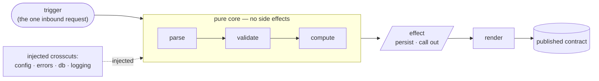

# Coral Architecture — the App

*A capability-first architecture for systems where **agents write the code and humans review and
orchestrate**.*

> **Read [`CONVENTIONS.md`](./CONVENTIONS.md) first.** It defines the eight nouns this document uses
> (slice, crosscut, adapter, composition root, published contract, app, system, channel), the rule-ID
> scheme, the enforcement classes, the [Coral kernel](./CONVENTIONS.md#the-coral-kernel) — the rules Coral
> would substantially relax without the agent-author / human-architect operating model — and the
> [canonical slice](./CONVENTIONS.md#the-canonical-slice) every rule here exists to produce.

This is the **app spine**: how to build one app — a CLI, backend, web app, library, or tool. App-type
specifics live in the appendices under [`appendix/`](#appendix-index). How separate apps compose into a
system lives in [`SYSTEM.md`](./SYSTEM.md). Worked code lives in
[`examples/cli-slice.md`](./examples/cli-slice.md) (a CLI in Python) and
[`examples/go-api-slice.md`](./examples/go-api-slice.md) (an HTTP endpoint in Go).

---

## How to read this document

Sections 1–22 **define** the rules and explain *why* each exists. The
[Agent Execution Contract](#agent-execution-contract) is the **complete** condensed checklist: every
`[auto]` and `[review]` rule below appears in it, so an agent that loads only the contract has the whole
normative surface. The build fails if a rule is missing from it.

Within a rule, **the first sentence is the rule** — complete and quotable on its own, so a reviewer can
paste it into a comment unedited. What follows is commentary: qualifications, examples, and
cross-references. A few rules lead with a bolded name instead (`[DUP-4]` The Extraction Test, `[TEST-3]`
Unit tests are a scalpel) — that name is the quotable form. Where a rule ends in a colon, the list beneath
it is part of the rule, not commentary.

---

## The shape of an app

Twenty-two sections of rules describe one thing, so here is the thing first. An expense tracker with four
capabilities, written without file extensions or a fixed language — the language binding fixes whether a
slice is a file or a directory, and whether tests colocate or mirror (`[STRUCT-1]`):

```
expenses/
  main              entry point
  app               bootstrap and composition root
  db                crosscut: connections and transactions
  config            crosscut: settings, resolved once at startup
  errors            crosscut: the error taxonomy
  category/
    add             definition + behavior
    add_test        tests for add (colocated, or mirrored if the language forbids colocation)
    list
    list_test
  expense/
    add
    add_test
  summary/
    month
    month_test
```

Everything in it is one of five things, which section 3 states as a rule (`[MODEL-1]`):

- `category/add`, `expense/add` and `summary/month` are **slices** — one capability each, owned from
  trigger through to output, tests included. `category/`, `expense/` and `summary/` are their **feature
  packages**: each groups the slices of one capability and owns the state behind them (`[STRUCT-2]`,
  `[STATE-5]`).
- `db`, `config` and `errors` are **crosscuts** — defined once, constructed at the root, and injected
  into the slices that need them.
- `app` is the **composition root**. It registers slices, constructs crosscuts, injects them, and holds
  no behavior of its own.
- What the app exposes to anything outside it — its command contract, HTTP shape, or library API — is
  its **published contract**.
- There is no **adapter** here, and for an app this size there usually isn't one: each slice writes its
  own queries through the injected `db` crosscut. An adapter appears when a slice declares a port and
  something else implements it — a generated persistence package, an external-system client
  (`[MODEL-4]`).

There is no `handlers`, no `services`, no `repositories`, no `utils`. The sections below are the rules
that keep it that way, each with the reasoning that produced it.

---

## 1. Purpose, Scope & Breakage Boundary  `[SCOPE-*]`

This architecture optimizes for:

1. predictable placement of new code
2. strong locality between behavior and its tests
3. low abstraction overhead
4. self-verifiable, observable contracts
5. bounded blast radius per change
6. readability at scale for both agents and humans

**`[SCOPE-1]` `[guide]` `{governance}`** — This architecture covers **command/request-shaped apps with
loosely-coupled features**, where each feature is largely its own world. CLIs, CRUD-shaped backends, web
apps, libraries, and action/tool runners fit naturally.

**`[SCOPE-2]` `[guide]` `{governance}`** — It is **weak for dense, deeply-coupled domains** where every
feature reaches into one large central concept.

A tax engine, a scheduler, a pricing solver, a physics or simulation core: in these, the "capability"
boundary cuts across the thing that actually holds the complexity, and slicing fights the domain instead
of serving it. This is not a defect to patch — no architecture is universal. If your whole product is
one of these, use something else and say so.

**`[SCOPE-3]` `[review]` `{baseline}`** — When features stop being independent and all converge on one
large shared concept, **give that concept its own app with the dense logic inside it** — do not grow a
shared core inside this one.

Be honest about what the split does: it does not dissolve the density, it **relocates and encapsulates**
it. The new app is allowed to be internally dense — it is precisely the kind of app `[SCOPE-2]` says
this architecture is weak for, and inside it you may use whatever model the domain wants (a rules
engine, a state machine, a solver). What you gain is that the density is **bounded to one app behind one
published contract**, so every other app stays slice-shaped and within an agent's context. The
orchestration layer still carries no business logic — a system-scale rule, and `SYSTEM.md` owns it, which
is why this document does not cite it (see `[SCOPE-4]`) — because the logic lives
*inside* the dense app, not in the wiring.

The prerequisite is a contract. **If you cannot draw a published contract around the dense concept, you
do not have a split** — you have a domain this architecture does not fit, and the right move is to say
so and choose differently, not to force a boundary that will leak. A slice getting dense is a *split
signal*, not a refactor-into-a-shared-core signal; see `[GROW-3]`.

**`[SCOPE-4]` `[guide]` `{governance}`** — What happens *after* the split is not in this document. How the
resulting apps relate — the channel between them, orchestration, cross-app contract testing — is the system
architecture, defined in [`SYSTEM.md`](./SYSTEM.md) (`[CHAN-*]`, `[ORCH-*]`, `[SYS-TEST-*]`). This document
publishes the split *signal*; `SYSTEM.md` consumes it. The dependency points one way.

---

## 2. The Operating Model: Agents Write, Humans Review

Defined once in
[`CONVENTIONS.md`](./CONVENTIONS.md#the-operating-model-agents-write-humans-review-agent) (`[AGENT-1]`;
`[AGENT-2]` flag-don't-guess; `[AGENT-3]` intent-over-letter), because it is cross-cutting to every
document in this set. In one line: deterministic placement, bounded blast radius, slice-sized context,
and self-verifiable contracts exist because **agents write and humans review**.

---

## 3. The Five Categories of Code  `[MODEL-*]`

Knowing which category you are writing answers most placement questions.

**`[MODEL-1]` `[review]`** — Every unit of code is a **slice**, a **crosscut**, an **adapter**, the
**composition root**, or a **published contract**.

There is no sixth category. Something that is none of these is a [forbidden
bucket](#_7-forbidden-buckets-bucket) (`[BUCKET-1]`). The five are not peers in volume:

| Category | What it owns | Volume |
|---|---|---|
| **slice** | one capability end to end — definition, parsing, validation, behavior, state access, output, tests | most of the code |
| **crosscut** | one cross-cutting concern, defined once and injected | few, precisely named |
| **adapter** | the infrastructure mechanics behind a port a slice declared | one per port that needs one; often none |
| **composition root** | registration, construction, injection, bootstrap | exactly one, thin |
| **published contract** | the surface others may depend on | one per slice/app that exposes anything |

**`[MODEL-2]` `[review]` `{baseline}`** — Every package is named for the **capability or the concern it
owns**, never for its technical role.

`expense`, `summary`, `pricing`, `errors`, `db` are legitimate names. `services`, `repositories`,
`models`, `handlers`, `utils` are not (`[BUCKET-1]`).

What this forbids is a **global technical layer** — one `services` package holding every capability's
behavior, one `repositories` package holding every capability's queries. It does *not* forbid internal
structure. Where a language or its tooling forces one capability to span more than one package — Go's
import-cycle rules and single-package code generation are the common case — **banding within a
capability is permitted**, provided every band is still named for the capability or concern it owns and
the dependency arrow points one way. [`examples/go-api-slice.md`](./examples/go-api-slice.md) works
through exactly this case.

The test is ownership, not file count: *could you delete this package and lose exactly one capability,
or exactly one concern?* If yes, it is named right. When you introduce banding, flag it (`[AGENT-2]`) so
the choice is visible rather than assumed.

**`[MODEL-3]` `[guide]` `{baseline}`** — A crosscut's decisive property is **defined once, injected many**.

A crosscut is not "a helper each slice copies" — that is the forbidden-bucket failure. It is one
definition, injected. Three things distinguish a crosscut from a bucket: a precise name, a real
invariant or convention, and an injection discipline. A crosscut that slices reach into, or
re-implement locally, has lost the property that made it worth having, and its copies will drift
(`[XCUT-4]`).

**`[MODEL-4]` `[review]` `{baseline}`** — An **adapter** implements a port the slice declared: it holds
infrastructure-specific mechanics, depends inward on the interface it satisfies, is wired by the
composition root, and owns no application behavior.

This category exists because the alternative was a false claim. A generated persistence package, an
external-system client, a broker binding: none of them owns a capability, none carries a
must-not-diverge invariant, and calling them buckets would forbid the one shape that makes
code-generated persistence work at all. [`examples/go-api-slice.md`](./examples/go-api-slice.md) had to
describe its `store` package as "deliberately not in this table" — that was the missing category
announcing itself.

**Direction of interface ownership is the whole test**, and it is the same one `[STATE-2]` states: the
slice declares the interface, listing only the operations *this* capability uses; the adapter
implements it; the dependency arrow runs adapter → slice. Reverse the arrow and it is a `repository`
layer (`[BUCKET-1]`) — the shared package defines the API, every caller consumes whatever it offers,
and no slice can be read alone.

Two consequences follow. An adapter is **never** a place to put logic: behavior that migrates into one
has migrated *out* of a slice, and the fix is to move it back rather than to grow the adapter. And one
adapter may serve several slices — one generated package, many ports — without becoming shared state,
because each slice still owns its own port. Name it for the infrastructure it speaks to (`store`,
`s3`, `stripe`), never for a role (`[MODEL-2]`).

**Anatomy of one slice.** A pure core (parse → validate → compute), effects at the edge (persist /
render), a stable published contract, and injected crosscuts:



---

## 4. The Slice Boundary  `[BOUND-*]`

**`[BOUND-1]` `[guide]` `{baseline}`** — A slice handles **one inbound request or trigger, end to end**.

This is the universal boundary; each app type names its concrete form:

| App type             | The request/trigger (slice boundary) | Observable contract to assert against    |
| -------------------- | ------------------------------------ | ---------------------------------------- |
| CLI                  | a command invocation                 | exit code + `stdout`/`stderr` + `--json` |
| Backend / web        | an HTTP route / use-case             | status code + response body + side effects |
| Queue/event worker   | a message handler                    | ack/nack + emitted events                |
| GitHub Action / tool | one action run                       | outputs + exit status + annotations      |
| Library / package    | a public API function                | return value + raised errors + types     |

**`[BOUND-2]` `[review]`** — Each request/trigger, or a very tight pair of related ones, forms one slice
that owns its behavior end to end.

**`[BOUND-3]` `[review]` `{baseline}`** — Use the boundary form fixed by the relevant appendix; do not
invent a new boundary kind for an app type that already has one.

**`[BOUND-4]` `[guide]` `{baseline}`** — "Continuous" or "real-time" work is **not** a new boundary kind.

Model it as an on-demand read trigger (recompute when asked), an event/message handler (recompute per
event, idempotently — `[IDEM-5]`), or a scheduled/timer tick (itself a trigger, handled like an event
handler). A genuinely long-running reconciler that owns evolving cross-domain rules is a `[SCOPE-3]`
split into its own app — and that app's slices are still triggered by reads, events, or ticks, never by
an ambient loop.

**`[BOUND-5]` `[review]` `{baseline}`** — A scheduled or background trigger is a slice like any other:
named for its effect, with an observable contract and its own tests.

It differs from a request in one way that matters: **it has no caller to return to**, so silent failure is
its default behavior rather than an edge case. Three things follow. Its outcome must be observable —
success, failure, and what it processed (`[OBS-2]`); a job whose only failure signal is "the number didn't
go up" is not shippable. It must be safe under **overlapping runs**, because the next tick can fire before
this one finishes (`[CONC-3]`), or it must decline to start while a run is in flight. And on any platform
that retries a missed or failed run, it must be idempotent (`[IDEM-5]`).

Give it a real observable contract even though no user reads it: a summary result (counts, ids touched, a
status) is what makes the job testable at its entry point like every other slice (`[TEST-1]`).

---

## 5. Composition Root  `[ROOT-*]`

**`[ROOT-1]` `[review]` `{baseline}`** — The root is **thin**: it registers slices, composes
sub-capabilities, constructs crosscuts and injects them, configures bootstrap, and contains no business
logic, no state-access calls, and no slice-specific validation.

**`[ROOT-2]` `[auto]` `{baseline}`** — The root module imports no persistence or domain-internal module.

Statically decidable, and it is the check that keeps `[ROOT-1]` honest: business logic in the root
almost always announces itself as an import of the thing it operates on. Pair it with a size budget
appropriate to your stack — if the root is the largest file in the app, `[ROOT-1]` is being violated
whatever the imports say.

**`[ROOT-3]` `[guide]` `{baseline}`** — **Each appendix names its root form** — including the app types
that have no root of their own: for a library the *consumer* is the composition root, so the package
exposes capabilities and lets the consumer wire them.

The library is the case worth naming here rather than only in its appendix, because it is the one where
the answer is *nothing in this package*: everything this section assigns to the root belongs to somebody
the author will never meet.

---

## 6. Directory Structure & Naming  `[STRUCT-*]`

The layout is [the one at the top of this document](#the-shape-of-an-app). Three rules fix how it is
named; a fourth thing it shows — that a crosscut is rare and lives at the root — is `[XCUT-2]`.

**`[STRUCT-1]` `[auto]` `{baseline}`** — Tests live beside the code they verify where the language allows;
otherwise they mirror the package/namespace structure exactly.

**`[STRUCT-2]` `[review]` `{baseline}`** — Slices live in **feature packages** whose names are concrete and
domain-oriented (`expense`, `summary`), never technical layers. A feature package holds the slices of one
capability and owns the state behind it (`[STATE-5]`).

A feature package is **not** a sixth category of code: `[MODEL-1]` classifies units of code, and this is a
container for them. What makes it more than a folder is that it is the **ownership boundary for state** —
inside it, sibling slices reach the same table directly; outside it, access goes through a published
capability (`[COMPOSE-1]`). A package holding a single slice is normal and needs no ceremony; the boundary
matters from the second operation on.

**`[STRUCT-3]` `[auto]` `{baseline}`** — Root-level crosscut modules are rare and precisely named (`db`,
`errors`, `config`), never generic.

---

## 7. Forbidden Buckets  `[BUCKET-*]`

**`[BUCKET-1]` `[auto]` `{baseline}`** — Do not create or expand generic catch-all packages: `shared`,
`common`, `utils`, `helpers`, `services`, `repository`, or generic `models`.

Do not introduce `core` as a home for "stuff that feels central" — if a module is genuinely a domain
engine, name it for the domain (`pricing`, `scoring`). A pre-existing `core` whose name already denotes
one specific bounded concept is grandfathered, but never grow it as a catch-all.

**`[BUCKET-2]` `[guide]` `{baseline}`** — Generic catch-all names destroy locality and predictability.

A forbidden bucket is simply a would-be crosscut with **no precise name and no injection
discipline** — a pile. The cure is not "ban all sharing"; it is to make the shared thing a real
crosscut ([`[XCUT-*]`](#_8-cross-cutting-concerns-crosscuts-xcut)) or to leave it duplicated
([`[DUP-*]`](#_9-duplication-policy-extraction-test-dup)).

---

## 8. Cross-Cutting Concerns (Crosscuts)  `[XCUT-*]`

A crosscut is the *legitimate* form of sharing — not an exception to "no shared buckets" but a
different category with its own discipline.

**`[XCUT-1]` `[review]`** — Promote something to a crosscut only if it is **both** genuinely
cross-cutting (consumed by two or more slices) **and** enforcing an invariant or convention that must
not diverge.

The second prong is the real gate. Shared *similarity* is not enough (`[DUP-2]`): the thing must enforce
something that would be a **bug** if it diverged — money parsing, period/date format, the error
taxonomy, connection management, a domain entity's identity rules. Two consumers is a floor, not a
trigger; a thing consumed by twenty slices that carries no invariant is still a bucket.

The normal moment to promote is when a *second* consumer appears for logic currently inline in one
slice. Extracting then, and touching the first slice, is expected — flag the change per `[AGENT-2]`.

**`[XCUT-2]` `[auto]` `{baseline}`** — A crosscut has a precise, domain- or infrastructure-oriented name
(`money`, `period`, `errors`, `db`), never a generic bucket name (`[BUCKET-1]`).

**`[XCUT-3]` `[review]` `{baseline}`** — A crosscut is consumed through its published surface, never
reached into, and anything holding configuration, a connection, or per-trigger state is **injected**.

Injection is about testability, not ceremony. A crosscut that is **pure and stateless** — a formatter, a
validator, a parse invariant — may be consumed by direct import; that *is* consuming its published
surface, and wrapping it in a container buys nothing. A crosscut that holds **configuration, a
connection, or per-trigger state** must be injected, or the slice cannot be exercised without ambient
setup and `[CONFIG-2]` is violated.

The test is a question about the slice's tests: *could you run this slice against temporary
infrastructure without setting an environment variable or patching a module?* If not, something that
should be injected is being reached for. Both examples show the split concretely
([Python](./examples/cli-slice.md#what-gets-injected-and-what-gets-imported),
[Go](./examples/go-api-slice.md)).

**`[XCUT-4]` `[guide]` `{baseline}`** — A crosscut is the *first line* of drift control.

If money formatting is a crosscut, there is structurally one copy and nothing to drift. Static and
LLM drift checks are the backstop for what slips past this, not a substitute for it. Beware making
`[XCUT]` the new escape hatch — `[XCUT-1]` is a gate, not a license.

**`[XCUT-5]` `[review]` `{baseline}`** — A domain entity may be a crosscut, but only its **type and
invariants** — never its persistence, its queries, or a multi-slice workflow.

This is the loophole that lets a layered domain model walk back in wearing a crosscut's badge, so the
line is drawn explicitly. A crosscut named for the domain (`money`, `pricing`, `booking`) may own the
entity's type, its validation, and the rules that must hold everywhere. It must not own the entity's
storage or its queries — that is a `repository` layer (`[BUCKET-1]`), and slices keep their own queries
(`[STATE-1]`).

The test: **if removing the crosscut would break an *invariant*, it is a crosscut; if it would only
break *access to data*, it is a bucket.** A slice constructs and validates entities through the
crosscut, then queries its own state itself.

---

## 9. Duplication Policy + Extraction Test  `[DUP-*]`

**`[DUP-1]` `[guide]` `{baseline}`** — Small duplication across slices is acceptable and often preferred;
do not extract merely to save lines.

**`[DUP-2]` `[review]` `{baseline}`** — **Similarity is not a shared concept.**

Two slices with similar-looking code today live in different contexts and may diverge under different
pressures. Extracting on similarity alone couples them permanently to an abstraction one may later need
to escape. Duplicate *incidental* similarity inside each slice; promote to a crosscut only when
`[XCUT-1]` is met.

**`[DUP-3]` `[review]` `{baseline}`** — Extract only when the extraction does at least one of: enforces a
business invariant; enforces a CLI/API/persistence convention that must not diverge; provides stable
infrastructure with a precise name; or materially clarifies a real domain calculation.

**`[DUP-4]` `[review]` `{baseline}` — The Extraction Test.** Before extracting, ask: is this a real domain
or infrastructure concept? Are we protecting an invariant or enforcing a convention that must stay
consistent everywhere? Would duplication be cheaper than a permanent abstraction? If the answer is mostly
*no*, do not extract.

**Bad reasons:** "two slices repeat lines," "might be reused later," "looks tidier." **Good reasons:**
"monetary values must always parse and store under one invariant," "dates must follow one validated
format," "connection and bootstrap must be consistent."

---

## 10. Slice-to-Slice Composition  `[COMPOSE-*]`

Some capabilities compose others (place order → reserve inventory → charge payment). Without a rule,
agents either copy whole workflows or quietly resurrect a `services` layer.

**`[COMPOSE-1]` `[review]`** — A slice may depend on another slice's **published capability**, never on
its internals — not its parsing, its queries, or its private helpers.

**`[COMPOSE-2]` `[review]` `{baseline}`** — Prefer inverting composition through the composition root
(inject the needed capability) over slice-to-slice imports, so the dependency is visible at the edge.

**`[COMPOSE-3]` `[review]` `{baseline}`** — A multi-step workflow two slices both need is a candidate
crosscut (`[XCUT-1]`), not a reason to create a generic `services` bucket.

**`[COMPOSE-4]` `[review]` `{baseline}`** — Read fan-in is legitimate composition: a slice that aggregates
several other slices' published *read* capabilities — a dashboard, a score — is a legitimate slice.

It must depend only on published capabilities (`[COMPOSE-1]`) and add no shared core. If the owning
feature package exposes no read capability the aggregator needs, that package publishes one — normally as
a read slice of its own (`expense/list`), which is why this is rarely the imposition it sounds like; the
aggregator never reaches into another package's state. The same idea across a process boundary becomes a system concern
(`[SCOPE-4]`). When the fan-in starts carrying its own growing cross-domain rules, that is the
`[GROW-3]` split signal.

---

## 11. Pure Core, Effects at the Edge  `[EFFECT-*]`

**`[EFFECT-1]` `[review]` `{baseline}`** — Prefer pure functions for parsing, validation, normalization,
calculation, and output shaping.

**`[EFFECT-2]` `[review]` `{baseline}`** — Keep side effects at the edges: the request boundary, state
writes, filesystem, environment, and external process or network calls.

**`[EFFECT-3]` `[guide]` `{baseline}`** — The preferred slice flow is **parse → validate → compute →
persist/effect → render**; do not intermingle calculation and side effects unnecessarily.

**`[EFFECT-4]` `[review]` `{baseline}`** — Do not extract a function *only* to make it pure or testable;
extract only when it enforces a rule, clarifies a real calculation, or deserves a precise name (`[DUP-3]`).

---

## 12. State & Effects  `[STATE-*]`

State may be a database, the filesystem, a remote API, or nothing.

**`[STATE-1]` `[review]` `{baseline}`** — Keep state-access logic local to the slice that needs it.

Prefer direct queries for small and medium tools. A slice owning its own queries is the architecture
working, not a problem to solve; repeated query patterns across slices are cheap to generate
consistently. This holds *within* a feature package too: siblings sharing a table (`[STATE-5]`) still
write their own queries against it, and the first shared `queries` module is where the package quietly
becomes a layer.

**`[STATE-2]` `[auto]` `{baseline}`** — Do not create a shared repository or data-access layer.

Connection management, pooling, and migration *execution* may be a small, precisely-named `db`
crosscut; it must not grow into a generic data-access layer (`[BUCKET-1]`).

**The direction of interface ownership is the test**, and it is what distinguishes a forbidden repository
from a legitimate adapter. If a shared package **defines** the data-access API and slices consume whatever
it offers, it is a repository layer: it accumulates every caller's needs and no slice can be read alone.
If the **slice declares the interface it needs** — listing only the operations *this* capability uses — and
a shared package merely *implements* it, the dependency arrow runs adapter → slice and the slice stays
self-contained. That inversion is permitted, and it is how code-generated persistence (sqlc, an ORM's
generated queries) coexists with slice ownership; see
[`examples/go-api-slice.md`](./examples/go-api-slice.md).

**`[STATE-3]` `[guide]` `{baseline}`** — A shared persistence layer accumulates special cases and forces
cross-slice reasoning on every change; local ownership keeps each slice independently changeable.

**`[STATE-4]` `[review]` `{baseline}`** — Derived or computed state is owned by the slice that computes it,
even when every input belongs to other slices.

It is not "shared state" and does not justify a shared layer. Persisting a derived value (a cached
score) is an idempotent-set effect (`[IDEM-1]`); on a redelivering platform it must be idempotent
(`[IDEM-5]`). Because writing the cache is a *set* effect, it belongs to a set- or event-named handler —
a `refresh`/`recompute` slice, or an `on_change` handler — **not** a read-named slice. A `show`/`GET`
reads the cached value and never writes it, which keeps `[IDEM-2]` satisfied.

**`[STATE-5]` `[review]` `{baseline}`** — Every table, file, or bucket is owned by **exactly one feature
package**, and its schema is defined **once** inside that package. Slices in the owning package reach it
directly; any slice outside the package goes through the owner's published capability (`[COMPOSE-1]`).

Ownership sits at the package rather than at a single slice because a capability is normally **several
operations over one shape**: `expense/add`, `expense/edit`, `expense/delete` and `expense/list` all touch
the `expenses` table, and that is a well-formed capability rather than a defect. The earlier per-slice
form of this rule said otherwise — "exactly one owning slice", with two slices writing one table as a
split signal — so ordinary CRUD tripped a trip-wire, and the only strictly compliant alternative was
worse: a write slice publishing a read capability for its own siblings, which is the owning slice becoming
the repository these rules exist to prevent.

**Package ownership is not permission for a shared query module.** `[STATE-1]` and `[STATE-2]` still hold
*inside* the package: each slice writes its own queries against the shared shape, and an `expense/queries`
module serving all four operations is the `repository` layer at smaller scale (`[BUCKET-1]`). This rule
moves the **ownership** boundary, not the **locality** one, and the difference is the whole point —
[`examples/cli-slice.md`](./examples/cli-slice.md) shows it working: `list` writes its own `SELECT`
against a table `add` defined, and neither slice reaches into the other.

Split the mechanism from the content: the `db` crosscut **runs** migrations; the owning package
**defines** them, at one site within it, so a schema change has exactly one place to be.

A slice **outside** the package that needs the data reads it through a published capability
(`[COMPOSE-1]`); if it genuinely shares the entity's invariant, the invariant — not the storage — becomes
a crosscut (`[XCUT-5]`). **Two feature packages** writing one table is the `[GROW-3]` split signal, not a
reason for a shared data-access layer.

**`[STATE-6]` `[review]` `{baseline}`** — A cache is an optimization, never a source of truth: every read
path must be correct with the cache empty, and nothing may exist *only* in the cache.

Test it by deleting the cache. If a read now returns wrong data rather than slow data, the cache has
become primary storage — which means it has silently acquired an owner, a schema, and a durability
requirement it was never designed for. Whatever the cache holds must be derivable from the real store
(`[STATE-4]`).

**`[STATE-7]` `[review]` `{baseline}`** — Name the invalidation strategy when you add a cache, and own it
in the slice that owns the cached value.

There are three workable strategies and you must pick one explicitly: a **TTL** (staleness is bounded and
acceptable), **write-through** from the slice that owns the underlying value, or **event-driven**
invalidation on a change signal. A cache with no stated strategy is not shippable — it will be correct in
testing and stale in production, and the next agent has no way to know which behavior was intended. Write
the choice down next to the cache.

---

## 13. Concurrency  `[CONC-*]`

Two triggers can run at the same time. The architecture makes that mostly safe by construction — a slice
owns one trigger and holds nothing between triggers — but "mostly" is where the bugs live, so the
assumption is written down rather than left implicit.

**`[CONC-1]` `[auto]` `{baseline}`** — A slice holds no mutable state between triggers: per-trigger state
lives in the trigger's own scope, never in a module-level or static variable.

This is the rule that makes every other concurrency question tractable. A slice with no cross-trigger
state cannot race with a copy of itself, so the only concurrency left to reason about is the *shared* kind
— crosscuts (`[CONC-2]`) and state (`[CONC-3]`). Statically decidable: mutable module-level state in a
slice module is a violation. Immutable constants and lookup tables are fine.

**`[CONC-2]` `[review]` `{baseline}`** — Every crosscut is explicitly either **shared and
concurrency-safe** or **constructed per trigger**, and the root constructs it accordingly.

There is no third option and no default to fall back on. A connection pool, a logger, a config object, and
a pure invariant helper (`money`) are shared and must be safe for simultaneous use. A transaction handle,
the authenticated principal, and the correlation id are per-trigger. The failure mode is a crosscut that
*looks* shareable and holds one trigger's state — a client object caching the last response, a builder
reused across calls. State which kind each crosscut is where it is constructed.

**`[CONC-3]` `[review]` `{baseline}`** — When two triggers can write the same state, the slice names its
strategy at the write: **serialize** on the affected key, use **optimistic concurrency** (compare-and-set
on a version), or make the update **commutative**.

Never assume exclusivity. The common bug is a read-modify-write split across two effects — read the row,
compute, write it back — which is a lost-update race whenever two triggers interleave, and which testing
almost never catches. Either collapse it into one atomic operation, or take one of the three strategies
above and say which in the code. This is also why `[IDEM-1]` distinguishes absolute from relative updates:
a *set* to a caller-supplied value tolerates interleaving in a way an increment does not.

**`[CONC-4]` `[review]` `{baseline}`** — A transaction is scoped to one trigger and never spans an external
call.

Opening a transaction, calling out to another service or a model, and then committing holds a database
lock for the duration of somebody else's latency — it converts their slow day into your outage. Do the
external call before the transaction or after it, and if the two must be consistent, make the effect
idempotent (`[IDEM-5]`) and reconcile rather than holding the lock.

**`[CONC-5]` `[guide]` `{baseline}`** — The architecture's concurrency default is *one trigger, one thread
of control, no shared mutable state*.

That default is what lets a reviewer, or an agent, reason about a slice in isolation. Every escape from it
— a shared mutable crosscut, a background worker, an in-process queue — removes that property for the
whole app, not just for the code that uses it. Treat introducing one as a `[AGENT-2]` decision to flag,
not a local implementation detail. Async work is a trigger, not an ambient loop (`[BOUND-4]`, `[BOUND-5]`).

---

## 14. Configuration  `[CONFIG-*]`

Configuration is the crosscut every app has and most architectures forget to govern. Ambient config
reads are the most common way a slice stops being self-contained.

**`[CONFIG-1]` `[review]` `{baseline}`** — Configuration is a crosscut: resolved once at the composition
root, validated there, and injected into the slices that need it.

A **feature flag is configuration**, and the same rule applies: resolve it at the root and inject the
decision, rather than having a slice reach for a flag client mid-behavior. A slice that queries a flag
service inline is untestable without that service and has a hidden dependency the reviewer cannot see in
its signature. Where a flag must be evaluated per request (a per-user rollout), inject the *evaluator* as a
crosscut and treat its result as request-bound state (`[CONC-2]`).

**`[CONFIG-2]` `[auto]` `{baseline}`** — No slice reads the process environment, a config file, or a global
settings object directly.

Statically decidable, and worth gating: a single `os.Getenv` inside a slice defeats `[AGENT-1]` (the
slice's world is no longer in one place) and makes the slice untestable without ambient setup.

**`[CONFIG-3]` `[review]` `{baseline}`** — Validate every required setting when the config crosscut is
constructed, not at first use.

A missing or malformed setting is a **startup failure** raising `infrastructure` (`[ERR-1]`), never an
empty value that surfaces hours later as a mystery. Document the precedence order once — typically
explicit argument → environment → file → default — and apply it in the crosscut, not per slice.

**`[CONFIG-4]` `[auto]` `{baseline}`** — Secrets are read through the config crosscut only: never inlined,
never logged, never placed on a published contract.

See `[TRUST-2]` and `[OBS-3]`. This is the one `[CONFIG]` rule whose violation is a security incident
rather than a design smell.

---

## 15. Idempotency & Effect Semantics  `[IDEM-*]`

**`[IDEM-1]` `[review]` `{baseline}`** — The request or trigger's **name signals its effect semantics**,
and the implementation matches.

| Semantic        | CLI verb                              | HTTP method    | Library naming                   |
| --------------- | ------------------------------------- | -------------- | -------------------------------- |
| read-only       | `show`/`list`/`summary`               | `GET`/`HEAD`   | `get`/`find`/`list`              |
| idempotent set  | `set`/`edit`/`update`/`init`/`ensure` | `PUT`/`DELETE` | `set`/`update`/`ensure`/`upsert` |
| non-idempotent  | `add`/`create`/`import`               | `POST`         | `add`/`create`                   |

An update that **sets a field to a caller-supplied value** is idempotent (`edit`/`update`/`set`, `PUT`).
An update that **changes state relative to its current value** (increment, append) is non-idempotent —
name it accordingly and do not classify it as `set`.

**`[IDEM-2]` `[auto]` `{baseline}`** — A read-named slice (`show`/`list`/`GET`) contains no write or
mutation call, including a cache write.

Route a derived-state write to a set- or event-named handler (`[STATE-4]`). The static check is one-hop:
a read-named slice module that calls an insert/update/delete or a write API fails. Deeper mutation
reached through several calls is a `[review]` concern.

**`[IDEM-3]` `[review]` `{baseline}`** — Do not make a non-idempotent operation behave idempotently without
renaming it; names must signal behavior truthfully.

**`[IDEM-4]` `[review]` `{baseline}`** — Non-idempotent mutations must not be retried automatically.

**`[IDEM-5]` `[review]` `{baseline}` — At-least-once platforms make idempotency mandatory.** When the
platform itself redelivers — queues, webhooks, GitHub Action reruns, cron retries — a handler with mutating
effects **must** be idempotent, via an idempotency key or a natural dedupe key, because you do not control
the retry.

This is a hard requirement for those app types, not advice. It is also what reconciles `[IDEM-4]` with
reality: the key makes the *handler* a safe no-op on redelivery even when the underlying operation is
non-idempotent.

**`[IDEM-6]` `[review]` `{baseline}`** — If a needed verb is not in the `[IDEM-1]` table, classify it by
its effect (read-only / idempotent-set / non-idempotent), pick a name that signals that effect, and
proceed.

Do not invent a name whose effect is ambiguous. If the *effect itself* is unclear, flag it
(`[AGENT-2]`).

---

## 16. Error Model  `[ERR-*]`

**`[ERR-1]` `[review]` `{baseline}`** — Use one small, stable error taxonomy, defined once as a crosscut:

1. `usage` — invalid invocation, malformed arguments, bad flag/parameter combinations
2. `validation` — syntactically valid input that fails business rules
3. `not_found` — required resource does not exist
4. `conflict` — current state conflicts with the request's intent
5. `infrastructure` — database, filesystem, permissions, environment, or OS failure
6. `internal` — unexpected bug

**Authentication and authorization outcomes are deliberately not in this list**, and leaving that
unstated was a gap: nothing said whether `unauthenticated` and `forbidden` were missing on purpose. They
are. Both are decided at the boundary by the code that holds the principal (`[TRUST-1]`, `[BE-6]`), so a
slice has nothing to raise — and making them categories would push a security decision into a taxonomy
slices own, whose first consequence is slices raising `forbidden` about state they should never have
loaded. What replaces them is a rendering rule per app type; `[BE-8]` fixes the HTTP shape.

One authorization outcome *does* reach the taxonomy, and it is the one that matters most: a scoped query
that matches nothing raises `not_found`, not a permission error. "Exists but is not yours" and "does not
exist" must be **indistinguishable** to a caller who is not entitled to know which — so the honest-looking
answer is the leak, and the taxonomy's existing category is the correct one.

**`[ERR-2]` `[auto]` `{baseline}`** — Errors carry the structured shape `{ category, code, message }` and
raised errors use the taxonomy enum, not ad-hoc strings.

`category` is one of the six; `code` is a stable string id (`"invalid_month"`); `message` is
human-readable. The `category` enum and the error type are the `errors` crosscut's published surface.
The `code` strings are **owned by the slice that raises them** — minted locally, kept stable — so a
slice stays self-contained and adding a code never edits a shared registry.

**`[ERR-3]` `[review]` `{baseline}`** — **Slices raise. The root renders. Nothing else renders.**

Validate at the boundary, fail fast, do not swallow errors, do not partially succeed silently.
Unexpected errors are caught once at the root.

**`[ERR-4]` `[review]` `{baseline}`** — Batch and bulk operations default to all-or-nothing: one
transaction, one bad item aborts and rolls back.

A command may offer a partial mode, but only if it **reports per-item outcomes explicitly** in its
observable contract — partial success must never be *silent* (`[ERR-3]`). State which mode a command is
in; never leave it implicit.

---

## 17. Observability  `[OBS-*]`

**`[OBS-1]` `[guide]` `{baseline}`** — Diagnostics are **opt-in, off the data path, and never part of the
machine contract**. The principle is universal; the mechanism is per-appendix (a `--debug` flag to `stderr`
for CLIs; structured logs, metrics, and trace IDs for backends).

**`[OBS-2]` `[review]` `{baseline}`** — Observability is configured globally at the root, not reinvented
per slice; slices emit through the injected logging/tracing crosscut.

**`[OBS-3]` `[review]` `{baseline}`** — Diagnostic output must not appear on the machine-readable contract
channel — not on `--json` on `stdout`, not in a response body.

Assert this in behavior tests (`[TEST-4]`). It is not statically decidable in general — any print call
could reach the contract channel — which is why it is `[review]` and test-covered rather than `[auto]`.

---

## 18. Public & Observable Contracts  `[CONTRACT-*]`

**`[CONTRACT-1]` `[review]` `{baseline}`** — What the outside world depends on — machine-readable output,
HTTP API shape, library public API — is stable, explicit, fully typed, and free of decoration.

**`[CONTRACT-2]` `[review]` `{baseline}`** — Changes to a public contract follow that app type's versioning
discipline: semver for libraries, API versioning for backends, documented stability for `--json`. The
concrete rule lives in the appendix.

---

## 19. Trust Boundary  `[TRUST-*]`

**`[TRUST-1]` `[review]` `{baseline}`** — Treat the request boundary as the **trust boundary**: validate
and authorize untrusted input at the edge before it reaches behavior.

**`[TRUST-2]` `[review]` `{baseline}`** — Every app **states its trust boundary explicitly**, including the
apps that barely have one.

Authentication, authorization, secret handling, and tenant isolation are first-class for networked app
types and are specified in those appendices (`[BE-6]`, `[WEB-7]`, `[AGENTIC-10]`). A local CLI or pure
library may have a minimal trust boundary — the invoking user or caller is trusted — but "minimal" must
be *written down*, because an unstated trust assumption is the one an agent will silently widen. Secrets
always come from the config crosscut (`[CONFIG-4]`).

---

## 20. Testing Philosophy  `[TEST-*]`

**`[TEST-1]` `[review]`** — Testing is **behavior-first**: exercise the slice's entry point, assert its
observable contract (`[BOUND-1]`), use real or realistic temporary infrastructure, and minimize mocking.

"Realistic temporary infrastructure" means a temp database, a test container, an in-memory
implementation of the *real* interface — not a mock that asserts on calls. The distinction that matters
is whether the test would still pass if the behavior broke.

**`[TEST-2]` `[review]` `{baseline}`** — Prefer integration and end-to-end tests over isolated unit tests;
behavior tests verify what the slice actually does and survive refactors that unit tests often do not.

**`[TEST-3]` `[review]` `{baseline}` — Unit tests are a scalpel, not a default.** Write one only when
behavior is genuinely hard or expensive to reach at the integration boundary: complex branching, pure
calculations with many input combinations, impractical-to-set-up edge cases.

Do not write unit tests that duplicate integration coverage, and do not extract code only to make unit
testing easier (`[EFFECT-4]`).

**`[TEST-4]` `[review]` `{baseline}`** — Behavior tests validate, where relevant: the observable contract,
error rendering and codes, idempotency semantics, transactional behavior, authorization at the boundary,
and diagnostic behavior.

---

## 21. File Growth & Split Signals  `[GROW-*]`

**`[GROW-1]` `[guide]` `{baseline}`** — Start small: prefer one file per slice initially.

**`[GROW-2]` `[review]` `{baseline}`** — When a slice grows hard to navigate, **split inside the slice
first** (e.g. `expense/add/` → `cli`, `behavior`, `sql`, `add_test`); never answer file growth with a
global abstraction.

**`[GROW-3]` `[review]` `{baseline}`** — Distinguish *file* growth from *domain densification*: if features
stop being independent and all reach into one large central concept, that is a `[SCOPE-3]` split signal.

Concrete trip-wires — any one is a prompt to flag per `[AGENT-2]`: a single slice needs the *read* state
of three or more other slices at once; a new feature cannot be described without naming several existing
capabilities; two feature packages write the same table (`[STATE-5]`); or one rule must change in lockstep across
many slices.

The threshold is a judgment call, not a hard metric. When it is unclear, prefer the reversible move (a
composition slice, `[COMPOSE-4]`) and flag for review.

---

## 22. Variations on the canonical slice

The [canonical slice](./CONVENTIONS.md#the-canonical-slice) lives in `CONVENTIONS.md` — read it there,
once. [`examples/go-api-slice.md`](./examples/go-api-slice.md) is the same shape in real Go, including
how the bands fall out under a real language's constraints. Three variations come up often enough to
name:

**Lookup-then-mutate (`edit`/`update`, `not_found`).** A slice that changes an existing record validates
input purely, then performs the lookup-and-write as **one** effect; if the write affects zero rows it
raises `not_found` (`[ERR-1]`). Existence is knowable only via state, so the `not_found` check lives
*inside* the write step — it is an effect, not a pure pre-validation. The verb that *sets* a field to a
supplied value is idempotent: name it `edit`/`update`/`set`, not `add` (`[IDEM-1]`, `[IDEM-6]`).

**A first slice, with no crosscuts yet.** The canonical slice consumes `money`/`db`/`errors` as
*pre-existing* crosscuts. A lone first slice keeps that logic inline and waits for a second consumer
to trigger `[XCUT-1]`. Standing up a crosscut for a single slice is the `[DUP-4]` failure, not
diligence.

**A read that fans in (`summary`, a dashboard).** Compose other slices' published read capabilities
(`[COMPOSE-4]`), keep the composition in this slice, and do not create a shared query layer to serve it.
If the fan-in starts owning its own cross-domain rules, that is `[GROW-3]`.

---

## Agent Execution Contract

The **complete** normative checklist: every `[auto]` and `[review]` rule in this document, in one place.
Load this as your working contract; sections 1–21 are the *why*, and `[guide]` rules live only there.
Reviewers walk this same list and cite the same IDs.

<!-- coral:contract:start -->

### Placement & naming
- `[MODEL-1]` Every unit of code is a slice, a crosscut, an adapter, the composition root, or a published contract.
- `[MODEL-2]` Name every package for the capability or concern it owns, never for its technical role.
- `[MODEL-4]` An adapter implements a slice-declared port: infrastructure only, arrow inward, wired by the root, no behavior.
- `[STRUCT-2]` Put slices in concrete, domain-oriented feature packages; the package owns its capability's state.
- `[STRUCT-3]` Keep root-level crosscuts rare and precisely named.
- `[STRUCT-1]` Colocate tests, or mirror the package structure where colocation is impossible.
- `[BOUND-2]` One request/trigger — or a very tight pair — per slice, owned end to end.
- `[BOUND-3]` Use the boundary form the appendix fixes; do not invent a new one.
- `[BOUND-5]` A scheduled/background trigger is a slice: observable outcome, overlap-safe, tested.
- `[ROOT-1]` Keep the root thin: register, construct, inject, bootstrap. No business logic.
- `[ROOT-2]` The root imports no persistence or domain-internal module.

### Forbidden moves
- `[BUCKET-1]` Do not create or expand `shared`/`common`/`utils`/`helpers`/`services`/`repository`/generic `models`.
- `[DUP-2]` Do not extract on similarity alone; similarity is not a shared concept.
- `[COMPOSE-1]` Do not reach into another slice's internals; depend on its published capability.
- `[CONFIG-2]` No slice reads the environment, a config file, or a global settings object directly.

### The sharing decision
- `[XCUT-1]` Promote to a crosscut only when it is genuinely cross-cutting AND enforces a must-not-diverge invariant.
- `[XCUT-2]` Give every crosscut a precise domain or infrastructure name.
- `[XCUT-3]` Inject crosscuts; consume their published surface, never their internals.
- `[XCUT-5]` A domain entity may be a crosscut only as type + invariants — never its queries or storage.
- `[DUP-3]` Extract only to enforce an invariant or convention, provide named infrastructure, or clarify a real calculation.
- `[DUP-4]` Apply the Extraction Test before extracting.
- `[COMPOSE-2]` Prefer injecting a capability through the root over a slice-to-slice import.
- `[COMPOSE-3]` A shared multi-step workflow is a candidate crosscut, not a `services` bucket.
- `[COMPOSE-4]` Read fan-in is a legitimate slice, provided it uses published capabilities only.

### Semantics & effects
- `[IDEM-1]` The name signals the effect; the implementation matches it.
- `[IDEM-2]` A read-named slice contains no write or mutation call, including a cache write.
- `[IDEM-3]` Do not make a non-idempotent operation idempotent without renaming it.
- `[IDEM-4]` Never auto-retry a non-idempotent mutation.
- `[IDEM-5]` On an at-least-once platform, a mutating handler must be idempotent.
- `[IDEM-6]` Classify an unlisted verb by its effect and name it truthfully; flag an unclear effect.
- `[EFFECT-1]` Keep parsing, validation, normalization, calculation, and output shaping pure.
- `[EFFECT-2]` Keep side effects at the edges.
- `[EFFECT-4]` Do not extract a function only to make it pure or testable.

### State & configuration
- `[STATE-1]` Keep state-access logic local to the slice that owns it.
- `[STATE-2]` Do not create a shared repository or data-access layer.
- `[STATE-4]` The slice that computes derived state owns it; write it from a set-/event-named handler.
- `[STATE-5]` One owning feature package per table/file/bucket, schema defined once inside it; siblings reach it directly, outsiders via a published capability.
- `[STATE-6]` A cache is never a source of truth; every read path must be correct with it empty.
- `[STATE-7]` Name the cache's invalidation strategy — TTL, write-through, or event-driven.
- `[CONFIG-1]` Resolve, validate, and inject configuration at the root as a crosscut.
- `[CONFIG-3]` Validate every required setting at construction; fail startup, not first use.
- `[CONFIG-4]` Read secrets only through the config crosscut; never inline, log, or publish them.

### Concurrency
- `[CONC-1]` A slice holds no mutable state between triggers.
- `[CONC-2]` Every crosscut is explicitly shared-and-concurrency-safe or constructed per trigger.
- `[CONC-3]` Name the strategy where two triggers can write the same state: serialize, compare-and-set, or commute.
- `[CONC-4]` Scope a transaction to one trigger; never hold it across an external call.

### Errors, observability, contracts, trust
- `[ERR-1]` Use the six-category taxonomy, defined once as a crosscut.
- `[ERR-2]` Raise `{category, code, message}` using the enum; slices own their `code` strings.
- `[ERR-3]` Slices raise; the root renders; nothing else renders.
- `[ERR-4]` Batch operations are all-or-nothing unless partial outcomes are reported explicitly.
- `[OBS-2]` Configure observability at the root; emit through the injected crosscut.
- `[OBS-3]` Keep diagnostics off the machine-readable contract channel.
- `[CONTRACT-1]` Keep the public contract stable, explicit, fully typed, and undecorated.
- `[CONTRACT-2]` Version public-contract changes per the app type's discipline.
- `[TRUST-1]` Validate and authorize untrusted input at the boundary.
- `[TRUST-2]` State the app's trust boundary explicitly, however minimal.

### Testing
- `[TEST-1]` Behavior-first: exercise the entry point, assert the observable contract, real infra, minimal mocking.
- `[TEST-2]` Prefer integration and end-to-end tests over isolated unit tests.
- `[TEST-3]` Unit tests are a scalpel; never duplicate integration coverage; never extract just to test.
- `[TEST-4]` Assert contract, errors, idempotency, transactions, authorization, and diagnostics where relevant.

### Scope & growth
- `[SCOPE-3]` When features converge on one dense concept, give it its own app behind a published contract.
- `[GROW-2]` Answer file growth by splitting inside the slice, never with a global abstraction.
- `[GROW-3]` Treat domain densification as a split signal, not a refactor-into-a-shared-core signal.

<!-- coral:contract:end -->

### Change algorithm

1. Identify the owning capability — the request or trigger. → `[BOUND-1]`
2. Locate the existing feature package; if none, create a concrete one. → `[STRUCT-2]`
3. Place new code inside that slice. → `[MODEL-2]`
4. Keep logic local unless `[XCUT-1]` justifies a crosscut.
5. Add or update colocated behavior tests. → `[TEST-1]`
6. Verify the observable contract — exit code/status, channels, `--json`/body. → `[CONTRACT-1]`
7. At genuine ambiguity, take the reversible option and flag it. → `[AGENT-2]`

---

## Enforcement & Drift Control

The rule IDs and enforcement classes exist so the architecture can be **checked**, not just read. The
first line of drift control is structural: a genuine crosscut (`[XCUT]`) has one copy and nothing to
drift. The tiers below are the backstop for what slips past it.

Two things are checked today. This repository enforces its **own** consistency at build time, in four
groups. Each rule is **classified**: exactly one enforcement class, and exactly one ownership layer —
kernel membership read only from `CONVENTIONS.md`'s kernel block, every other rule tagged on its own
definition line against a registered profile. Each document is **complete and honestly scoped**: every
`[auto]`/`[review]` rule appears in its Agent Execution Contract, and a contract marks its opt-in groups
so it cannot present a profile-scoped rule as unconditional. Each **citation resolves**, this document
cites no
system rule, and every link fragment reaches a real anchor. And the **published set is stable**: no rule
ID removed or silently reclassified, the generated [rule index](./rules.md) still matching the registry it
indexes, every worked example declaring the current Coral version. Malformed metadata fails the build
rather than being skipped, because a skipped rule is one that quietly leaves a layer while the page still
reads correctly. Separately, [`tools/coral-lint`](./tools/coral-lint/README.md) enforces a growing subset
of Tier 1 against a target repository.

**Tier 1 — static checks (deterministic, blocking).** One per `[auto]` rule **defined in this document**;
each appendix carries its own, and each check cites the rule ID it enforces so a failure points back here. Some of these ship as
[`tools/coral-lint`](./tools/coral-lint/README.md) and some do not yet.

| Rule | Check |
|---|---|
| `[BUCKET-1]` | no `utils/`, `services/`, `helpers/`, `common/`, or generic `models/` directory |
| `[STRUCT-1]` | every slice ships its tests (colocated, or a mirror exists) |
| `[STRUCT-3]` / `[XCUT-2]` | top-level modules match an allowlist of precise names |
| `[ROOT-2]` | the root module imports no persistence or domain-internal module |
| `[STATE-2]` | no shared repository/data-access package |
| `[CONC-1]` | no mutable module-level or static state in a slice module |
| `[CONFIG-2]` | no slice module references the environment or config-file API |
| `[CONFIG-4]` | no literal secret in source; no secret on a logged or published field |
| `[IDEM-2]` | a read-named slice makes no one-hop write/mutation call |
| `[ERR-2]` | raised errors use the taxonomy enum, not ad-hoc strings |

> **Which of these actually run is the tool's answer, not this table's.** These documents own the *rules*;
> `coral-lint` owns the *implementation status*, reports it on every run, and prints the full map under
> `coral-lint --coverage` — including a stated reason for each rule it does not check. Keeping the status
> in one place is `[XCUT-4]` applied to this page: a status column here would be a second copy, and it
> would be wrong within a month. A test in the tool reads the `[auto]` rules straight out of these docs
> and fails if any rule is neither implemented nor explicitly excused, so the two cannot drift apart
> silently.

**Tier 2 — LLM reviewer (advisory first, graduated to blocking per check once low-false-positive).**
Reserved for `[review]` rules a static check cannot decide: cross-slice drift smells (date, money, or
error formats that diverged); "this is the Nth copy — promote per `[XCUT-1]`?" classification calls;
`[XCUT-5]` crosscut-vs-bucket judgments; `[STATE-5]` ownership disputes.

**Tier 3 — behavior tests.** Some `[review]` rules are cheap to assert and expensive to lint: `[OBS-3]`,
`[ERR-3]`, `[ERR-4]`, `[IDEM-5]`, and the authorization half of `[TEST-4]`. Cover them in the slice's
own tests rather than pretending a linter can decide them.

**Four constraints that keep enforcement from fighting the architecture:**

1. **Static-first.** A gate that flakily passes a forbidden bucket loses all credibility.
2. **Flag drift as a question, never force convergence.** Suggest "A and B diverged — intended, or a
   missed `[XCUT]` promotion?" for a human to adjudicate. A "make everything consistent" reviewer would
   pressure agents back into premature shared abstractions — an anti-`[DUP]` engine.
3. **One slice at a time.** The reviewer gets this contract as input, cites IDs, and reviews one slice
   per pass; slices are context-sized, so review stays tractable.
4. **The human is the final gate on anything irreversible.** The reviewer multiplies human attention; it
   does not replace the "humans review" half of the operating model.

New convention → new rule ID → new `[auto]` check (or `[review]` note) → enforced going forward.

---

## Document Set

- **[`CONVENTIONS.md`](./CONVENTIONS.md)** — the shared crosscut: vocabulary, rule-ID scheme,
  enforcement classes, operating model, and the canonical slice. The front door.
- **`ARCHITECTURE.md`** (this doc) + **[`appendix/*.md`](#appendix-index)** — the app spine and its
  per-app-type instantiations.
- **[`SYSTEM.md`](./SYSTEM.md)** — the system spine: how apps compose over a channel (`[CHAN-*]`, `[ORCH-*]`,
  `[SYS-TEST-*]`). Builds on this doc; this doc never cites a system rule.
- **Worked examples** — [`examples/cli-slice.md`](./examples/cli-slice.md) (two CLI slices in Python, one
  file each), [`examples/go-api-slice.md`](./examples/go-api-slice.md) (an HTTP slice in Go, where the
  language forces banding), and [`examples/backend-review.md`](./examples/backend-review.md) (the rules
  applied to a real service, including where they'd be overkill).

## Appendix Index

Each appendix instantiates the abstract slots for one app type: boundary, observable contract,
composition root, state/effects, configuration, idempotency form, error rendering, observability
mechanism, trust/security, contract versioning, and testing mechanics.

**An appendix is *complete* when every slot either carries an app-type rule or is explicitly deferred to
the spine.** "Deferred to the spine" is an answer, not a gap — it means the spine's rule needs no
app-type-specific form here, and saying so is what lets a reader stop looking. A slot that is neither is
listed under "slots still to fill" on the appendix itself, so the gap is named rather than implied.
`[VER-2]` ties `1.0.0` to every **core** appendix being complete by this definition.

### Core appendices

- **[`appendix/cli.md`](./appendix/cli.md)** — CLI tools. **Complete.**
- **[`appendix/backend.md`](./appendix/backend.md)** — backends and services; heaviest use of
  crosscuts and `[COMPOSE]`. **Complete.**
- **[`appendix/web.md`](./appendix/web.md)** — web apps; the trust boundary is first-class. **Complete.**
- **[`appendix/library.md`](./appendix/library.md)** — libraries and packages; the consumer is the root;
  the contract is semver. **Complete.**
- **[`appendix/gh-action.md`](./appendix/gh-action.md)** — Actions and tools; at-least-once reruns make
  idempotency mandatory. **Complete.**

### Addenda

An **addendum** covers an app type nobody here has built yet. It is written from reading rather than from
experience, sits outside the `1.0.0` condition, and may change substantially without a major bump — see
[`CONVENTIONS.md`](./CONVENTIONS.md#versioning-and-local-deviations). It graduates to a core appendix once
someone has built the thing and the rules survived contact with it.

- **[`appendix/agentic-app.md`](./appendix/agentic-app.md)** — the **runtime-agent profile**, not a
  sixth app shape: an app of any shape adds it when it calls a model at runtime, so an agentic backend
  loads this *and* `appendix/backend.md`. The model is an injected effect and the agent runs in a
  harness. **ADDENDUM.** Its safety guardrails
  (harness, untrusted model output, never exact-match, never float the model identifier) hold regardless;
  its construction advice is provisional, and one slot is open pending a decision.
