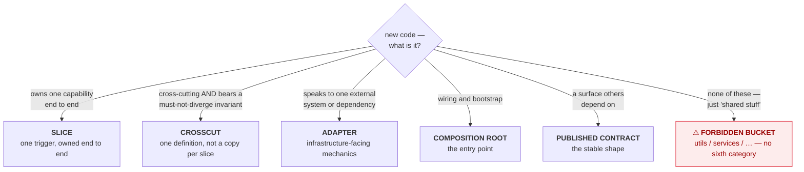
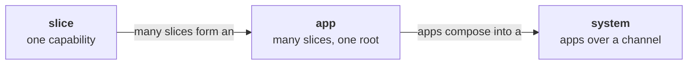

# Coral Architecture — Conventions

<!-- AGENT NOTE (not shown on the rendered site): this file is AUTHORITATIVE for the vocabulary, the
rule-ID scheme, the enforcement classes, the ownership layers, the kernel, and the [AGENT-*] operating
model. Load it before reasoning across documents. ARCHITECTURE.md, PRODUCTION.md and SYSTEM.md defer to
it and must not redefine these. Agent-only hints elsewhere use this same "AGENT NOTE" comment form. -->

This file holds what every other document builds on, so none of them has to repeat it:

- **The vocabulary** — the eight nouns the whole set uses. ([below](#the-vocabulary))
- **The rule-ID scheme** — how rules are numbered and cited, e.g. `[DUP-2]`. ([below](#rule-ids))
- **The enforcement classes** — `[auto]` / `[review]` / `[guide]`. ([below](#enforcement-classes))
- **The operating model** — agents write, and humans review and orchestrate. ([below](#the-operating-model-agents-write-humans-review-agent))
- **The kernel** — the rules Coral would substantially relax without that operating model.
  ([below](#the-coral-kernel))
- **The ownership layers** — which surface each rule belongs to, and so who has to load it.
  ([below](#ownership-layers))
- **What applies to a project** — how a project declares the scopes it adopts, and how the rule set is
  composed from that declaration. ([below](#what-applies-to-a-project))

Three spines refer back here instead of repeating any of it: [`ARCHITECTURE.md`](./ARCHITECTURE.md)
(the kernel-facing app architecture), [`PRODUCTION.md`](./PRODUCTION.md) (the optional production
baseline at app scale) and [`SYSTEM.md`](./SYSTEM.md) (how apps compose into a system). That applies
Coral to Coral: a concern used in many places is defined once and pointed to.

---

## The vocabulary

Eight nouns. Every document uses exactly these, and there are no synonyms.

| Noun | What it is | Governed by |
|---|---|---|
| **slice** | one capability, owned end to end: the trigger it answers, the work that answers it, the output it returns, and its tests | `[BOUND-*]` `[MODEL-1]` |
| **crosscut** | one concern that several slices need (`config`, `errors`, `db`, `money`) | `[XCUT-*]` |
| **adapter** | the infrastructure-facing mechanics that connect application behavior to an external system or dependency (`store`, `s3`, `stripe`) | `[MODEL-4]` |
| **composition root** | the app's wiring and bootstrap boundary, where the parts are brought together and started | `[ROOT-*]` |
| **published contract** | the surface others are allowed to depend on: a slice's public capability, a machine-readable output, an HTTP shape, a library API | `[CONTRACT-*]` |
| **app** | one deployable unit: many slices, one composition root, one set of crosscuts | `ARCHITECTURE.md`, `PRODUCTION.md` |
| **system** | several apps composed together | all of `SYSTEM.md` |
| **channel** | the pathway between two apps, and the contract governing what crosses it | `[CHAN-*]` |

**The nouns name shapes. The rules say how to build them, and most of those rules are optional.** This
table defines the vocabulary and nothing more. It is deliberately thinner than a reader may expect.
`[MODEL-1]` is a **kernel** rule requiring every unit of code to be one of these five, so a definition
that put optional policy into a noun would make that policy binding without being adopted. The
discipline therefore sits with the rules, not with the words:

| The noun says | The governing rules then say |
|---|---|
| a **crosscut** is one concern several slices need | give it a precise, domain- or infrastructure-oriented name (`[XCUT-2]`). Consume it through its published surface, and **inject** anything holding config, a connection or per-trigger state (`[XCUT-3]`). Promote to one only against a must-not-diverge invariant (`[XCUT-1]`, kernel) |
| an **adapter** connects behavior to an external system | the **slice** declares the port and the adapter implements it, so the dependency runs adapter → slice, and the adapter owns no application behavior (`[MODEL-4]`) |
| a **composition root** is the wiring and bootstrap boundary | keep it **thin**: register, construct, inject, bootstrap, with no business logic and no state access (`[ROOT-1]`). Import no persistence or domain-internal module (`[ROOT-2]`) |
| a **channel** is the pathway between apps and its contract | it is the **only** coupling, and apps never share a datastore (`[CHAN-1]`, `[CHAN-3]`). It is versioned (`[CHAN-4]`) and takes one of three forms (`[CHAN-2]`) |

Every rule in the right-hand column is **production baseline** except `[XCUT-1]`. Each binds a project
that has adopted that layer at the relevant scale ([What applies to a project](#what-applies-to-a-project)).
The **Governed by** column above says where each noun's rules live. It does not say that all of them
apply to you. A kernel-only project may use any of these categories, correctly and conformantly, without
taking on the optional discipline attached to them. `[MODEL-1]` asks that every unit of code *fit* one of
the five. It does not ask that a project contain an instance of each, or that the categories be built the
way the right-hand column describes.

Two further terms name what a crosscut is *not*, and they are defined below the canonical slice, where
there is a concrete crosscut to contrast them against: **forbidden bucket** and **drift**.

### "Capability" is scale-relative — always say which scale

`capability` is the one word in this set that means different things at different scales. Conflating
them is how an agent ends up publishing internals. Qualify it:

| Phrase | Means | Consumed by |
|---|---|---|
| *a slice owns a capability* | one user-facing behavior | the app's users |
| *a **feature package's** capability* (production baseline) | one domain area, and the state behind it | its own slices directly, and anything else via a published capability |
| *a slice's **published** capability* | one exported function/entry point of that slice | sibling slices, via `[COMPOSE-1]` |
| *an app's **published** capability* | one endpoint/event on the channel | other apps, via `[CHAN-1]` |

A slice's published capability is **not** automatically an app's published capability. The two are
consumed by different audiences, over different boundaries, and a re-export is not a promotion. What a
project must then *do* about the process boundary is `[CHAN-1]`, a production-baseline rule at system
scale: cross it only through a published channel contract.

### A channel is a published contract at app scale

Two of the eight nouns are the same idea at different ranks, and this section states that rather than
leaving a reader to guess. A **published contract** is the surface a slice or an app *exposes*. A
**channel** is the pathway *between* two apps, and the contract that governs it.

Both exist because a channel carries something a contract cannot: **delivery semantics**. A contract
states the shape. The channel states whether that shape arrives once or twice, in order or not, and
consistently or eventually. That half of the noun has no meaning at slice scale, where a call either
returns or raises.

A channel is not a *broker*. Two apps exchanging requests over plain HTTP are using one. That is the
misreading the noun exists to prevent, and it holds however much of Coral a project has adopted.

**What Coral then requires of a channel is optional policy, all of it.** The three permitted forms
(`[CHAN-2]`), backward-compatible versioning (`[CHAN-4]`), at-least-once delivery and its idempotency
obligation (`[CHAN-5]`), ordering (`[CHAN-9]`) and the absence of a transactional view across apps
(`[CHAN-10]`) are production-baseline rules at **system** scale. They bind a repository that composes
several apps *and* has adopted the baseline. A project that has done neither still uses the word
`channel` to mean this.

---

## The canonical slice

**The kernel's capability shape is one sentence:** one capability, owned end to end, tests included,
consumed by other code only through what it publishes (`[MODEL-1]`, `[BOUND-2]`, `[COMPOSE-1]`,
`[TEST-1]`). That is the shape of the *unit*, and it is deliberately short. It is **not** the whole
kernel: an app or package also owes one declared, structured error model of its own, presented at a
boundary rather than inside a slice (`[ERR-1]`), the gate on promoting anything to a crosscut
(`[XCUT-1]`), and the `[AGENT-*]` and `[VER-*]` rules that govern how it relates to Coral. The
[kernel block](#the-coral-kernel) is the complete list.

> **The listing below is a slice as a project that has adopted the [production
> baseline](./PRODUCTION.md) writes one.** It is the kernel shape *plus* a set of opinions the baseline
> supplies — injected crosscuts, `[ERR-5]`'s recommended six-category vocabulary inside the error model
> the kernel already requires, one effect at the edge, the root doing the rendering, colocated tests
> against real storage, an effect-truthful verb. Each of those is a rule in
> [`PRODUCTION.md`](./PRODUCTION.md) and applies where a project's `CORAL.md` adopts that layer. A
> kernel-only project's slices satisfy the capability shape above and may look nothing like this listing.

Read it before the rules, because the rules are the reasons it is shaped this way. It is
language-neutral. This exact capability is written out in real Python in
[`examples/cli-slice.md`](./examples/cli-slice.md).

```
expense/add                                    # one slice = one capability

  # injected crosscuts, constructed at the root and passed in
  #   money  · parse/format invariant
  #   db     · connection + transaction
  #   errors · taxonomy {category, code, message}

  function run(rawArgs, deps):
    input  = parse(rawArgs)                    # pure
    amount = deps.money.parse(input.amount)    # pure; raises validation/invalid_amount
    if input.category is empty:
        raise deps.errors.of("validation", "missing_category", "category is required")

    record = { amount, category: input.category, date: input.date }   # pure

    deps.db.tx(conn => insertExpense(conn, record))   # the one effect, at the edge
    return Result.ok({ id: record.id, amount, category, date })       # the root renders

  test "expense add records and is observable":    # colocated
    out = run(["--amount","12.50","--category","food"], realTempDeps())
    assert out.exitCode == 0
    assert out.json == { id: any, amount: "12.50", category: "food", date: any }
    assert queryExpenses().contains(food, 12.50)   # real storage
```

**Three of its properties are the kernel's**, and hold for any Coral codebase: `expense/add` owns one
capability from its trigger to its output (`[BOUND-2]`), its behavior is asserted at that entry point
against what a caller can observe (`[TEST-1]`), and it constructs its failures through this app's one
declared error model rather than inventing a local one, and presents none of them itself (`[ERR-1]`).

**Five are the production baseline's**, and they are what makes the listing look the way it does:

- parse, validate and compute are **pure** (`[EFFECT-1]`)
- the single effect sits at the **edge** (`[EFFECT-2]`)
- crosscuts are **injected**, never reached for (`[XCUT-3]`)
- the root is the boundary that renders, and nothing else does (`[ERR-3]`), over a taxonomy carrying
  `{category, code, message}` (`[ERR-2]`) with `[ERR-5]`'s recommended category names
- the test runs against real temporary storage (`[TEST-2]`, `[TEST-4]`)

The verb `add` truthfully signals a non-idempotent operation (`[IDEM-1]`). A project that has not adopted
the baseline owes none of these.

`money`, `db` and `errors` above are crosscuts: each names one concern and is defined once. That is what
makes the two remaining vocabulary terms legible, because both are named for the shape a crosscut is not:

- A **forbidden bucket** is a would-be crosscut with no precise name and no injection discipline:
  `utils`, `shared`, `common`, `services`, `helpers`, or generic `models`. The *term* is vocabulary. The
  *prohibition* on creating one is `[BUCKET-1]`, a production-baseline rule.
- **Drift** is what happens when one concern is re-implemented per slice instead of held in one
  definition. The copies diverge, and the divergence is a bug. Naming it is what lets `[XCUT-1]` state
  its second prong, that a crosscut must enforce something that would be a bug if it diverged.
  `[XCUT-4]` develops the point in the baseline.

---

## Placing new code

Almost every placement question is one of six outcomes. Five are the categories of code `[MODEL-1]`
recognises. It is a kernel rule, so the question has these five answers for every Coral codebase. The
sixth is the shape none of them covers.



When more than one fits, or none cleanly does, **flag it** (`[AGENT-2]`) rather than guess.

`[MODEL-1]` says there is no sixth category, which is why "shared stuff" has no box of its own. The
stronger claim is `[BUCKET-1]`, a **production-baseline** rule enforceable by a linter: *do not create or
expand* `utils`, `services`, `helpers`, `common`, or generic `models`. A project owes it once it has
adopted that layer.

The boxes are the categories, not the discipline. Which one a unit of code *is* has a kernel answer. How
it must then be built is the production baseline's answer, and none of it is needed to place the code:
the port declared by the slice rather than by the adapter (`[MODEL-4]`), the crosscut injected and
precisely named (`[XCUT-3]`, `[XCUT-2]`), and the root kept thin (`[ROOT-1]`).

Under the **production baseline**, slices are grouped into **feature packages**, and the two are not the
same thing. This diagram used to label the slice box "a feature package", which is where the confusion
started. The package groups the slices of one capability and owns the state behind them (`[STRUCT-2]`,
`[STATE-5]`). The slice owns one trigger. The package is a container, not a category of code, which is
why `[MODEL-1]` does not list it. A project that has not adopted the baseline has the slice without
owing the container.

One shape repeats at every scale — slice, app, and system alike:

1. **Own your trigger end to end**: the one request, command, or event you answer. (`[BOUND-2]`, kernel)
2. **Consume other units through what they publish**, never by reaching into their internals.
   (`[COMPOSE-1]`, kernel. Sharing through a named crosscut rather than a copy is `[XCUT-1]`, also
   kernel.)
3. **Between apps, that surface is a channel**: the contract governing what crosses the process
   boundary.

The first two bind every Coral codebase. The third is the vocabulary. The enforceable policy is
`[CHAN-1]` and `[CHAN-3]`: apps communicate *only* through a channel and never share a datastore. Those
are **production-baseline** rules at **system** scale. A one-app repository has no channel at all, and a
project that has not adopted the baseline is not held to them.



---

## Rule IDs

Rules carry stable IDs like `[DUP-2]`, namespaced by family (`SCOPE`, `BOUND`, `DUP`, `CHAN`, …). Cite
them in reviews and commit messages so feedback is unambiguous ("this violates `[BUCKET-1]`"). On the
live site every citation links to its definition.

**One rule, one ID.** A rule is defined in exactly one place and cited everywhere else. There are no
alias IDs — no second family that restates an existing rule under a new name — because two IDs for one
rule make findings unsearchable and let the two copies drift.

**IDs are permanent.** They are never renumbered, never recycled, and never removed. See `[VER-1]`. That
is why `[IDEM-6]` sits out of numeric order: it was appended rather than inserted.

**The spines use separate families.** App families live in `ARCHITECTURE.md`, `PRODUCTION.md` and the
appendices (`CLI-`, `BE-`, …). System families live in `SYSTEM.md` (`CHAN-`, `ORCH-`, `SYS-TEST-`). The
dependency points **one way**: neither app-scale spine **ever** cites a system rule, so the app model
stays loadable without system concerns. The build enforces this rather than trusting it.
`ARCHITECTURE.md` had been citing `[ORCH-1]` in prose until the gate was added. `SYSTEM.md` may cite app
rules, because it builds on them. An **appendix** may cite system rules where its app type reproduces
the system pattern internally. A microfrontend web app is a browser-scale system of panels over a
channel, so `web.md` legitimately references `[CHAN-*]` and `[SYS-TEST-*]`.

## Enforcement classes

Each rule carries **exactly one**, and the docs build fails otherwise:

- `[auto]`: statically checkable. A linter can decide it without judgment.
- `[review]`: needs LLM or human judgment.
- `[guide]`: rationale or principle. It shapes decisions but is not a pass/fail gate.

The class is read from the [metadata slot](#where-a-rule-s-layer-is-recorded) next to the rule ID, so a
rule that *discusses* `[review]` in its prose neither gains a second class nor supplies a missing one.

The resulting coverage map shows which rules a tool can enforce and which depend on a reader following
them. Classify honestly. A rule marked `[auto]` that no linter could decide is a promise the architecture
cannot keep, and it costs more credibility than an honest `[review]`.

A new convention becomes a clean unit of work: new rule ID → new `[auto]` check (or `[review]` note) →
enforced going forward.

## Prose vs. contract

Each document has two layers, and the build enforces the relationship between them:

- The **prose sections** define each rule and explain *why* it exists. Every rule is defined here,
  once. The first sentence of a rule is the rule, complete and quotable on its own. Qualifications,
  examples, and cross-references follow it as commentary.
- The **Agent Execution Contract** is the condensed, **complete** normative checklist. Every `[auto]`
  and `[review]` rule in the document appears in it, so an agent that loads only the contract has the
  whole normative surface and misses nothing. `[guide]` rules are rationale and stay in the prose.

Completeness is checked at build time, so a new rule cannot be added without wiring it into the
contract. Reviewers walk the same contract and cite the same IDs, and there is no separate review
checklist to drift against. Every document carries one: the spines, this file for its `[AGENT-*]` and
`[VER-*]` rules, and each appendix. Contracts **add up** rather than replacing one another, and a
project loads exactly the ones its `CORAL.md` adopts. Building a CLI on the baseline means
`ARCHITECTURE.md`'s contract, which is unconditional, plus `PRODUCTION.md`'s and `appendix/cli.md`'s.

[`rules.md`](./rules.md) is the cross-document view: every rule, its class, and its one-line statement
on one page. It is generated from these contracts, so it cannot drift from them.

---

## The Operating Model: Agents Write, Humans Review  `[AGENT-*]`

This is about **agents as authors**. At *build time*, agents write the code, and humans review and
orchestrate. Do not confuse it with **agents as runtime components**, where the running app itself uses
a model. That is a different axis, covered by
[`appendix/agentic-app.md`](./appendix/agentic-app.md). Both are governed by the same *harness* pattern.
This document set is the build-time harness, and an agentic app is the run-time one.

**The division of labour is what motivates the kernel**, and the kernel alone. Coral's unconditional
constraints protect four properties. Each is a property of *this* way of working rather than of software
generally:

- **Context-window economy.** One slice owns the complete behavior specific to its trigger, and what it
  needs from outside itself is explicit: a shared concern promoted to a crosscut (`[XCUT-1]`), or another
  slice's published capability (`[COMPOSE-1]`). The set an agent must load to be correct is therefore
  bounded and knowable, rather than discovered halfway through. The production baseline goes further. It
  physically colocates the behavior the slice owns, and prescribes how the surrounding packages and
  directories are organized. Dependencies outside the slice stay outside it, and stay explicit.
- **A bounded amount of code affected per change.** Behavior specific to one trigger changes in the slice
  that owns it, so the reviewer's audit surface is bounded and the diff stays legible. A change to a
  shared concern or a published contract is legitimately wider. What the kernel prevents is an
  *unbounded* change, where a trigger's behavior turns out to have been scattered.
- **Deterministic architectural placement.** "Where does this go?" collapses to "which of the five roles
  is it?" (`[MODEL-1]`), a finite question with a knowable answer rather than an open-ended one. Fewer
  degrees of freedom means fewer wrong guesses. *How* that role then maps onto packages and directories
  is production-baseline policy, not part of this property.
- **Self-verification.** A slice exposes an observable contract the agent can assert against by running
  it, which closes the loop without trusting internal state (`[TEST-1]`). The same idea across a process
  boundary is `[SYS-TEST-1]`, a production-baseline rule at system scale. The property is the kernel's,
  and the system-scale realization is adopted.

**Everything else Coral publishes is justified some other way, and adopted separately.** A small, named
subset of rules owes its presence, or its strictness, to this division of labour. The
[Coral kernel](#the-coral-kernel) below names exactly which, and how to tell them apart, and that block
is the only record of the membership. **Every other rule** is stated at the strength it is for reasons
that survive a human author: the production baseline because the *software* needs it, an app profile
because that app *shape* needs it, and the runtime-agent profile because a *running* model needs it. None
of them is a consequence of who typed the code, and a project takes each on deliberately
([What applies to a project](#what-applies-to-a-project)).

**`[AGENT-1]` `[guide]` `{governance}`** — Prefer the structure that minimizes an agent's placement and
cross-file-reasoning decisions, even at the cost of some duplication.

**`[AGENT-2]` `[review]`** — **Flag, don't guess.** When a decision is genuinely ambiguous, take the
**reversible** option, leave a clearly marked note such as a `REVIEW:` comment citing the relevant rule
ID, and surface it for human review. Do not pick silently and bury the decision.

Ambiguous cases include a new slice against extending an existing one, duplicating against promoting to
a crosscut, and one slice against a split into another app.

**`[AGENT-3]` `[guide]` `{governance}`** — Do not over-comply literally. A rule that forbids generic
buckets does not mean contorting code to avoid a legitimate crosscut. A rule that tolerates duplication
does not license copying a large invariant-bearing block. When the letter and the intent diverge, follow
the intent and apply `[AGENT-2]`.

**`[AGENT-4]` `[review]`** — An agent never authors an exception or an extension. It flags per
`[AGENT-2]`, and a **human** decides and records the decision.

This is the guard that holds the loop together, and it is the one a helpful agent is most likely to
violate. Writing "we deviate here because X" is legislating, and an agent that can legislate has removed
the humans-review half of the operating model. Propose the wording if asked. Never commit it.

**`[AGENT-5]` `[review]` `{governance}`** — Read the project's `CORAL.md` before escalating. A documented
exception or extension is a settled decision and is not raised again.

Without this the loop never converges: the same ambiguity bubbles up every time a new agent meets it, the
human answers it again, and the accumulated decisions buy nothing. Escalate what is genuinely unsettled.

---

## Versioning and local deviations

Coral is versioned because it will be **incomplete**. Rules will be missed, new patterns will need
covering, and some rules will turn out to be wrong. A project therefore needs to say which Coral it
follows, and to record where it knowingly differs. Otherwise "conforms to Coral" is not a checkable
claim.

What changed lives in [`CHANGELOG.md`](./CHANGELOG.md), recorded per rule ID.

### Two versions: released and working

`[VER-3]` makes version identity part of applicability, and `[VER-6]` makes it part of the record
schema too, so it has to be said exactly which version is meant. Coral has two at any moment, and they
are not interchangeable:

- the **latest released version** is what `VERSION` holds. It moves when a batch is cut, not when a
  commit lands. The Unreleased section of the changelog covers the interval. **This is the only version
  a consuming project can target**, because it is the only one that is published and frozen. A worked
  example or a skill that says *"Written against **Coral x.y.z**"* names this one. The marker tells a
  reader which Coral the page is good for, and a reader can only pin a release.
- the **working version** is the rule set the documents in the tree currently describe. Between releases
  that is a successor to `VERSION`, named by the changelog's Unreleased heading, such as
  `## Unreleased — 0.7.0`. Live development docs on `main` therefore describe a version nobody has
  released yet, and a rule that is in them may not be in any release. A `targets:` line in an adherence
  record is resolved against this one, which is why records kept *inside* this repository may name it and
  a project outside cannot.

When a batch changes no rule, the heading names no version, as a bare `## Unreleased`, and the two are
the same. **That bare heading is a statement, and it is required.** A changelog with no Unreleased
heading, or no changelog at all, is not a tree asserting that it is still the released version. It is a
tree that has not said, and the build refuses it. The difference matters because the silent reading is
the dangerous one. A tree still holding unreleased rules, but identifying as the release before them,
would let a record targeting that release resolve against rules that were never in it. That is the
failure the identity exists to prevent, arriving through a deleted file.

Everything mechanical follows from that split. `scripts/version.mjs` reads both. The canonical rule
model carries the working version as its identity. Every applicability resolution compares a record's
target against it. See [What applies to a project](#what-applies-to-a-project).

**`[VER-1]` `[auto]` `{governance}`** — Rule IDs are append-only: never renumbered, never recycled, never
removed. A withdrawn rule keeps its ID and is marked retired in place.

A project's `CORAL.md` records "breaks `[STATE-5]`", and that citation has to mean the same thing in five
years. `rules.lock` is the checked-in record of every published ID and its class. The build fails if one
disappears, gets reclassified, or is added without the lock being regenerated. That forced step is where
the changelog entry and the version bump get remembered.

**`[VER-2]` `[review]` `{governance}`** — A change that **adds, tightens, or retires** a rule is a
**major** version, a change that **loosens or clarifies** a rule, adds an appendix, or adds a `[guide]`
rule is **minor**, and prose that leaves conformance unchanged is **patch**.

Adding a rule is a breaking change, because a rule is a **constraint**. It is closer to adding a
required field than to adding an API endpoint. Code that conformed yesterday can fail today.

**While the version is `0.y.z`, the rule set is not yet stable** and a change that would be major bumps
the **minor** instead (`0.1.0` → `0.2.0`), per semver's major-version-zero clause. That is the accurate
state while appendices are still being filled. Rules are still arriving in batches, and spending a major
per batch would put Coral at version 6 with nothing stable to show for it.

**`1.0.0` is cut when every *core* appendix is complete**, meaning every slot either carries an app-type
rule or an explicit "spine-sufficient" note. That is a checkable condition, so the promise `1.0.0` makes
is a real one. From there, an added rule costs a major, and a project can pin with confidence.

**An appendix marked ADDENDUM is outside that condition, and outside the version discipline.** An
addendum covers an app type nobody here has built yet. It is written from reading rather than from
experience, it is expected to be wrong in places, and it may change substantially without a major bump.
Rule IDs in an addendum are still permanent (`[VER-1]`), so a citation of one stays valid. Its *content*
carries no stability promise, and a project adopting it should say so in its `CORAL.md`.

Writing a blueprint for something you have not built produces speculation in the form of guidance, and an
agent cannot tell the difference from the page. The ADDENDUM label is how it tells the difference. An
addendum graduates to a core appendix when someone has built the thing and the rules survived contact
with it.

**A version marks a release, not a commit.** Bumping per commit would put a version number on every typo
and make the changelog unreadable. That defeats its one purpose, which is telling a consuming project
what it must newly satisfy. Changes accumulate under **Unreleased** in
[`CHANGELOG.md`](./CHANGELOG.md), and the bump happens when the batch is cut. `rules.lock` still moves
with the commit that changes a rule, because its job is to catch an ID vanishing, not to track
releases.

**`[VER-3]` `[review]`** — A project states the Coral version it targets, and an audit is performed
against that version.

Without a declared target, every Coral change silently invalidates every project's audit, and "we are
Coral-conformant" becomes an unverifiable claim. With one, upgrading is a deliberate act with a readable
diff: *4.0 added `[CONC-1..5]`, and here is what that means for us.*

**`[VER-4]` `[auto]` `{governance}`** — A project's own rule IDs are namespaced by a project prefix and
never reuse a Coral family name.

`ACME-1`, not `XCUT-9`. A project that invents an ID in a Coral family collides the day Coral adds that
number, and the collision is silent: two documents, the same citation, and a different rule.

The typography above is deliberate. An **illustrative** ID is written bare (`ACME-1`), while a
**citation** is bracketed (`[VER-4]`). Only the bracketed form is a reference the build resolves, so a
hypothetical ID written as a citation fails the build. That is how this paragraph was caught while being
written.

**`[VER-5]` `[auto]`** — Every exception and extension in `CORAL.md` is recorded as a **machine-readable
entry naming the rule ID it concerns and the path it scopes**.

An exception a tool cannot read is an exception the tool re-reports forever. `coral-lint` has no way to
honour a decision written as prose, so an approved `internal/models` package fails the gate on every run.
The team then learns to ignore the output, and the register stops being believed, which costs more than
the original violation. The same applies to agents. `[AGENT-5]` tells one to read `CORAL.md` before
escalating, and that loop only converges if the file can be read the same way twice.

Four properties make an entry usable, and they are what the format exists to force:

- it is **attributable** to a rule ID, so a finding and a decision can be matched
- it is **scoped** to a path, so it excuses one place rather than a habit
- it is **explicit**, so nothing is excused by silence
- it is **visible**, because a decision recorded where nobody loads it is not recorded

**Scope narrowly.** `path: internal/models` excuses a decision. `path: "**"` excuses the rule, and a
project that needs that has an amendment to file (below), not an exception to record. This is statically
decidable: the block parses, its rule IDs resolve against `rules.lock`, and its paths exist.

**Both records are path-scoped, and an extension no less than an exception.** An extension without a
path is a project-wide rule recorded in a format that promises a scope, and a tool that has to guess
which files it binds will guess differently from the human who wrote it.

**`[VER-6]` `[auto]`** — A project's `CORAL.md` **declares the non-kernel Coral scopes it adopts**, and
the scales it adopts them at. A Coral rule is applicable to that project only through kernel membership
or through that declaration at the rule's scale.

`[VER-3]` pins *which Coral*. This pins *how much of it*. Both are needed, and neither implies the
other. Two projects on the same version can owe different rule sets, and the difference is a decision
somebody made rather than a property of the repository the rules are published from. Without the
declaration, the question "what rules apply here?" has no answer that does not involve guessing, and
guessing has only bad options. Auditing against everything Coral publishes charges a CLI for HTTP status
codes, and a one-app repository for channel versioning. Inferring the answer from the repository's
contents makes applicability move whenever a directory is renamed. Both are silent, and both put a rule
in front of an agent that no human ever agreed to.

The declaration is what makes **adding** to Coral safe. A new app profile, a new optional layer, and a
new rule inside a layer a project has not adopted all reach an existing project only when that project
edits its own `CORAL.md`. Applicability grows by a decision, never by a release. That is the same
guarantee `[VER-3]` gives for the version, one axis over.

It is `[auto]` because it is statically decidable, and it must be decided the same way twice: the block
parses, every scope key it names is a layer the target version publishes, every profile it names is
registered there, and every scale it names exists. A missing or invalid declaration is a **configuration
finding**, because the project has an undeclared normative surface. It is not a licence to substitute a
default. Silence is not the same decision as `adopts: {}`, and a tool must not read it as one.

[What applies to a project](#what-applies-to-a-project) gives the schema, the composition algebra, and
what the scopes mean.

### Three kinds of divergence

| | What it is | Where it is recorded | Who decides |
|---|---|---|---|
| **Exception** | Coral has a rule, and this project knowingly breaks it for a trade-off | the project's `CORAL.md` | a human on the project |
| **Extension** | Coral has no rule, this project needs one, and it stays local | the project's `CORAL.md` | a human on the project |
| **Amendment** | Coral has a rule and **the rule is wrong or too narrow** | an issue or PR on the Coral repo | Coral's maintainers |

An **amendment is not recorded in the project.** It is an outbound proposal, referenced from the entry
that motivated it. `[MODEL-2]` was an amendment. It forbade layering outright, the correct Go shape
violated it, and the rule was wrong rather than the code. Had that been filed as a per-project exception,
every Go project would have carried the same exception forever, and the defect in the rule would never
have surfaced.

**Drift is not an exception.** A deviation nobody chose is a finding to fix. Only a deliberate decision
qualifies. Otherwise the register accumulates violations, and the architecture becomes advisory.

**An exception names an `[auto]` or a `[review]` rule.** A `[guide]` is rationale rather than
instruction. It is in no Agent Execution Contract and is never reported as a violation, so there is
nothing for an exception to excuse. An entry naming one is refused, because it records a deviation from
a rule nobody could have been in breach of. If a guide's reasoning does not fit the project, the prose
below the block is where that is written. A rule that ought to be normative and is not is an
amendment.

### `CORAL.md` — the project's adherence record

One file, in the consuming project's root, holding both record types. One file rather than two because
of `[AGENT-1]`. The agent's question is *"what rules apply here?"*, and that should be one load with one
answer. An agent that read only half would have a wrong picture of what is permitted.

<!-- coral:adherence:start -->

````markdown
# Coral adherence

```yaml coral
# Which Coral this project is audited against ([VER-3]).
targets: "0.7.0"

# Which architectural scales this repository is written at. One deployable app, so
# `app` alone — there is no channel here for a system-scale rule to bind.
scales:
  - app

# Which non-kernel Coral scopes this project adopts, named by ownership key ([VER-6]).
# The kernel is implicit and is not listed. `framework-governance` is not an
# application conformance layer and cannot be listed. A key that is absent is not
# adopted. A missing `adopts` block is an error, not "adopt everything".
adopts:
  production-baseline: true
  app-profile:
    - cli
  language-binding: []
  runtime-agent-profile: false

# Exceptions — Coral rules this project knowingly breaks, inside one subtree.
exceptions:
  - rule: STATE-5
    path: internal/billing
    reason: two slices co-own the invoice table while the split is in flight
    decided_by: <name>
    decided: 2026-08-18
    revisit_when: the reconciliation slice lands
    upstream: candidate

# Extensions — local rules Coral does not have. Namespaced per [VER-4] and scoped
# to a path per [VER-5], exactly as an exception is.
extensions:
  - rule: ACME-1
    path: internal/billing
    statement: <the rule, stated as a rule>
    reason: why Coral does not cover it · which families it touches
    upstream: not-a-candidate    # not-a-candidate | candidate | proposed | landed
```

Prose below the block carries what the fields cannot: the trade-off in full, the
history of a decision, a diagram. The block is the record; the prose is the why.
````

<!-- coral:adherence:end -->

Coral's own build checks the block above. It is parsed with the same resolver a consuming project's
tooling uses, and every key, profile name and scale in it is resolved against this version's registries.
A worked example of a machine-readable format that the machine has never read is a format with one
untested user.

That is why its `targets` names the version **these documents currently describe**, and not necessarily
the one in `VERSION`. Between releases those differ, and a record is always resolved against the rule set
it targets. Your project pins a released version.

What `adopts` and `scales` mean, and how the rule set is composed from them, is in
[What applies to a project](#what-applies-to-a-project). The short version: the kernel applies without
being named, everything else applies because it is named here, and nothing applies because it exists in
the Coral repository.

Two fields carry weight beyond their own entry. The **`upstream` disposition** is what makes the loop
run. The same exception appearing across several projects, all marked `candidate`, is the signal for an
amendment. When the amendment lands, the entries are deleted and the projects bump their target. **The
register shrinks when Coral improves**, which is what stops it growing without limit.

**`revisit when` is a condition, not a date.** Dates get renewed rather than acted on. *"When a third
slice needs this"* or *"when we split the shared datastore"* is a trigger someone will reach.

The worked examples and the audit skill each state the **latest released** Coral they were written
against, which is the cheapest available test that this convention is usable. A page that already
implements a rule from the unreleased working version says so in prose rather than declaring a version
nobody can pin.

---

## The Coral kernel

Coral's rules are not all here for the same reason. A **kernel rule** is one whose **presence or
strictness is materially justified by the operating model**:
[agents author the code while humans retain architectural authority](#the-operating-model-agents-write-humans-review-agent).
Remove that premise and Coral would **substantially relax** the constraint.

Note what that does *not* claim. A human-authored codebase has its own reasons to encapsulate
(`[COMPOSE-1]`), to test behavior (`[TEST-1]`), and to be careful about abstraction (`[XCUT-1]`). Several
kernel rules would still be good advice. What changes without the premise is how *hard* Coral has to
insist, and whether the rule needs to be normative at all rather than a matter of taste. The kernel is
the set where the answer is "hard, and normative, because of who is writing."

**"Kernel" does not mean "the most important rules."** `[TRUST-1]` matters more to a running system than
anything below it. Get the trust boundary wrong and the system is unsafe, while getting `[MODEL-1]` wrong
only makes it hard to change. Kernel membership answers a different question: *why is Coral imposing
this, at this strength?*

The kernel is a **named subset of existing rules**, never a family of its own. There are no `KERN-*` IDs.
**One rule, one ID** ([above](#rule-ids)) forbids a second family that restates rules defined elsewhere,
and an alias is a copy that will drift from the rule it aliases. Every ID below is a **citation**. Each
rule's normative statement lives at its own definition and nowhere else, including here.

### Membership test

A rule is a kernel rule only when **all four** hold:

1. **Agent-justified.** Its presence, or the strictness at which Coral states it, materially comes from
   agents authoring code while humans retain architectural authority, rather than from the code being
   software. The test is a counterfactual. Drop the premise, and ask whether Coral would substantially
   relax this rule.
2. **Protects a defended property.** It directly protects at least one of the six below.
3. **Not merely general correctness.** It is not a general software-correctness, distributed-systems, or
   security rule, and not a stack- or app-type-specific convention.
4. **Not downstream of another kernel rule.** It cannot reasonably be read as an enforcement mechanism
   or a refinement of one.

The **defended properties** are the operating model's four properties, restated at the grain a single
rule can be tested against, plus drift, which is the failure the vocabulary already names:

| Property | What it keeps true | Operating-model property |
|---|---|---|
| **locality** | one slice is the clear owner of a trigger's behavior | context-window economy |
| **bounded context** | what an agent must load in order to be correct is finite and knowable | context-window economy |
| **deterministic placement** | "which of the five roles is this?" has one answer | deterministic architectural placement |
| **reviewability** | the architectural decision is visible in the diff a human reads | a bounded amount of code affected per change |
| **self-verification** | the agent can close its own loop by running the thing | self-verification |
| **drift prevention** | copies of one concern cannot silently diverge | drift (`[XCUT-4]`) |

### The kernel rules

<!-- coral:kernel:start -->

| Rule | Why it is kernel | Properties defended |
|---|---|---|
| `[BOUND-2]` | Gives the agent one capability-sized unit to understand and modify end to end. | locality, bounded context, reviewability |
| `[MODEL-1]` | Gives new code a finite set of architectural roles instead of an open-ended placement decision. | deterministic placement |
| `[XCUT-1]` | Stops similarity-driven extraction from becoming global abstraction: sharing requires a must-not-diverge invariant. | locality, drift prevention |
| `[COMPOSE-1]` | Preserves context boundaries — another slice is consumed through its published capability, without loading its internals. | bounded context, reviewability |
| `[ERR-1]` | Gives the agent one finite failure vocabulary per app or package, and presentation owned by a boundary rather than by slices, instead of a local error convention discovered slice by slice. | bounded context, reviewability, drift prevention |
| `[TEST-1]` | Gives the authoring agent an executable feedback loop against observable behavior. | self-verification, reviewability |
| `[AGENT-2]` | Makes an ambiguous architectural decision visible to a human reviewer instead of a hidden guess. | deterministic placement, reviewability |
| `[AGENT-4]` | Reserves architectural legislation — exceptions and extensions — for humans. | reviewability, drift prevention |
| `[VER-3]` | Fixes the normative Coral version an agent follows, so its architectural context cannot change implicitly. | drift prevention |
| `[VER-5]` | Persists human architectural decisions as explicit, scoped data rather than tribal knowledge. | bounded context, reviewability, drift prevention |
| `[VER-6]` | Fixes how much of Coral an agent is answerable to, so applicability cannot be inferred from what the Coral repository happens to contain. | bounded context, drift prevention |

<!-- coral:kernel:end -->

The block above is the **only** place kernel membership is recorded, and the build reads it. There must
be exactly one such block. Two would leave a fully visible table contributing nothing, with no way to
tell which one counted. Every line between the markers has to be accounted for, and each of the following
fails the build:

- a definition line, because the kernel cites rules and never restates one
- a row whose ID is not a backticked citation
- a row with the wrong number of columns
- a duplicated rule
- a header or delimiter that does not carry the same three columns as the rows
- prose inside the markers
- an ID no rule defines

Failing on a *malformed* row rather than skipping it matters, because skipping is how a rule leaves the
kernel silently while the table still reads correctly to a human. [`rules.md`](./rules.md) marks them
from this same block rather than from a second list, so changing the kernel produces a reviewable diff in
a generated file. That is the forcing step `rules.lock` gives a rule change.

`[VER-3]` is in the kernel for determinacy, not for process. The pinned version makes "the rules that
apply here" a stable, deterministic set rather than whatever `main` says today. It is mapped to **drift
prevention** alone. Pinning does not reduce how much an agent must load, so it does not defend bounded
context. What it prevents is the rule set moving underneath a project whose conformance was checked
against an earlier one.

`[VER-6]` is the other half of the same determinacy, on the other axis, and it *is* mapped to bounded
context. `[VER-3]` fixes which Coral, and `[VER-6]` fixes how much of it. Neither implies the other,
because two projects on one version can owe different rule sets. Without the second, "what applies here"
is answered by whoever is reading, which is not a stable set at all.

`[ERR-1]` is the one kernel rule about a concern that is otherwise general correctness, so its membership
is worth stating against all four tests. **Agent-justified:** drop the operating model and Coral would
say "have a coherent error strategy" and leave it there. Keep it, and the vocabulary has to be finite and
declared, because an agent writing the next slice either loads one small set or reconstructs local
convention from whatever the neighbouring slices happened to do. **Defended properties:** bounded context
(one vocabulary per app or package to load, rather than a per-slice discovery), reviewability (widening
the taxonomy or moving presentation lands as an architectural diff, not as a line inside one handler),
and drift prevention (categories, construction and presentation cannot diverge slice by slice). **Not
merely general correctness:** the rule constrains *where the vocabulary is declared and who presents it*,
which is a placement and ownership constraint. Whether the app then retries, logs or wraps is not its
business, and neither is the shape of the value. **Not downstream:** nothing else in the kernel implies
it. `[ERR-2]` is downstream of it, which is exactly why `[ERR-2]` stays in the production baseline.

The rest of the `[ERR-*]` family is outside the kernel and stays there. `[ERR-2]` is the concrete shape
and the static enforcement of `[ERR-1]`, `[ERR-3]` is the baseline's realization of its presentation half
for an executable application, `[ERR-4]` is
transaction policy for batches, and `[ERR-5]` is the recommended category vocabulary. A project reaches
all four by adopting the production baseline, and none of them by adopting nothing.

### Everything else

**Non-kernel does not mean weak, and it does not mean advisory.** Kernel membership classifies *why
Coral imposes a rule, and at what strength*. It never classifies how hard the rule binds once it binds. A
non-kernel rule is fully normative for a project that has adopted the layer or profile contributing it,
at a scale where that rule applies. Once applicable, an `[auto]` rule outside the kernel is enforced
exactly as an `[auto]` kernel rule is, and a `[review]` one takes the same judgment.

**What decides advisory is the enforcement class, not the layer.** `[guide]` rules are rationale and are
never a pass/fail gate ([above](#enforcement-classes)), inside the kernel or outside it — `[ERR-5]`'s
recommended error-category vocabulary is production baseline *and* advisory, and a project that declares
a different taxonomy fails nothing. The sentence above is about `[auto]` and `[review]`, which are the
classes that instruct.

What differs is **how a rule enters a project's normative surface**, and that is a separate axis from
strength. The kernel enters without a decision. Everything else, the production baseline included, enters
because the project's `CORAL.md` says so (`[VER-6]`,
[What applies to a project](#what-applies-to-a-project)). "Non-kernel" therefore says nothing about
whether a given project owes the rule. It says the project's own declaration answers that, and until it
does, the rule is not part of that project's surface at all. Publishing a rule here is not what makes it
apply.

With that distinction held, here is *why* each remaining rule is outside the kernel. Every one is one or
more of:

- **a refinement of a kernel constraint.** `[STRUCT-1]` and `[STRUCT-2]` refine locality, meaning where
  the slice and its tests physically sit. `[GROW-2]` does the same: answer file growth inside the slice,
  never with a global abstraction. `[DUP-2]`, `[DUP-3]` and `[DUP-4]` refine the extraction discipline
  `[XCUT-1]` states. `[TEST-2]`, `[TEST-3]` and `[TEST-4]` refine `[TEST-1]`. `[GROW-3]` refines the
  split discipline that keeps a bounded context bounded: domain densification is a `[SCOPE-3]` signal,
  not a licence to build a shared core.
- **static or mechanical enforcement of a kernel constraint.** `[BUCKET-1]` mechanically reinforces
  deterministic placement and controlled sharing. It is the check that catches the failure `[MODEL-1]`
  and `[XCUT-1]` describe.
- **general application correctness.** Purity and effect placement (`[EFFECT-*]`), the error-model
  refinements and category vocabulary (`[ERR-2]`–`[ERR-5]`), caching, and concurrency (`[CONC-*]`).
- **security or trust-boundary correctness.** `[TRUST-1]`, `[TRUST-2]`, and the status-code and
  authorization rules in the appendices.
- **distributed-systems correctness.** Channel semantics (`[CHAN-5]`, `[CHAN-9]`, `[CHAN-10]`),
  idempotency (`[IDEM-*]`), and observability across apps (`[OBS-*]`).
- **an app-type-specific convention.** The appendix families (`[CLI-*]`, `[BE-*]`, `[WEB-*]`,
  `[LIB-*]`, `[GHA-*]`).
- **a runtime-AI convention.** `[AGENTIC-*]`, and `[ORCH-4]`, `[ORCH-5]` and `[ORCH-6]`, which apply
  only when the running system employs a model.
- **a system-scale convention.** The rest of `[ORCH-*]`, and `[SYS-TEST-*]`.
- **implementation guidance.** `[AGENT-5]` is operating protocol around the decisions `[VER-5]`
  persists: read them before escalating. `[GROW-1]` ("start small: one file per slice") is a starting
  default, not a constraint.

Concurrency, idempotency, error enforcement and vocabulary, caching, security, channel semantics and
observability are required Coral rules. They are not kernel rules, and importance is not the reason
either way. Coral states them at the strength it does because the *system* needs them, not because of who
typed them. A
project that adopts the production baseline owes every one of them as hard as it owes `[MODEL-1]`.

That list says *why* a rule is not kernel. [Ownership layers](#ownership-layers), below, says something
narrower and machine-readable: which projects have to load it.

---

## Ownership layers

The kernel answers *why* Coral imposes a rule. This answers a different question: **who has to load it
at all.**

No single project is the audience for every rule Coral publishes. A CLI with no runtime model has no
reason to read `[AGENTIC-*]`. A library has no reason to read HTTP status codes. A one-app repository has
no channel to contract-test. The rule-numbering discipline constrains no application's source at all.
Left unstated, all of them arrive as one undifferentiated set, and the reviewer's real budget is spent on
rules that were never about them. That budget is the `[review]` rules, which need judgment one at a
time.

So every rule carries exactly one **ownership layer**: the narrowest surface that justifies it.

This table is the **authoritative** taxonomy, and the build reads it. The tooling carries no
exhaustive list of valid layers. Adding one is a registry change, never a JavaScript
vocabulary change, because two lists of one vocabulary is how a renamed layer keeps passing
every check. The build's *tests* do hold a required subset of the machine keys already
published, so an existing key cannot be silently renamed. That is a compatibility lock rather than a
second authority, and it does not have to grow when a layer is added. Five of the table's
columns are machine facts:

- **Key**: the layer's stable machine identity, and what a tool switches on. It is stated
  here rather than derived from the other columns, so that the other columns can move. The
  **Layer** name is presentation text and may be reworded, and a **Tag** may be renamed,
  without either changing what a resolved scope reports. It is written as a code span holding one
  lowercase hyphen-separated token, unique across the table. The cell is matched whole, so a
  malformed one is refused rather than corrected into a key nobody wrote. **Adding a key is
  supported. Changing a published one is a compatibility break**, because external tooling switches
  on it. A rename is therefore a version-relevant change under `[VER-2]`, and it is one even for a
  layer that currently has no rules.
- **Tag**: how a rule names this layer. `—` marks the one whose members come from the
  [kernel block](#the-kernel-rules) instead of from a tag. `{app:…}` marks a layer whose
  members must say *which* profile. A layer that takes profiles is necessarily `opt-in`, because a
  profile is something a project selects, and its rules live in a document only a selecting
  project loads. A layer with a fixed tag may be opt-in too. `baseline` and `runtime-agent`
  both are, and both are adopted whole rather than by naming a profile.
- **Surface**: which of the three top-level audiences below the layer belongs to. This is
  what [`rules.md`](./rules.md) groups its subtotals by, and the three groups partition the
  rule set.
- **Contract scope**: whether an Agent Execution Contract must mark the rule as opt-in with
  a `coral:scope` marker. This is a different question from *surface*, because one is who the rule is
  for and the other is how that is written down in a contract. It is **not an independent one**: an
  `opt-in` layer is `profile-scoped`, every other surface is `unscoped`, and the build
  refuses a row where the two disagree. `opt-in | unscoped` would have the index call a layer
  optional while the contract gate accepted its rules as unconditional, which is the split
  the classification exists to close.
- **Read by**: the audience, in the words the generated index prints.

<!-- coral:layers:start -->

| Layer | Key | Tag | Surface | Contract scope | Read by | Justified by |
|---|---|---|---|---|---|---|
| kernel | `kernel` | — | conformance | unscoped | every Coral codebase | the operating model — agents author, humans keep architectural authority |
| framework governance | `framework-governance` | `{governance}` | governance | unscoped | Coral-aware humans, agents and tooling — never audited against application source | Coral itself: how it is interpreted, versioned, extended, adopted |
| production baseline | `production-baseline` | `{baseline}` | opt-in | profile-scoped | projects that adopt it, at the scales they adopt | the software needing it — architecture, correctness, security, concurrency, state, observability, contracts, testing, distributed behavior |
| app profile | `app-profile` | `{app:…}` | opt-in | profile-scoped | projects with an app of that shape | the application's external shape — CLI, backend, web, library, action |
| language binding | `language-binding` | `{lang:…}` | opt-in | profile-scoped | projects in that language ecosystem | one language ecosystem needing a concrete realization of a neutral concept |
| runtime-agent profile | `runtime-agent-profile` | `{runtime-agent}` | opt-in | profile-scoped | applications that call a model at runtime | the **running** application using a model |

<!-- coral:layers:end -->

**`unscoped` does not mean universal.** It means a contract lists the rule without a scope
marker. The two unscoped surfaces have different audiences, as the *Read by* column says and
the next section states. A seventh layer, or a change to any of these machine facts, is a
change to what Coral means by ownership. Edit the row and the tooling follows, or the build
fails saying it cannot. A seventh layer is a seventh **row**. No exhaustive key list in the
tooling has to be extended alongside it, and the compatibility lock on the published keys says
nothing about a key that is new. The **surface** vocabulary is the one closed part. A layer
belongs to `conformance`, `governance` or `opt-in`, and nothing else, because the index writes
a different sentence about each and a fourth would be one it silently omitted.

### The layers do not stack into one list

They answer to three audiences, and conflating them is how "load Coral" becomes "load every rule Coral
publishes".

**Only the kernel is applicable without a decision.** It is the one layer a project cannot select and
cannot decline. Those rules are what "conformant to Coral" means before anything else is said. Every
other layer is **adopted**. The project names it in its `CORAL.md`, and until it does, that layer's
rules are not part of its normative surface. That includes the production baseline. Coral publishes it
for every codebase that wants it, and a project still has to say that it wants it. The alternative is a
rule becoming applicable by existing in this repository
([What applies to a project](#what-applies-to-a-project), `[VER-6]`).

**`framework governance` is not on that surface at all, and cannot be adopted onto it.** No application
source code satisfies or violates `[VER-2]` or `[VER-4]`. Those rules bind the *decisions a project makes
about Coral*: which version it targets, how much of it it adopts, how it records a deviation, and how it
numbers rules of its own. **The distinction is what they are audited against, not how often they are
read.** Several are needed mid-task. `[AGENT-3]` governs how an agent reads a rule whose letter and
intent diverge, and `[AGENT-5]` sends it to `CORAL.md` before it escalates. Coral-aware humans, agents
and tooling load them when interpreting Coral, consulting the adherence record, or changing how the
project relates to Coral. They never load them as findings against a slice. That is why the counts in
[`rules.md`](./rules.md) report them separately rather than folding them into the conformance surface,
and why a manifest that lists `framework-governance` under `adopts` is rejected rather than obeyed.

The runtime-agent profile is orthogonal to app shape, never an alternative to it, which is why an
agentic app is not a seventh app type. A repository holding a CLI and a library adopts both profiles.
**Layers compose. They do not replace.**

**Ownership is not enforcement.** A rule has an ownership layer *and* an enforcement class, and the two
say unrelated things. `[CLI-6]` is `app profile · cli` **and** `[auto]`. `[CLI-9]` is
`app profile · cli` **and** `[review]`. Ownership says who must read the rule. The class says how the
rule is checked once they do.

**A narrow layer is not a weak one.** Once a project adopts a layer, that layer's rules bind exactly as
hard as the kernel's. Classifying `[BE-8]` as backend-only does not soften it. It says a library was
never its audience.

### Core documents

Classifying a rule does not finish the loading problem, because **a rule defined in a universally-read
document is encountered by everyone who reads that document**, whatever its tag says. The profile
registry already acts on that. An `{app:cli}` rule must live in `appendix/cli.md`, and the registry may
not name a spine as a profile's home. The same argument reaches one document further up.

A **core document** is one a project reads without adopting anything: the vocabulary and the kernel, and
nothing whose applicability depends on a decision. Only layers whose surface is `conformance` or
`governance` may define rules there. An `opt-in` rule defined in a core document would be published to
every reader as though it were unconditional, so the build refuses it. That covers a production-baseline
rule, an app-profile rule, and a runtime-agent rule.

<!-- coral:core:start -->

| Document | Defines | Justified by |
|---|---|---|
| `CONVENTIONS.md` | the vocabulary, the kernel block, the registries, and the rules that govern Coral itself | every Coral reader needs it before any adoption decision is meaningful |
| `ARCHITECTURE.md` | the kernel's app-shaped rules and the framing they need | "conformant to Coral at app scale" has to be readable without loading an optional layer |

<!-- coral:core:end -->

**The boundary is checked in both directions**, and the second direction is what makes the first mean
anything. A core document may define no `opt-in` rule, and **every document that defines a kernel rule
must be a core document**. Without the second, the registry is self-disabling. Delete a row, and the
first check stops looking at that document, while the block is still non-empty and everything still
builds. The claim this section makes is that *a reader of these documents has met the whole
unconditional surface*. That is only true if the unconditional rules are all inside them, so the build
derives it from the [kernel block](#the-kernel-rules) rather than trusting it.

The build reads that block, and holds it to the same shape as the other registries: exactly one block, no
prose inside the markers, no duplicate or unknown document, and no row naming a document that cannot
define rules. It is a list of **documents**, never of rule IDs. A table of individual rules would be a
second classification of the thing `rule.scope` already answers, and it would need editing every time a
rule was added. Both checks read registries that already exist: the layer registry's `surface` column for
one direction, and the kernel block's membership for the other.

This is why [`PRODUCTION.md`](./PRODUCTION.md) exists as a document rather than as a section of
[`ARCHITECTURE.md`](./ARCHITECTURE.md). The production baseline is opt-in, the app spine is core, and a
reader who has not adopted the baseline must be able to finish the app spine without it. `SYSTEM.md` is
deliberately **not** core. Everything in it is opt-in, namely the system-scale production baseline and
the runtime-agent orchestration rules, and its contract marks which is which.

### Architectural scale

Ownership does not finish the applicability question, and the production baseline is where it stops
short. `[STATE-5]` is stated for **one app**, in [`PRODUCTION.md`](./PRODUCTION.md). `[CHAN-1]` is
stated for **several apps composing**, in [`SYSTEM.md`](./SYSTEM.md), covering channel contracts,
orchestration topology, and cross-app contract testing. That is one ownership layer with two audiences,
because a repository that ships one app has no channel to version and no topology to wire. The
runtime-agent layer splits the same way, with `[AGENTIC-*]` in an appendix and `[ORCH-4]`, `[ORCH-5]` and
`[ORCH-6]` at system scale.

So a rule carries a second applicability axis: the **scale** it is stated at. A project declares the
scales it is written at, and an adopted layer contributes only its rules at those scales. Adopting the
production baseline in a standalone CLI therefore brings the app-scale baseline and nothing else.

Scale is **not** a seventh ownership layer, and it is not a third tag on a definition line either.
Ownership says *why* a rule exists and *how narrowly*. Scale says *at what size it applies*, and Coral
already states that structurally: a document is written at one scale, and every rule in it inherits that
one. The registry below is the whole of it. It holds one row per scale, naming the document written at
it, plus exactly one **default** row written `—` that covers every document no other row claims. It is
the same idiom the kernel uses in the ownership table, and the build reads it for the same reason. A
scale hardcoded in the tooling would be a second authority for a documented fact.

<!-- coral:scales:start -->

| Scale | Key | Stated in | Read by | Justified by |
|---|---|---|---|---|
| app | `app` | — | every project — one deployable unit, its slices, its crosscuts, its root | one app's own correctness, structure and contracts |
| system | `system` | `SYSTEM.md` | projects where separately-built apps compose over a channel | behaviour that only exists between apps — delivery, topology, contract compatibility |

<!-- coral:scales:end -->

The **app** row is the default, so a new appendix or example is app-scale by existing, and an app-scale
rule needs no marking. Only a document written at another scale needs a row. `kernel` rules are not
scale-filtered at all. The kernel binds without a decision, so it cannot be narrowed by one either.

### Where a rule's layer is recorded

Next to the rule, on its definition line, as a `{tag}` after the enforcement class:

```
**`[CONC-1]` `[auto]` `{baseline}`** — A slice holds no mutable state between triggers…
- **`[CLI-6]`** `[auto]` `{app:cli}` No interactive prompts by default.
```

The tag sits with the statement it classifies for the same reason the enforcement class does. A table
of classifications kept elsewhere is a second copy, and a copy can be edited without the rule moving.
The build requires **exactly one** tag on every rule outside the kernel. A new rule that nobody
classified therefore fails rather than landing silently in a default layer, and a tag written in a shape
the parser cannot read is an error rather than a rule that quietly leaves every layer.

**Both markers live in a slot, the slot is ordered, and the slot ends.** A definition line reads
*ID → enforcement class → ownership tag → the statement*, in that order, and the build rejects a tag
written before its class. Only the metadata run before the statement is classification. After it, a rule
may refer to braces and to enforcement classes freely. It may say ``use `{id}` as the path placeholder``,
name the route `/widgets/{id}`, or write ``compare this with `[review]` ``, without any of them being read
as a second tag or a second class, and [`rules.md`](./rules.md) keeps all of it in the generated
statement. The boundary applies in both directions: a rule whose slot holds no class cannot take one from
its own sentence. Inside the slot the reservation is absolute. A class- or tag-shaped span there is
metadata whether or not it was meant as one, which is what makes "exactly one of each" a checkable claim
rather than an assumption about where people put punctuation.

**Kernel rules carry no tag.** The [kernel block](#the-kernel-rules) above is the only record of
kernel membership, and a tag on any of them would be a second membership registry, which that design
forbids. The build enforces both directions: a tag on a kernel rule fails, and removing a rule from the
kernel table fails until the rule is given a tag.

### The profiles

`baseline`, `governance` and `runtime-agent` name a whole layer. `app:` and `lang:` need to say *which*
one, and the profiles they may name are registered here. A typo therefore becomes a build failure rather
than a silent new layer, and every profile states where its rules live.

<!-- coral:profiles:start -->

| Profile | Rules live in | What it covers |
|---|---|---|
| `{app:cli}` | `appendix/cli.md` | Command-line applications: `stdout`/`stderr`, exit codes, `--json`. |
| `{app:backend}` | `appendix/backend.md` | HTTP services: routes, status codes, middleware, API versioning. |
| `{app:web}` | `appendix/web.md` | Browser applications: panels, the composition shell, routes, client state. |
| `{app:library}` | `appendix/library.md` | Libraries and packages consumed as source: the public API is the contract. |
| `{app:gh-action}` | `appendix/gh-action.md` | GitHub Actions and comparable tool runners: declared outputs, event payloads. |

<!-- coral:profiles:end -->

**There are no `lang:` rows, and that is the accurate state.** Coral has no language-binding rules
today. Every rule it publishes is stated in language-neutral terms, and the worked examples in Go and
Python are illustrations of neutral rules rather than bindings of them. A language binding is what you
would write if a language forced a *different* realization of a Coral concept. The layer exists so that
rule has somewhere to go that is not the baseline, and inventing one to populate the layer would be worse
than leaving it empty. `coral-lint`'s Python internals are a tool's implementation, not a binding either.

Every registered `app:` or `lang:` profile's rules are **defined in that profile's own document**, and
the build holds them to it. A rule kept in a broadly-loaded document is read as binding however it is
classified, so the classification and the file have to agree. The registry cannot name a spine as a home,
and two profiles cannot share one. Either would let the registry excuse the failure the check exists to
catch.

The fixed `runtime-agent` layer has no registry row and no dedicated-document requirement. `[ORCH-4]`,
`[ORCH-5]` and `[ORCH-6]` deliberately stay in [`SYSTEM.md`](./SYSTEM.md), where the harness guardrail
does not depend on an ADDENDUM. They are made opt-in by contract scope instead.

### Scoped contract sections

A document's [Agent Execution Contract](#prose-vs-contract) is the complete normative surface of that
document, and an agent is invited to load only it. A contract that lists an opt-in rule beside an
unscoped one therefore tells the agent that the opt-in rule is unconditional too. The classification
would be right and the loading still wrong.

A contract therefore marks its optional groups. `<!-- coral:scope:app:cli -->` opens a scope that governs
the contract lines below it, until `<!-- coral:scope:end -->` or the close of the contract. Every
appendix contract opens with the profile it belongs to. `SYSTEM.md` scopes `[ORCH-4]`, `[ORCH-5]` and
`[ORCH-6]` to `runtime-agent` inside an otherwise unscoped system contract. The build checks both
directions: an opt-in rule outside a matching scope fails, and a rule from an unscoped layer inside one
fails too.

### Reading the classification

[`rules.md`](./rules.md) is generated from these sources and carries a **Layer** column plus a count per
layer. It is the page to open for *"how much of Coral applies to me?"* and *"how many `[review]` rules am
I signing up for?"*.

---

## What applies to a project

Ownership and scale classify the rules Coral publishes. This section answers the question a consuming
project has: **which of them bind this repository, and where.** `[VER-3]` pins *which Coral*. `[VER-6]`
pins *how much of it*.

The whole answer comes from one file, the project's
[`CORAL.md`](#coral-md-—-the-project-s-adherence-record). There is no second manifest, no
`coral-rules.yaml`, and no inspection of the repository's contents. An agent asks one file what applies
here and gets one answer, which is what `[AGENT-1]` is for.

### What is always applicable, and what is opt-in

| | Applicable | How |
|---|---|---|
| **kernel** | always | implicit: it cannot be selected and cannot be declined |
| **production baseline** | when adopted | `production-baseline: true` |
| **app profile** | when adopted, per profile | `app-profile: [cli, library]` |
| **language binding** | when adopted, per profile | `language-binding: [go]` |
| **runtime-agent profile** | when adopted | `runtime-agent-profile: true` |
| **framework governance** | never, as application conformance | not selectable — see below |

Each adopted layer contributes only its rules at the **scales** the project declares. Nothing else
makes a rule applicable. A rule is not applicable because it exists in this repository, because a
directory in the project looks like it needs it, or because it is in a document somebody happened to
load.

### The adoption declaration

The machine-readable block in `CORAL.md` carries it, alongside the target version and the project's
exception and extension entries. Scopes are named by their **ownership key**, the stable identity in the
[layers registry](#ownership-layers). They are never named by a tag spelling, a document name, or a
layer's display name, all three of which may be reworded without the key moving.

```yaml
scales:
  - app                       # the architectural scales this repository is written at

adopts:
  production-baseline: true   # a layer with a fixed tag: adopted, or not
  app-profile:                # a layer that registers profiles: adopted BY NAME
    - cli
  language-binding: []        # adopted at no profile — the same as omitting the key
  runtime-agent-profile: false
```

Four things a resolver refuses, each because the alternative is silent:

- **an unknown ownership key**, or a key whose surface is not `opt-in`. `kernel` is rejected because it
  is implicit: a manifest that could select it could also decline it. `framework-governance` is
  rejected because no application source satisfies or violates its rules, so adopting it would put
  findings in front of an auditor that no slice can answer.
- **an unregistered profile name.** `app-profile: [clii]` is a typo, and a typo read as an empty
  profile drops every rule the project meant to adopt while the file still looks right.
- **an unknown scale key**, for the same reason.
- **a missing or unparsable declaration.** See [Fail closed](#fail-closed) below.

Absence *inside* a present `adopts` block is not an error. A key that is not there is not adopted. That
is what makes adding to Coral safe. See [Adding to Coral changes nothing until a project
adopts it](#adding-to-coral-changes-nothing-until-a-project-adopts-it).

### The composition algebra

One algorithm, and it is a union. For a project targeting Coral version *V*:

```text
selected Coral rules =
      kernel(V)
    ∪ production-baseline rules,   if adopted, at the declared scales
    ∪ app-profile rules,           for each adopted profile, at the declared scales
    ∪ language-binding rules,      for each adopted profile, at the declared scales
    ∪ runtime-agent rules,         if adopted, at the declared scales

effective rules at a project path P =
      selected Coral rules
    - Coral rules named by an exception whose path covers P
    + project rules named by an extension whose path covers P
```

The version is resolved **first**. The layers are composed from *that* version's rule model, never from
whatever this repository says today. A project does not acquire a rule by standing still (`[VER-3]`).

Four properties follow from it being a union, and all four are required:

- **declaration order carries no meaning.** Reordering `adopts`, or the entries under it, cannot change
  the result.
- **selecting the same thing twice is selecting it once.**
- **presence is never a selector.** Registering a profile in Coral makes it *selectable*, not selected.
- **there is no precedence between Coral layers.** No layer overrides, weakens, or replaces another.

**Selection is not the same as self-containment, and Coral does not yet guarantee the second.** The union
above decides which rules a project owes. It does not promise that every selected rule is *readable*
without the layers the project declined. A rule's statement may cite, or silently assume, a rule from an
unselected layer, and nothing in the resolver notices.

This is not a corner case. **Rules in every one of the profiles depend on the production baseline inside
their own definition**, so no profile is self-contained today. The dependency takes two forms:

- **an explicit citation.** `[WEB-8]` names `[IDEM-2]` and `[IDEM-4]`, `[BE-3]` names `[XCUT-3]` and
  `[CONFIG-2]`, `[CLI-4]` and `[BE-2]` name `[CONTRACT-1]`, `[LIB-6]` names `[EFFECT-2]`, `[AGENTIC-7]`
  names `[STATE-2]` and `[STATE-5]`, and `[ORCH-5]` names `[CHAN-1]`.
- **an assumed concept.** A rule can rest on a baseline *concept* without citing a rule at all, which is
  worse, because nothing in the text points at what is missing.

**The largest instance of the second form is closed.** `[BE-5]`, `[WEB-9]`, `[GHA-9]` and `[LIB-8]` said
slices "raise **the taxonomy**" and map `category`, while the taxonomy was `[ERR-1]`, a baseline rule — so
a project adopting `app-profile: [backend]` and nothing else was told to raise a taxonomy it had selected
no definition for. `[ERR-1]` is now a kernel rule, so every profile that renders errors rests on a model
the project already owes, and each of those rules states its own boundary's mapping. The explicit-citation
form is unchanged, and the general gap below remains open.

The resolver is correct and stays as it is. Adopting a profile selects no baseline rule, and the tests
hold it to that. What is missing is a way for a rule to say *I refine `[CONTRACT-1]`*, so that a project
selecting the refinement either gets what it refines or is told plainly that the pair is incomplete.
Coral has no such concept today, and inventing one is a **model** change.

Three repairs are possible, and none of them belongs in a documentation pass:

- rewrite the dependent statements to stand alone
- declare them conditional refinements that apply only when their base rule is also selected
- add an explicit dependency relation to the layer model

Each is a **versioned rule change** under `[VER-2]`. What is *not* a repair is making one adoption imply
another. That puts applicability back where `[VER-6]` found it, with a rule binding a project that never
declared it.

### Two worked selections

A standalone CLI. Every rule it owes comes from the kernel or from these four lines:

```yaml
scales: [app]
adopts:
  production-baseline: true
  app-profile: [cli]
```

An agentic backend in a multi-app system:

```yaml
scales: [app, system]
adopts:
  production-baseline: true
  app-profile: [backend]
  runtime-agent-profile: true
```

The second declares `system`, so it takes the channel, topology and contract-testing rules in
[`SYSTEM.md`](./SYSTEM.md). That includes `[ORCH-4]`, `[ORCH-5]` and `[ORCH-6]`, which come with the
runtime-agent adoption at that scale. The first declares only `app`, so it takes none of them. Adopting
the runtime-agent profile would give it the `[AGENTIC-*]` rules without the orchestration ones.

The runtime-agent profile is orthogonal to app shape, never an alternative to it. A repository holding a
CLI and a library writes `app-profile: [cli, library]` and gets both, because profiles compose.

### No layer wins over another

Coral does **not** implement "language binding beats app profile", "app profile beats baseline",
"runtime-agent beats app profile", "the more specific rule wins", or "the last layer selected wins".
Rule IDs are globally unique and the layers are additive, so there is nothing for a precedence rule to
arbitrate.

**Two selected Coral rules that contradict each other are a defect in Coral.** Report it as an amendment
(see [Three kinds of divergence](#three-kinds-of-divergence)) rather than resolving it locally. A
precedence rule here would apply the same hidden fix in every consuming project, and leave the defect in
place upstream, where it would never be found.

A project that genuinely needs to diverge says so in two entries, because it is two decisions:

- an **exception** suppresses one named Coral rule, **within the path it declares and nowhere else**
- an **extension** adds one project-local rule, within the path it declares

An extension may not carry a Coral rule ID, and may not reuse a Coral family name (`[VER-4]`), so
"extension" can never quietly mean "override". Replacing a Coral requirement with a local one is an
exception to the Coral rule **plus** an extension of the project's own, and the record shows both
halves.

### Paths, exactly

Both record types are path-scoped (`[VER-5]`), and the semantics are the narrowest ones that answer the
only question asked of them: *does this entry cover this source file?*

- A path is **repo-relative**, and names a directory. It covers that directory and everything beneath
  it. `internal/billing` covers `internal/billing/invoice.go`. It does not cover
  `internal/billing-archive`.
- **Patterns are refused**, not interpreted. `*`, `**`, `?` and brace forms would need a precedence
  between overlapping entries, and there is deliberately none.
- **The repository root is written `path: "."`, and the two record types differ on it** — see below.
- **A missing path is a missing decision**, never the root by omission. `[VER-5]` requires the path to be
  stated, and silence is not the same as `path: "."`.
- An exception **does not remove a Coral rule globally.** The rule it names is still in force at every
  path the entry does not cover.
- An exception naming a rule the project has **not** selected is **rejected as stale**, not kept. It
  excuses nothing today, and it would start excusing something the day the project adopts that layer,
  with nobody deciding that. Adopting the layer is when that decision gets made.
- A project rule ID has **exactly one definition**. Two extension entries under one ID are two rules
  answering to one citation, so the second is refused whatever its path — see below.

#### Why the root differs between the two

**An exception at the root is refused.** Declining a Coral rule *everywhere* is not a decision about a
place. It is a decision about the rule. Coral has a name for that, and it is not "exception". It is an
**amendment**, filed upstream, so the defect gets fixed for everyone instead of being carried forever as
a per-project exemption. That is what `[VER-5]` means by *"`path: internal/models` excuses a decision;
`path: "**"` excuses the rule"*.

**An extension at the root is allowed.** Adding a rule Coral does not have, across the whole project, is
an ordinary thing for a project to need and none of Coral's business. Examples are *every outbound
request carries our trace header*, *every capability publishes our metadata descriptor*, and *generated
files follow our ownership convention*. None of those is a defect in Coral, and none of them belongs
upstream. Refusing them would leave a project inventing artificial subdirectories, or filing an amendment
for a rule Coral should never adopt. An extension may therefore write `path: "."`, and it then binds
every path in the repository.

The asymmetry is the same one that runs through the whole section. An exception **selects** a rule Coral
has already defined. An extension **defines** one.

#### One project rule ID, one definition

Because an extension defines its rule rather than selecting it, two entries sharing an ID are two
different rules with one citation:

```yaml
extensions:
  - rule: ACME-1
    path: internal
    statement: every request logs the tenant
  - rule: ACME-1                 # refused — ACME-1 already means something else
    path: internal/billing
    statement: every invoice uses decimal arithmetic
```

At `internal/billing` both definitions are in force, and a finding citing `ACME-1` names neither. A
duplicate ID is therefore refused **regardless of path**. Differing paths look the most reasonable case
and are exactly as ambiguous, because the definitions overlap wherever one path contains the other. Give
the rules separate IDs, or state one rule once at a path that covers both places.

Duplicate **exceptions** are permitted, for the same underlying reason read the other way. `[STATE-5]`
already means one thing, so two path-scoped exceptions to it are two decisions about two places rather
than two definitions.

### The target version comes first

`[VER-6]` is itself a versioned rule, and that has a consequence worth stating plainly: **a project
targeting a Coral release from before `[VER-6]` has no adoption declaration, and is not wrong for it.**
Its `CORAL.md` was written against a version where the field did not exist.

The order is therefore fixed. A tool reads `targets` first, using nothing the record has not always had.
It then loads *that* version's rule set **and that version's record schema**. Only then does it check the
fields that version requires. Reversing the two means enforcing today's schema and reporting a missing
`adopts`. That applies `[VER-6]` retroactively to every project that has not upgraded, which is the drift
`[VER-3]` exists to prevent, committed by the tool that enforces it.

The answer for such a record is *"load the applicability semantics of the version it targets"*, never
*"this record is invalid"*. Whether an older Coral can be fetched is a separate problem. Refusing to
answer is still the correct answer, and it is a different refusal from the one below.

### Fail closed

A project whose adoption declaration is **missing, unparsable, or invalid** has an **undeclared normative
surface**. That is a configuration finding, and it is not permission to guess.

None of the following is a defensible default, and none of them is implemented:

- a missing `adopts` means every known profile
- a missing `adopts` means the current production baseline
- inspect the repository and adopt whichever app profile looks plausible
- an unregistered profile name means an empty profile
- an absent `CORAL.md` means "audit against everything in whatever version the auditor happens to have
  loaded"

A project may adopt **no** optional layer and run on the kernel alone. It writes `adopts: {}` and means
it. **Silence is not that decision**, and no tool may read it as one. A tool that infers a likely
adoption set may offer it to a human as a recommendation, and must not treat it as normative.

### Adding to Coral changes nothing until a project adopts it

A new app profile, a new optional layer, and a new rule inside a layer a project has not adopted all
reach an existing project's effective rule set only when the project adopts them. The project's
declaration names what it adopts, and a name that is not in it is not adopted. Applicability grows by a
decision recorded in the project, never by a release cut here. That is the same guarantee `[VER-3]` gives
for the version, one axis over.

Adding a rule to a layer a project **has** adopted does reach it, and that is exactly why `[VER-2]` makes
adding a rule a major change: the project reads the changelog between its target and the new version and
decides whether to move.

### The generated execution contract

Everything above answers *which rules apply*. This answers *how an agent gets them*, because knowing the
answer is not the same as being able to load it. Coral's normative content is spread across
`CONVENTIONS.md`, `ARCHITECTURE.md`, `PRODUCTION.md`, `SYSTEM.md`, one appendix per profile, and a
generated rule index. **Most of it does not apply to any given project.** An agent handed the repository
has to redo the selection above, from prose, every session. That inference is what `[VER-6]` exists to
stop.

So the selection is written down. **`CORAL-CONTRACT.md` is a generated file in the project's root holding
the project's complete normative Coral surface, and nothing else.** An agent that loads only that file
knows every Coral requirement the project is answerable to, without opening a Coral document.

**The command runs from a Coral checkout, not from the project.** It is an npm script in this repository,
and Coral deliberately supports projects that are not Node projects at all. The consuming repository is
therefore named by `--project` rather than being where the command lives:

```bash
# from a Coral checkout describing the version the project targets
npm run contract:generate -- --project /path/to/project
```

Write it somewhere else with `--out <file>`, or to standard output with `--stdout`. `--help` prints the
rest. The generated file repeats the invocation in its own header, naming the Coral version the checkout
must describe. Because `--out` exists, the header also says that a contract kept anywhere other than the
default `CORAL-CONTRACT.md` must be regenerated with that same `--out`. Following the bare command from
inside a relocated contract would write a second one at the default location, and leave the file being
read stale. The header states this without naming an absolute path, which would
make the contract machine-specific.

**There is no option to point the rule model at a different checkout, and that is a version-first
requirement rather than a missing feature.** The documents are only half of a Coral release. The other
half is the code that reads them: the applicability resolver, the record schema, the selection algebra,
and this generator. A flag that moved the documents alone would let one release's implementation
interpret another release's rule set. The model would truthfully report the version it was read from, the
target check [above](#the-target-version-comes-first) would pass, and the record would still be resolved
under the running checkout's semantics. Every gate would be satisfied, and the answer would come from the
wrong release.

The rule model therefore always comes from the checkout that is executing, and generating for another
version is what it has always been: **check out that version of Coral and run its own
`contract:generate`.** That is the same instruction `[VER-3]` gives everywhere else. Load the
applicability *semantics* of the version a record targets, not only its Markdown.

**`CORAL.md` is the source. `CORAL-CONTRACT.md` is the output.** Editing the contract changes nothing,
because the next generation overwrites it. Change the declaration and regenerate. There is no second
manifest. `CORAL.md` remains the only file a project writes by hand, and `--out` refuses a destination
named `CORAL.md` for that reason: writing the contract over the record would destroy the decisions the
contract is derived from. The refusal ignores case, because `coral.md` and `Coral.md` name that same file
on Windows and on a default macOS volume. A guard that held only on Linux would protect the declaration
in one place and hand it over in the others.

What the contract contains:

- every applicable `[auto]` and `[review]` Coral rule, stated once, in rule-ID order, with the same
  one-line statement its own document's Agent Execution Contract gives it
- the project's accepted **exceptions**, as path decisions
- the project's **extensions**, as path-scoped project rules

What it does not contain matters as much. A rule from a scale, a layer or a profile the project has not
adopted leaves **no trace at all**: no rule, no heading, and no "backend: not selected" line.

`[guide]` rules are absent for a different reason, and the generated prose keeps the two apart rather
than collapsing them. *Applicable* and *normative* are not one question. A guide can belong to a scope
the project has adopted and still be omitted, because it is rationale rather than instruction and is
never reported as a violation. The contract therefore says that an `[auto]` or `[review]` rule missing
from it does not apply, which is a claim about the classes it lists. It says separately that guides are
left out on the other ground. "Every Coral rule missing from this file is inapplicable" would be false,
and false about the distinction the file is built on.

**An exception is a path decision, not a deletion.** The excepted rule stays in the rule list, because it
still binds everywhere outside its path. The decision is recorded separately with its scope and whatever
`reason`, `decided_by`, `decided` and `revisit_when` the record carries:

```markdown
## Accepted exceptions

- `[STATE-5]` — `internal/billing` and descendants
  - Reason: two slices co-own the invoice table while the split is in flight
  - Revisit when: the reconciliation slice lands
```

An agent working under `internal/billing` reads that and stops re-reporting a settled decision. It is
told two further things, and both matter. First, if the entry's **`Revisit when`** condition has been
met, the agent surfaces the exception for human re-evaluation rather than treating the decision as
permanent. That field exists to bring a decision back, and an instruction to never raise the rule again
would make every revisit condition unusable. Second, outside the path the Coral rule applies normally,
which is why it is still in the rule list. **Extensions** are rendered the same way, with the project
rule's statement as the normative content, and `path: "."` reading as the whole repository.

**Record values are rendered as one line.** A `reason`, a `statement` or a `revisit when` may be written
as a multi-line YAML scalar. The contract collapses it to a single line, and escapes a leading `#`, `-`
or other block marker. No word is dropped, and the generated document's structure stays the generator's.
A project string can never open a section or a rule entry in the file an agent trusts. This is the same
convention the block already follows: the fields are the record, and [the prose below the
block](#coral-md-—-the-project-s-adherence-record) carries the long form.

Three properties the file is required to have.

It is **deterministic**. The same Coral model and the same `CORAL.md` produce byte-identical output,
there is no timestamp, and reordering the declaration without changing its meaning changes nothing. A
contract is therefore reviewable in a diff and belongs in version control. Ordering is total, down to the
rendered text of a decision, because two exceptions may name one rule at one path.

Generation **fails closed**. An invalid rule model, an unparsable record, an unregistered profile, an
unknown scale, or a target-version mismatch produces an error and *no file*. There is no partial
contract, and no fallback to "all Coral rules".

**A failed regeneration leaves no stale contract behind.** This is the half that only shows up on the
second run: a contract generated yesterday, a declaration edited into something that does not resolve,
and an error message printed beside a file that still claims to be the project's complete normative
surface. The operator is told, and the next agent is not. A failed run therefore deletes the contract it
had previously written, and only that.

Which file that is, is decided by a **machine marker** on the second line, not by the title:

```markdown
# Coral project execution contract
<!-- coral:generated-execution-contract -->
```

A heading is not provenance. `--out` names any destination, and a document a human wrote may reasonably
open with that title: a note about a contract, a draft, or a copy pasted for review. Deleting it because
a later generation failed is data loss presented as a safety property. Removal requires the exact
preamble, heading and marker in order.

Ownership decides replacement as well as removal, because the gap is symmetrical. Refusing to delete a
human's file when generation fails buys nothing if a generation that *succeeds* overwrites it. A
destination that exists and carries no marker is **refused rather than replaced**, and nothing is
written. There is no `--force`. Moving the file, or choosing another destination, is a decision for
whoever knows what is in it. A destination the generator did write is replaced normally.

Recognition tolerates line endings even though the output does not use them. The contract belongs in
version control, and a repository configured for CRLF checks it out with `\r\n`. A byte comparison would
stop recognising the generator's own file and let the stale contract survive, through `core.autocrlf`
rather than through anything Coral did.

Failures on the way in are part of the same lifecycle. A Coral checkout that cannot be read, an
unreadable `CORAL.md`, and a document removed mid-read are each a configuration problem exactly as an
unregistered profile is. Each is reported in the same list rather than thrown, and each still clears a
stale contract from the destination. A successful run publishes by writing beside the destination and
renaming onto it, so the destination holds the old contract or the new one and never half of either. That
temporary artifact is created exclusively under an unpredictable name, so a file already occupying the
path is never truncated and never deleted. That is the ownership rule the destination follows, applied to
its sibling.

One thing it deliberately does not solve is **acquiring the version a project targets**. A `CORAL.md`
whose `targets` names a release other than the one the Coral checkout describes is refused with the
version-first semantics [above](#the-target-version-comes-first): load that release and generate against
it. Fetching it is separate work.

---

## Agent Execution Contract (conventions)

The complete normative checklist for this document: every `[auto]` and `[review]` rule defined above.
`[guide]` rules are rationale and live only in the prose.

<!-- coral:contract:start -->

- `[AGENT-2]` Flag, don't guess: take the reversible option, mark it, surface it for human review.
- `[AGENT-4]` Never author an exception or an extension. A human decides and records.
- `[AGENT-5]` Read the project's `CORAL.md` before escalating. A documented decision is settled.
- `[VER-1]` Rule IDs are append-only: never renumbered, recycled, or removed.
- `[VER-2]` Adding, tightening, or retiring a rule is a major version. Loosening or clarifying is minor.
- `[VER-3]` State the Coral version a project targets, and audit against that version.
- `[VER-4]` Namespace a project's own rule IDs by project prefix. Never reuse a Coral family name.
- `[VER-5]` Record exceptions and extensions in `CORAL.md` as machine-readable entries naming a rule ID and a scoped path.
- `[VER-6]` Declare in `CORAL.md` which non-kernel Coral scopes the project adopts, and at which scales.

<!-- coral:contract:end -->

---

## Document set

Read in this order:

1. **`CONVENTIONS.md`** (this file): the vocabulary, rule scheme, enforcement classes, ownership
   layers, and operating model. The front door.
2. **[`ARCHITECTURE.md`](./ARCHITECTURE.md)**: the kernel-facing **app** spine. It holds the shape of one
   app, and the rules Coral would substantially relax without its operating model. It is a
   [core document](#core-documents), so it binds without being adopted.
3. **[`PRODUCTION.md`](./PRODUCTION.md)**: the **production baseline** at app scale. It is **optional**.
   Read it to decide whether to adopt it, and adopt it in `CORAL.md` before it binds anything.
4. **[`SYSTEM.md`](./SYSTEM.md)**: the **system** spine, covering how apps compose over a channel. It is
   optional too, and carries two independent opt-ins: the system-scale production baseline, and the
   runtime-agent orchestration rules. It builds on the app spine, and no app-scale spine cites it.
5. **[Appendices](./ARCHITECTURE.md#appendix-index)**: one **app profile** per app type (CLI, backend,
   web, library, GitHub Action), plus the runtime-agent profile an app of any shape adds when it calls a
   model at runtime. Each is adopted by name.
6. **Worked examples**:
   - [`examples/cli-slice.md`](./examples/cli-slice.md): two CLI slices in Python, one file each.
   - [`examples/go-api-slice.md`](./examples/go-api-slice.md): an HTTP slice in Go, where the language
     forces a capability across packages.
   - [`examples/backend-review.md`](./examples/backend-review.md): the rules applied to a real service,
     including where they would be overkill.

To look a rule up rather than read through, [`rules.md`](./rules.md) lists all of them on one page,
grouped by document, with each ID linking to its definition.

Supporting files:

- `VERSION`: the latest released version. The working version these documents describe is named by the
  changelog's Unreleased heading ([above](#two-versions-released-and-working)).
- [`CHANGELOG.md`](./CHANGELOG.md): what changed, per rule ID.
- `rules.lock`: every published rule ID and class, checked in so `[VER-1]` can be enforced.
