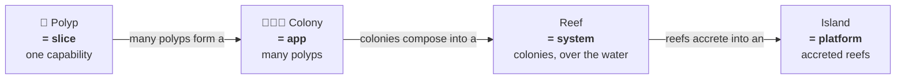
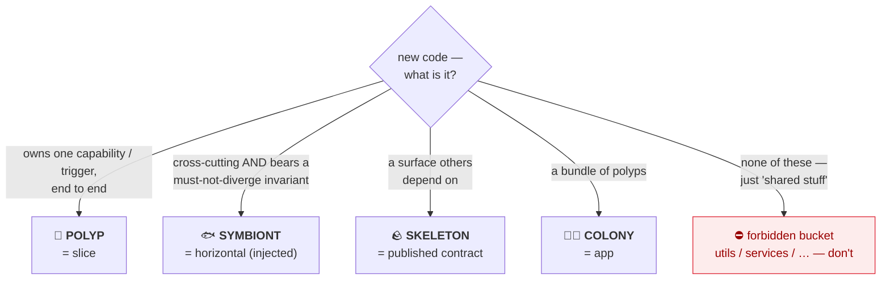

# Coral Architecture — Conventions (the shared horizontal)

**Start here.** This file is the **horizontal** for the whole document set: the things that must not
diverge across documents — the **Coral model** (the guiding metaphor), the rule-ID scheme, the
enforcement classes, and the agents-write/humans-review operating model. Both spines
([`ARCHITECTURE.md`](./ARCHITECTURE.md), a single app/colony, and [`SYSTEM.md`](./SYSTEM.md), a system/
reef of apps) reference this file instead of duplicating it.

That this exists as a separate file is the architecture applied to its own docs: a cross-cutting
concern, consumed by every document and required to stay consistent, is defined once and injected by
reference — not copied (the `[XCUT-1]` gate), and not dumped into one growing file (the `[GROW-3]`
split signal). The metaphor is itself such a concern, so it lives here once.

---

## The Coral Model

<figure class="coral-fig">
  
  <figcaption>A polyp (a slice) — a self-contained animal that hosts its symbionts, with the same form repeating behind it at larger scale.</figcaption>
</figure>

The architecture is named for coral because coral is a **living fractal**: the same simple unit
repeats and accretes from the smallest scale to the largest, and a few rules at one scale hold at
every scale. To use the metaphor for prediction, you need an accurate picture of *how coral actually
lives* — not "coral = colorful rock." So, briefly, the biology.

### How a coral actually lives (the picture)

- A **polyp** is the living animal: a tiny, self-contained creature that does one thing — feed and
  build. It is complete and alive on its own.
- A polyp **cannot make its own food.** Inside its body it *hosts* a different organism — symbiotic
  algae (**zooxanthellae**) — which photosynthesize and feed it. The polyp doesn't build this
  capability; it **hosts an injected partner**. Many polyps host the *same species* of symbiont.
  Other partners specialize too: **guardian crabs** that fight off predators, **gobies** that prune
  away harmful algae. The polyp's powers are mostly *provided*, not *built*.
- The polyp secretes a hard **calcium skeleton** beneath itself — a stable, public structure that
  outlives it and that the next generation builds directly on top of.
- Identical polyps form a **colony** (one organism, one genome). Many colonies and species together
  form a **reef** — a whole living structure where specialists coexist. They never fuse bodies; they
  interact only through **signals carried in the water**.
- A reef **grows at its edges**, accreting outward onto the skeletons of what came before. Over ages,
  reefs build up into **atolls and islands** — new land that other life then inhabits.
- If a polyp loses its symbiont (the injected partner is ripped out or the relationship breaks), it
  **bleaches** and dies — even though the skeleton remains. Broken injection is fatal.
- A reef is **robust to local damage**: one dead colony does not kill the reef. Life is distributed,
  redundant, and local.

### The mapping (canonical — every document uses these terms)

| Coral (the biology) | Architecture concept | Why it maps |
|---|---|---|
| **Polyp** | a **slice** / capability | self-contained, does one thing, alive on its own |
| Polyp's body | the **vertical** (parse→validate→compute) | the unit's own end-to-end logic |
| Photosynthetic symbiont (zooxanthellae) | **observability** horizontal | always-on injected provider; defined once, hosted everywhere |
| Guardian crab (defends the coral) | **authN/authZ** horizontal | sits at the boundary, repels what shouldn't enter |
| Pruning goby (clears harmful algae) | **business-rule validation** horizontal | rejects what doesn't belong before it takes root |
| Secreted calcium **skeleton** | **published contract** + persisted state | hard, stable, outlives the polyp — what others build on |
| Tentacles / mouth | the **boundary / trigger** | the one place it takes the world in |
| **Colony** (one genome) | an **app** | many polyps; shared conventions = the DNA = this file |
| **Reef** (many colonies/species) | a **system** | composed living whole; specialists coexisting |
| Signals in the **water** | the **bus** (`[BUS-*]`) | the only medium between colonies; bodies never fuse |
| New polyps on old skeletons | new slices on stable **published contracts** | build on what's hardened, never on living internals |
| Growth at the **reef edge** | the distributed-**edge** vision | the system accretes outward at the frontier |
| Atoll / **island** | system-of-systems / platform | reefs accrete into new land others inhabit |
| **Bleaching** (symbiosis breaks → death) | ripping out / wrongly coupling a horizontal | broken injection kills the unit — a built-in cautionary tale |
| Reef survives local damage | **bounded blast radius** | locality + redundancy; one dead colony ≠ a dead reef |

### The fractal ladder

The same unit repeats and accretes across scales — and the same three rules (own your trigger; share
only via a named symbiont or a published skeleton; interact only through the water) hold at each one.

### Why this metaphor, and why it predicts

- **Symbiosis is a more honest picture of a horizontal than a "shared helper."** The *same species*
  of algae lives in thousands of polyps, defined once and hosted everywhere — and the polyp does not
  *build* it, it *hosts* it. That is dependency injection, exactly: a separately-defined capability,
  injected, not owned. A horizontal you reach into or re-implement per slice is the broken case.
  **The promotion test (gist):** if the logic must stay *identical* across slices or bears an
  invariant that would be a bug if it drifted, it is a symbiont — define it once and inject it. If
  drift between slices is harmless, leave it duplicated. The full rule (`[XCUT-1]`/`[DUP-*]`) lives in
  the app spine; this is the one-line version for the front door.
- **The symbionts are distinct by *where they act*.** Guardian crab (authN/authZ) defends the
  *boundary* — who/what may enter. Pruning goby (validation) judges the *content* — whether the
  payload is well-formed and allowed by business rules. A rule about *identity/permission* is the
  crab; a rule about *the data itself* is the goby. When one case is genuinely both, flag it
  (`[AGENT-2]`).
- **The picture is fractal, so the rules are too.** Own your trigger end to end; share only via a
  named symbiont (horizontal) or a published skeleton (contract); interact only through the water
  (the bus). These hold for a polyp (slice), a colony (app), and a reef (system) alike.
- **For agents, the parts form a complete, mutually-exclusive ontology** — polyp / symbiont /
  skeleton / colony / reef / signal. Almost every placement question reduces to *"is this a new
  polyp, a new symbiont, a new skeleton, or a new colony?"* — one part, one answer, less ambiguity.

### Placing new code (the ontology as a decision)

When more than one fits, or none cleanly does, that is the signal to **flag it** (`[AGENT-2]`) rather
than guess.

Throughout the documents, **the technical nouns are primary** (slice, vertical, horizontal, app,
system) and the coral terms are the picture mapped onto them — the way "hexagonal architecture" keeps
"ports and adapters." When prose says "polyp," read "slice"; when it says "the water," read "the bus."

---

## Rule IDs

- Rules carry stable IDs like `[DUP-2]`, namespaced by family (`SCOPE`, `BOUND`, `DUP`, `BUS`, …).
  Cite them in reviews and commit messages so feedback is unambiguous ("this violates `[BUCKET-1]`").
- **The single-app spine and the system spine use separate families.** App families live in
  `ARCHITECTURE.md` and its appendices (`CLI-`, `BE-`, …); system families live in `SYSTEM.md`
  (`BUS-`, `ORCH-`, `SYS-TEST-`). The dependency points **one way**: the **app spine**
  (`ARCHITECTURE.md`) **never** cites a system rule, so the core app model stays independent of
  system concerns. `SYSTEM.md` may cite app rules (it builds on them). An **appendix** may cite system
  rules where its app type *recapitulates the reef pattern internally* — e.g. a microfrontend web app
  is a browser-scale reef of panel-polyps over a bus, so `web.md` legitimately references `[BUS-*]`/
  `[SYS-TEST-*]`. This is the fractal property surfacing, not a leak.

## Enforcement classes

Each rule carries exactly one:

- `[auto]` — statically checkable; a linter can decide it.
- `[review]` — needs LLM or human judgment.
- `[guide]` — rationale or principle; shapes decisions but isn't a pass/fail gate.

The resulting coverage map shows which rules have teeth and which run on goodwill. A new convention
becomes a clean unit of work: new rule ID → new `[auto]` check (or `[review]` note) → enforced going
forward.

## Prose vs. contract

Each spine's prose explains *why*; its **Agent Execution Contract** is the condensed, normative
checklist an agent loads as its working contract. They must not contradict each other — the prose is
the source of the *why*, the contract is the source of the *do*. Treat every document here as a
contract: strict, obvious patterns let humans spot deviations instantly and let agents navigate and
generate code confidently.

---

## The Operating Model: Agents Write, Humans Review  `[AGENT-*]`

The whole document set is designed *around* this division of labor, not merely tolerant of it. Every
constraint earns its place by serving one of these properties:

- **Context-window economy** — a slice (or an app) holds everything it needs in one place, so an
  agent can load the *complete* relevant world into one context and reason without missing a
  cross-file dependency.
- **Bounded blast radius** — a change touches one directory (or one app), so the human reviewer's
  audit surface is bounded and the diff stays legible.
- **Deterministic placement** — "where does this go?" collapses to "find or make the feature
  package." Fewer degrees of freedom means fewer wrong guesses.
- **Self-verification** — every slice (and every app, across the bus) exposes an observable contract
  the agent can assert against by running it, closing the loop without trusting internal state.

**`[AGENT-1]` `[guide]`** — Prefer the structure that minimizes an agent's placement and
cross-file-reasoning decisions, even at the cost of some duplication.

**`[AGENT-2]` `[review]`** — **Flag, don't guess.** When a decision is genuinely ambiguous (new
slice vs. extend existing; duplicate vs. promote to a horizontal; slice vs. split into another app),
take the **reversible** option, leave a clearly marked note (e.g. `REVIEW:` comment citing the
relevant rule ID), and surface it for human review. Do not silently pick and bury the decision.

**`[AGENT-3]` `[guide]`** — Do not over-comply literally. A rule that forbids generic buckets does
not mean contorting code to avoid a legitimate horizontal; a rule that tolerates duplication does
not license copying a large invariant-bearing block. When the letter and the intent diverge, follow
the intent and apply `[AGENT-2]`.

---

## Document set

- **`CONVENTIONS.md`** (this file) — the shared horizontal: the Coral model, rule scheme, operating
  model. The front door — read first.
- **`ARCHITECTURE.md`** + **`appendix/*.md`** — the **app/colony** spine: how to build one polyp-shaped
  app (CLI, backend, web, library, tool). Each appendix is one species of polyp.
- **`SYSTEM.md`** — the **system/reef** spine: how colonies (apps) compose into a reef over the water
  (the bus). Builds on the app spine; the app spine never cites it.
