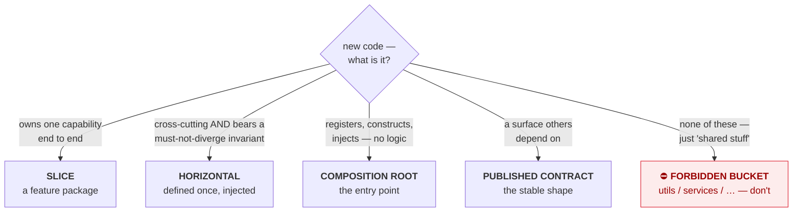
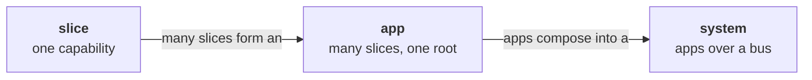

# Coral Architecture — Conventions

<!-- AGENT NOTE (not shown on the rendered site): this file is AUTHORITATIVE for four things: the
vocabulary, the rule-ID scheme, the enforcement classes, and the [AGENT-*] operating model. Load it
before reasoning across documents; ARCHITECTURE.md and SYSTEM.md defer to it and must not redefine
these. Agent-only hints elsewhere use this same "AGENT NOTE" comment form. -->

This file holds what every other document builds on, so none of them has to repeat it:

- **The vocabulary** — the seven nouns the whole set uses. ([below](#the-vocabulary))
- **The rule-ID scheme** — how rules are numbered and cited, e.g. `[DUP-2]`. ([below](#rule-ids))
- **The enforcement classes** — `[auto]` / `[review]` / `[guide]`. ([below](#enforcement-classes))
- **The operating model** — agents write; humans review and orchestrate. ([below](#the-operating-model-agents-write-humans-review-agent))

The two spines — [`ARCHITECTURE.md`](./ARCHITECTURE.md) (how to build one app) and
[`SYSTEM.md`](./SYSTEM.md) (how apps compose into a system) — refer back here instead of repeating any
of it. That is the architecture practicing what it preaches: a concern used in many places is defined
once and pointed to.

The name is explained in one paragraph at the end ([Why "Coral"?](#why-coral)). It is a naming
scheme, not a reasoning tool — you never need it to apply a rule.

---

## The vocabulary

Seven nouns. Every document uses exactly these; there are no synonyms.

| Noun | What it is | Governed by |
|---|---|---|
| **slice** (a *vertical*) | one capability, owned end to end: its trigger, parsing, validation, behavior, state access, output, and tests | `[BOUND-*]` `[MODEL-1]` |
| **horizontal** | a cross-cutting concern — defined **once**, precisely named, and **injected** into the slices that use it (`config`, `errors`, `db`, `money`) | `[XCUT-*]` |
| **composition root** | the thin entry point that registers slices, constructs horizontals, and injects them. Holds no business logic | `[ROOT-*]` |
| **published contract** | the surface others are allowed to depend on: a slice's public capability, a machine-readable output, an HTTP shape, a library API | `[CONTRACT-*]` |
| **app** | one deployable unit: many slices, one composition root, one set of horizontals | all of `ARCHITECTURE.md` |
| **system** | several apps composed together | all of `SYSTEM.md` |
| **bus** | the only coupling between apps: a published, versioned contract — sync API, event, or message queue | `[BUS-*]` |

Two things are named for what they are *not*:

- A **forbidden bucket** is a would-be horizontal with no precise name and no injection discipline —
  `utils`, `shared`, `common`, `services`, `helpers`, generic `models`. `[BUCKET-1]`
- **Drift** is what happens when a horizontal is re-implemented per slice instead of injected: the
  copies diverge, and the divergence is a bug. `[XCUT-4]`

### "Capability" is scale-relative — always say which scale

`capability` is the one word in this set that means different things at different scales, and
conflating them is how an agent ends up publishing internals. Qualify it:

| Phrase | Means | Consumed by |
|---|---|---|
| *a slice owns a capability* | one user-facing behavior | the app's users |
| *a slice's **published** capability* | one exported function/entry point of that slice | sibling slices, via `[COMPOSE-1]` |
| *an app's **published** capability* | one endpoint/event on the bus | other apps, via `[BUS-1]` |

A slice's published capability is **not** automatically an app's published capability. Crossing a
process boundary requires a bus contract (`[BUS-1]`), not a re-export.

---

## The canonical slice

Everything else in this document set exists to make code look like this. Read it before the rules;
the rules are the reasons it is shaped this way. (Language-neutral; the full worked example is
[`examples/go-api-slice.md`](./examples/go-api-slice.md).)

```
expense/add                                    # one slice = one capability

  # injected horizontals, constructed at the root and passed in
  #   money  · parse/format invariant
  #   db     · connection + transaction
  #   errors · taxonomy {category, code, message}

  function run(rawArgs, deps):
    input  = parse(rawArgs)                    # pure
    amount = deps.money.parse(input.amount)    # pure; raises validation/invalid_amount
    if input.category is empty:
        raise deps.errors.of("validation", "missing_category", "category is required")

    record = { amount, category: input.category, date: input.date }   # pure

    deps.db.tx(conn => insertExpense(conn, record))   # the one effect, at the edge
    return Result.ok({ id: record.id, amount, category, date })       # the root renders

  test "expense add records and is observable":    # colocated
    out = run(["--amount","12.50","--category","food"], realTempDeps())
    assert out.exitCode == 0
    assert out.json == { id: any, amount: "12.50", category: "food", date: any }
    assert queryExpenses().contains(food, 12.50)   # real storage
```

Five properties make it canonical: parse/validate/compute are **pure**; the single effect sits at the
**edge**; horizontals are **injected**, never reached for; the slice **raises** taxonomy errors and
lets the root render them; the test asserts the **observable contract** against real storage. The verb
`add` truthfully signals a non-idempotent operation.

---

## Placing new code

Almost every placement question is one of five outcomes. Four are legitimate categories of code
(`[MODEL-1]`); the fifth is the failure mode.



When more than one fits, or none cleanly does, **flag it** (`[AGENT-2]`) rather than guess.

The same three rules hold at every scale — slice, app, and system alike:

1. **Own your trigger end to end** — the one request, command, or event you answer.
2. **Share only through a named horizontal or a published contract** — never a bucket, never a reach
   into internals.
3. **Cross a boundary only over the bus** — apps never fuse and never share a datastore.



---

## Rule IDs

Rules carry stable IDs like `[DUP-2]`, namespaced by family (`SCOPE`, `BOUND`, `DUP`, `BUS`, …). Cite
them in reviews and commit messages so feedback is unambiguous ("this violates `[BUCKET-1]`"). On the
live site every citation links to its definition.

**One rule, one ID.** A rule is defined in exactly one place and cited everywhere else. There are no
alias IDs — no second family that restates an existing rule under a new name — because two IDs for one
rule make findings unsearchable and let the two copies drift.

**The spines use separate families.** App families live in `ARCHITECTURE.md` and its appendices
(`CLI-`, `BE-`, …); system families live in `SYSTEM.md` (`BUS-`, `ORCH-`, `SYS-TEST-`). The dependency
points **one way**: the app spine **never** cites a system rule, so the core app model stays
independent of system concerns. `SYSTEM.md` may cite app rules — it builds on them. An **appendix** may
cite system rules where its app type reproduces the system pattern internally: a microfrontend web app
is a browser-scale system of panels over a bus, so `web.md` legitimately references `[BUS-*]` /
`[SYS-TEST-*]`.

## Enforcement classes

Each rule carries **exactly one** — the docs build fails otherwise:

- `[auto]` — statically checkable; a linter can decide it without judgment.
- `[review]` — needs LLM or human judgment.
- `[guide]` — rationale or principle; shapes decisions but isn't a pass/fail gate.

The resulting coverage map shows which rules have teeth and which run on goodwill. Classify honestly:
a rule marked `[auto]` that no linter could actually decide is a promise the architecture cannot keep,
and it costs more credibility than an honest `[review]`.

A new convention becomes a clean unit of work: new rule ID → new `[auto]` check (or `[review]` note) →
enforced going forward.

## Prose vs. contract

Each spine has two layers, and the build enforces the relationship between them:

- The **prose sections** define each rule and explain *why* it exists. Every rule is defined here,
  once. The first sentence of a rule is the rule — complete and quotable on its own; qualifications,
  examples, and cross-references follow it as commentary.
- The **Agent Execution Contract** is the condensed, **complete** normative checklist. Every `[auto]`
  and `[review]` rule in the document appears in it, so an agent that loads only the contract has the
  whole normative surface and misses nothing. `[guide]` rules are rationale and stay in the prose.

Completeness is checked at build time, so a new rule cannot be added without wiring it into the
contract. Reviewers walk the same contract and cite the same IDs; there is no separate review
checklist to drift against.

---

## The Operating Model: Agents Write, Humans Review  `[AGENT-*]`

This is about **agents as authors** — at *build time*, agents write the code and humans review and
orchestrate. Don't confuse it with **agents as runtime components**, where the running app itself uses
a model — a different axis, covered by [`appendix/agentic-app.md`](./appendix/agentic-app.md). (Both
are governed by the same *harness* pattern; this document set is the build-time harness, an agentic
app is the run-time one.)

The whole document set is designed *around* this division of labor. Every constraint earns its place
by serving one of four properties:

- **Context-window economy** — a slice (or an app) holds everything it needs in one place, so an agent
  can load the *complete* relevant world into one context and reason without missing a cross-file
  dependency.
- **Bounded blast radius** — a change touches one directory (or one app), so the reviewer's audit
  surface is bounded and the diff stays legible.
- **Deterministic placement** — "where does this go?" collapses to "find or make the feature package."
  Fewer degrees of freedom means fewer wrong guesses.
- **Self-verification** — every slice, and every app across the bus, exposes an observable contract the
  agent can assert against by running it, closing the loop without trusting internal state.

**`[AGENT-1]` `[guide]`** — Prefer the structure that minimizes an agent's placement and
cross-file-reasoning decisions, even at the cost of some duplication.

**`[AGENT-2]` `[review]`** — **Flag, don't guess.** When a decision is genuinely ambiguous (new slice
vs. extend existing; duplicate vs. promote to a horizontal; slice vs. split into another app), take the
**reversible** option, leave a clearly marked note (e.g. a `REVIEW:` comment citing the relevant rule
ID), and surface it for human review. Do not silently pick and bury the decision.

**`[AGENT-3]` `[guide]`** — Do not over-comply literally. A rule that forbids generic buckets does not
mean contorting code to avoid a legitimate horizontal; a rule that tolerates duplication does not
license copying a large invariant-bearing block. When the letter and the intent diverge, follow the
intent and apply `[AGENT-2]`.

---

## Document set

Read in this order:

1. **`CONVENTIONS.md`** (this file) — the vocabulary, rule scheme, enforcement classes, operating
   model. The front door.
2. **[`ARCHITECTURE.md`](./ARCHITECTURE.md)** — the **app** spine: how to build one app. Its
   [appendices](./ARCHITECTURE.md#appendix-index) instantiate it per app type (CLI, backend, web,
   agentic/LLM, library, GitHub Action).
3. **[`SYSTEM.md`](./SYSTEM.md)** — the **system** spine: how apps compose over a bus. Builds on the
   app spine; the app spine never cites it.
4. **Worked examples** — [`examples/go-api-slice.md`](./examples/go-api-slice.md) (a complete slice in
   Go, with code) and [`examples/backend-review.md`](./examples/backend-review.md) (the rules applied
   to a real service, including where they'd be overkill).

---

## Why "Coral"?

<figure class="coral-fig">
  
  <figcaption>Coral: one simple unit, repeating at every scale.</figcaption>
</figure>

Coral is a **living fractal** — the same simple unit repeats and accretes from the smallest scale to
the largest, and a few rules that hold for one unit hold for the whole structure. That is the property
this architecture is named for: a slice, an app, and a system are the same shape under the same three
rules. The biology supplies five useful nicknames and nothing more — the technical nouns above are
primary, the way "hexagonal architecture" keeps "ports and adapters."

| Coral | Architecture |
|---|---|
| **polyp** — a self-contained animal that hosts the partners it doesn't build | a **slice**, hosting **injected horizontals** |
| **skeleton** — the hard structure it secretes, which outlives it and gets built on | a **published contract** |
| **colony** — many polyps, one genome | an **app**, many slices under one set of conventions |
| **reef** — many colonies, coupled only by signals in the water | a **system**, many apps coupled only by the bus |

You will occasionally see these words in a heading or an aside. They are decoration. **No rule
requires the metaphor to apply it**, and if a rule ever seems to follow from the biology rather than
from the engineering, treat that as a defect in the rule and flag it (`[AGENT-2]`).
