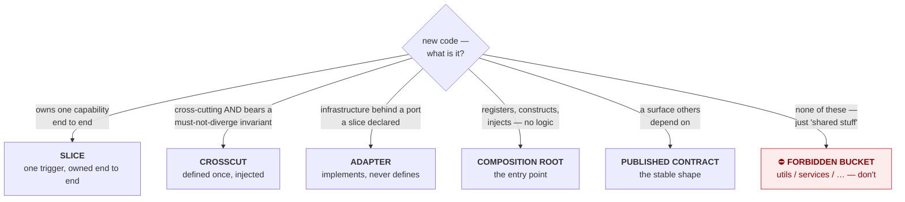
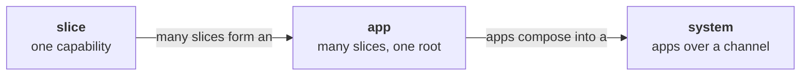

# Coral Architecture — Conventions

<!-- AGENT NOTE (not shown on the rendered site): this file is AUTHORITATIVE for the vocabulary, the
rule-ID scheme, the enforcement classes, the ownership layers, the kernel, and the [AGENT-*] operating
model. Load it before reasoning across documents; ARCHITECTURE.md and SYSTEM.md defer to it and must not
redefine these. Agent-only hints elsewhere use this same "AGENT NOTE" comment form. -->

This file holds what every other document builds on, so none of them has to repeat it:

- **The vocabulary** — the eight nouns the whole set uses. ([below](#the-vocabulary))
- **The rule-ID scheme** — how rules are numbered and cited, e.g. `[DUP-2]`. ([below](#rule-ids))
- **The enforcement classes** — `[auto]` / `[review]` / `[guide]`. ([below](#enforcement-classes))
- **The operating model** — agents write; humans review and orchestrate. ([below](#the-operating-model-agents-write-humans-review-agent))
- **The kernel** — the rules Coral would substantially relax without that operating model.
  ([below](#the-coral-kernel))
- **The ownership layers** — which surface each rule belongs to, and so who has to load it.
  ([below](#ownership-layers))
- **What applies to a project** — how a project declares the scopes it adopts, and how the rule set is
  composed from that declaration. ([below](#what-applies-to-a-project))

The two spines — [`ARCHITECTURE.md`](./ARCHITECTURE.md) (how to build one app) and
[`SYSTEM.md`](./SYSTEM.md) (how apps compose into a system) — refer back here instead of repeating any
of it. That is the architecture practicing what it preaches: a concern used in many places is defined
once and pointed to.

---

## The vocabulary

Eight nouns. Every document uses exactly these; there are no synonyms.

| Noun | What it is | Governed by |
|---|---|---|
| **slice** | one capability, owned end to end: its trigger, parsing, validation, behavior, state access, output, and tests | `[BOUND-*]` `[MODEL-1]` |
| **crosscut** | a cross-cutting concern — defined **once**, precisely named, and **injected** into the slices that use it (`config`, `errors`, `db`, `money`) | `[XCUT-*]` |
| **adapter** | the infrastructure mechanics behind a port **a slice declared** — it implements that interface, is wired by the root, and owns no behavior (`store`, `s3`, `stripe`) | `[MODEL-4]` |
| **composition root** | the thin entry point that registers slices, constructs crosscuts, and injects them. Holds no business logic | `[ROOT-*]` |
| **published contract** | the surface others are allowed to depend on: a slice's public capability, a machine-readable output, an HTTP shape, a library API | `[CONTRACT-*]` |
| **app** | one deployable unit: many slices, one composition root, one set of crosscuts | all of `ARCHITECTURE.md` |
| **system** | several apps composed together | all of `SYSTEM.md` |
| **channel** | the only coupling between apps — a published, versioned contract in one of three forms: sync API, event, or message bus | `[CHAN-*]` |

Two further terms name what a crosscut is *not*, and they are defined below the canonical slice, where
there is an injected crosscut to contrast them against: **forbidden bucket** and **drift**.

### "Capability" is scale-relative — always say which scale

`capability` is the one word in this set that means different things at different scales, and
conflating them is how an agent ends up publishing internals. Qualify it:

| Phrase | Means | Consumed by |
|---|---|---|
| *a slice owns a capability* | one user-facing behavior | the app's users |
| *a **feature package's** capability* | one domain area, and the state behind it | its own slices directly; anything else via a published capability |
| *a slice's **published** capability* | one exported function/entry point of that slice | sibling slices, via `[COMPOSE-1]` |
| *an app's **published** capability* | one endpoint/event on the channel | other apps, via `[CHAN-1]` |

A slice's published capability is **not** automatically an app's published capability. Crossing a
process boundary requires a channel contract (`[CHAN-1]`), not a re-export.

### A channel is a published contract at app scale

Two of the eight nouns are the same idea at different ranks, and it is worth saying so rather than letting
a reader guess. A **published contract** is the surface a slice or an app *exposes*. A **channel** is the
pathway *between* two apps, and the contract that governs it.

Both exist because a channel carries something a contract cannot: **delivery semantics**. A contract states
the shape; the channel states whether that shape arrives once or twice, in order or not, consistently or
eventually (`[CHAN-5]`, `[CHAN-9]`, `[CHAN-10]`). That half of the noun has no meaning at slice scale, where
a call either returns or raises.

A message bus is one of a channel's three forms, **not** its definition (`[CHAN-2]`) — two apps talking over
plain HTTP are using a channel.

---

## The canonical slice

Everything else in this document set exists to make code look like this. Read it before the rules; the
rules are the reasons it is shaped this way. It is language-neutral — this exact capability is written out
in real Python in [`examples/cli-slice.md`](./examples/cli-slice.md).

```
expense/add                                    # one slice = one capability

  # injected crosscuts, constructed at the root and passed in
  #   money  · parse/format invariant
  #   db     · connection + transaction
  #   errors · taxonomy {category, code, message}

  function run(rawArgs, deps):
    input  = parse(rawArgs)                    # pure
    amount = deps.money.parse(input.amount)    # pure; raises validation/invalid_amount
    if input.category is empty:
        raise deps.errors.of("validation", "missing_category", "category is required")

    record = { amount, category: input.category, date: input.date }   # pure

    deps.db.tx(conn => insertExpense(conn, record))   # the one effect, at the edge
    return Result.ok({ id: record.id, amount, category, date })       # the root renders

  test "expense add records and is observable":    # colocated
    out = run(["--amount","12.50","--category","food"], realTempDeps())
    assert out.exitCode == 0
    assert out.json == { id: any, amount: "12.50", category: "food", date: any }
    assert queryExpenses().contains(food, 12.50)   # real storage
```

Five properties make it canonical: parse/validate/compute are **pure**; the single effect sits at the
**edge**; crosscuts are **injected**, never reached for; the slice **raises** taxonomy errors and
lets the root render them; the test asserts the **observable contract** against real storage. The verb
`add` truthfully signals a non-idempotent operation.

`money`, `db` and `errors` above are crosscuts: each has a precise name, is constructed once at the root,
and arrives as `deps`. That is what makes the two remaining terms legible, because both are named for
missing exactly those properties:

- A **forbidden bucket** is a would-be crosscut with no precise name and no injection discipline —
  `utils`, `shared`, `common`, `services`, `helpers`, generic `models`. `[BUCKET-1]`
- **Drift** is what happens when a crosscut is re-implemented per slice instead of injected: the
  copies diverge, and the divergence is a bug. `[XCUT-4]`

---

## Placing new code

Almost every placement question is one of six outcomes. Five are legitimate categories of code
(`[MODEL-1]`); the sixth is the failure mode.



When more than one fits, or none cleanly does, **flag it** (`[AGENT-2]`) rather than guess.

A slice lives *in* a **feature package**, and the two are not the same thing — this diagram used to label
the slice box "a feature package", which is where the confusion started. The package groups the slices of
one capability and owns the state behind them (`[STRUCT-2]`, `[STATE-5]`); the slice owns one trigger. The
package is a container, not a category of code, which is why `[MODEL-1]` does not list it.

The same three rules hold at every scale — slice, app, and system alike:

1. **Own your trigger end to end** — the one request, command, or event you answer.
2. **Share only through a named crosscut or a published contract** — never a bucket, never a reach
   into internals.
3. **Cross a boundary only over a channel** — apps never fuse and never share a datastore.



---

## Rule IDs

Rules carry stable IDs like `[DUP-2]`, namespaced by family (`SCOPE`, `BOUND`, `DUP`, `CHAN`, …). Cite
them in reviews and commit messages so feedback is unambiguous ("this violates `[BUCKET-1]`"). On the
live site every citation links to its definition.

**One rule, one ID.** A rule is defined in exactly one place and cited everywhere else. There are no
alias IDs — no second family that restates an existing rule under a new name — because two IDs for one
rule make findings unsearchable and let the two copies drift.

**IDs are permanent.** They are never renumbered, never recycled, and never removed — see `[VER-1]`. That
is why `[IDEM-6]` sits out of numeric order: it was appended rather than inserted.

**The spines use separate families.** App families live in `ARCHITECTURE.md` and its appendices
(`CLI-`, `BE-`, …); system families live in `SYSTEM.md` (`CHAN-`, `ORCH-`, `SYS-TEST-`). The dependency
points **one way**: the app spine **never** cites a system rule, so the core app model stays
independent of system concerns. The build enforces this rather than trusting it — `ARCHITECTURE.md` had
been citing `[ORCH-1]` in prose until the gate was added. `SYSTEM.md` may cite app rules — it builds on them. An **appendix** may
cite system rules where its app type reproduces the system pattern internally: a microfrontend web app
is a browser-scale system of panels over a channel, so `web.md` legitimately references `[CHAN-*]` /
`[SYS-TEST-*]`.

## Enforcement classes

Each rule carries **exactly one** — the docs build fails otherwise:

- `[auto]` — statically checkable; a linter can decide it without judgment.
- `[review]` — needs LLM or human judgment.
- `[guide]` — rationale or principle; shapes decisions but isn't a pass/fail gate.

It is read from the [metadata slot](#where-a-rule-s-layer-is-recorded) next to the rule ID, so a rule that
*discusses* `[review]` in its prose neither gains a second class nor supplies a missing one.

The resulting coverage map shows which rules have teeth and which run on goodwill. Classify honestly:
a rule marked `[auto]` that no linter could actually decide is a promise the architecture cannot keep,
and it costs more credibility than an honest `[review]`.

A new convention becomes a clean unit of work: new rule ID → new `[auto]` check (or `[review]` note) →
enforced going forward.

## Prose vs. contract

Each document has two layers, and the build enforces the relationship between them:

- The **prose sections** define each rule and explain *why* it exists. Every rule is defined here,
  once. The first sentence of a rule is the rule — complete and quotable on its own; qualifications,
  examples, and cross-references follow it as commentary.
- The **Agent Execution Contract** is the condensed, **complete** normative checklist. Every `[auto]`
  and `[review]` rule in the document appears in it, so an agent that loads only the contract has the
  whole normative surface and misses nothing. `[guide]` rules are rationale and stay in the prose.

Completeness is checked at build time, so a new rule cannot be added without wiring it into the
contract. Reviewers walk the same contract and cite the same IDs; there is no separate review
checklist to drift against. Every document carries one — the spines, this file for its `[AGENT-*]`
and `[VER-*]` rules, and each appendix. An appendix contract **adds to** the app spine's rather than
replacing it: building a CLI means loading `ARCHITECTURE.md`'s contract and `appendix/cli.md`'s.

[`rules.md`](./rules.md) is the cross-document view — every rule, its class, and its one-line
statement on one page. It is generated from these contracts, so it cannot drift from them.

---

## The Operating Model: Agents Write, Humans Review  `[AGENT-*]`

This is about **agents as authors** — at *build time*, agents write the code and humans review and
orchestrate. Don't confuse it with **agents as runtime components**, where the running app itself uses
a model — a different axis, covered by [`appendix/agentic-app.md`](./appendix/agentic-app.md). (Both
are governed by the same *harness* pattern; this document set is the build-time harness, an agentic
app is the run-time one.)

The whole document set is designed *around* this division of labor. Every constraint earns its place
by serving one of four properties:

- **Context-window economy** — a slice (or an app) holds everything it needs in one place, so an agent
  can load the *complete* relevant world into one context and reason without missing a cross-file
  dependency.
- **Bounded blast radius** — a change touches one directory (or one app), so the reviewer's audit
  surface is bounded and the diff stays legible.
- **Deterministic placement** — "where does this go?" collapses to "find or make the feature package."
  Fewer degrees of freedom means fewer wrong guesses.
- **Self-verification** — every slice, and every app across the channel, exposes an observable contract the
  agent can assert against by running it, closing the loop without trusting internal state.

Nine of Coral's rules owe their presence, or their strictness, to this division of labour; the rest are
stated at the strength they are for reasons that survive a human author. Which nine, and how to tell them
apart, is the [Coral kernel](#the-coral-kernel) below.

**`[AGENT-1]` `[guide]` `{governance}`** — Prefer the structure that minimizes an agent's placement and
cross-file-reasoning decisions, even at the cost of some duplication.

**`[AGENT-2]` `[review]`** — **Flag, don't guess.** When a decision is genuinely ambiguous (new slice
vs. extend existing; duplicate vs. promote to a crosscut; slice vs. split into another app), take the
**reversible** option, leave a clearly marked note (e.g. a `REVIEW:` comment citing the relevant rule
ID), and surface it for human review. Do not silently pick and bury the decision.

**`[AGENT-3]` `[guide]` `{governance}`** — Do not over-comply literally. A rule that forbids generic
buckets does not mean contorting code to avoid a legitimate crosscut; a rule that tolerates duplication
does not license copying a large invariant-bearing block. When the letter and the intent diverge, follow
the intent and apply `[AGENT-2]`.

**`[AGENT-4]` `[review]`** — An agent never authors an exception or an extension. It flags per
`[AGENT-2]`; a **human** decides and records the decision.

This is the guard that keeps the loop honest, and it is the one a helpful agent is most likely to
violate. Writing "we deviate here because X" is legislating, and an agent that can legislate has removed
the humans-review half of the operating model. Propose the wording if asked; never commit it.

**`[AGENT-5]` `[review]` `{governance}`** — Read the project's `CORAL.md` before escalating. A documented
exception or extension is a settled decision and is not raised again.

Without this the loop never converges: the same ambiguity bubbles up every time a new agent meets it, the
human answers it again, and the accumulated decisions buy nothing. Escalate what is genuinely unsettled.

---

## Versioning and local deviations

Coral is versioned because it will be **incomplete**. Rules will be missed, new patterns will need
covering, and some rules will turn out to be wrong. A project therefore needs to say which Coral it
follows, and to record where it knowingly differs — otherwise "conforms to Coral" is not a checkable
claim.

The version lives in `VERSION`; what changed lives in [`CHANGELOG.md`](./CHANGELOG.md), recorded per rule
ID.

**`[VER-1]` `[auto]` `{governance}`** — Rule IDs are append-only: never renumbered, never recycled, never
removed. A withdrawn rule keeps its ID and is marked retired in place.

A project's `CORAL.md` records "breaks `[STATE-5]`", and that citation has to mean the same thing in five
years. `rules.lock` is the checked-in record of every published ID and its class; the build fails if one
disappears, gets reclassified, or is added without the lock being regenerated. That forced step is where
the changelog entry and the version bump get remembered.

**`[VER-2]` `[review]` `{governance}`** — A change that **adds, tightens, or retires** a rule is a
**major** version; a change that **loosens or clarifies** a rule, adds an appendix, or adds a `[guide]`
rule is **minor**; prose that leaves conformance unchanged is **patch**.

Adding a rule is a breaking change, because a rule is a **constraint** — it is closer to adding a
required field than to adding an API endpoint. Code that conformed yesterday can fail today.

**While the version is `0.y.z`, the rule set is not yet stable** and a change that would be major bumps
the **minor** instead (`0.1.0` → `0.2.0`), per semver's major-version-zero clause. That is the honest state
while appendices are still being filled: rules are still arriving in batches, and burning a major per batch
would put Coral at version 6 with nothing stable to show for it.

**`1.0.0` is cut when every *core* appendix is complete** — every slot either carries an app-type rule or
an explicit "spine-sufficient" note. That is a checkable condition, so the promise `1.0.0` makes is a real
one: from there, an added rule costs a major and a project can pin with confidence.

**An appendix marked ADDENDUM is outside that condition, and outside the version discipline.** An addendum
covers an app type nobody here has built yet: it is written from reading rather than from experience, it is
expected to be wrong in places, and it may change substantially without a major bump. Rule IDs in an
addendum are still permanent (`[VER-1]`), so a citation of one stays valid — but its *content* carries no
stability promise, and a project adopting it should say so in its `CORAL.md`.

Writing a blueprint for something you have not built is speculation dressed as guidance, and an agent
cannot tell the difference from the page. The ADDENDUM label is how it tells the difference. An addendum
graduates to a core appendix when someone has built the thing and the rules survived contact with it.

**A version marks a release, not a commit.** Bumping per commit would put a version number on every typo
and make the changelog unreadable, which defeats its one purpose — telling a consuming project what it
must newly satisfy. Changes accumulate under **Unreleased** in
[`CHANGELOG.md`](./CHANGELOG.md) and the bump happens when the batch is cut. `rules.lock` still moves with
the commit that changes a rule, because its job is to catch an ID vanishing, not to track releases.

**`[VER-3]` `[review]`** — A project states the Coral version it targets, and an audit is performed
against that version.

Without a declared target, every Coral change silently invalidates every project's audit and "we're
Coral-conformant" decays into a feeling. Upgrading is then a deliberate act with a readable diff: *4.0
added `[CONC-1..5]`; here is what that means for us.*

**`[VER-4]` `[auto]` `{governance}`** — A project's own rule IDs are namespaced by a project prefix and
never reuse a Coral family name.

`ACME-1`, not `XCUT-9`. A project that invents an ID in a Coral family collides the day Coral adds that
number, and the collision is silent — two documents, same citation, different rule.

Note the typography above: an **illustrative** ID is written bare (`ACME-1`), while a **citation** is
bracketed (`[VER-4]`). Only the bracketed form is a reference the build resolves, so a hypothetical ID
written as a citation fails the build — which is how this paragraph got caught while being written.

**`[VER-5]` `[auto]`** — Every exception and extension in `CORAL.md` is recorded as a **machine-readable
entry naming the rule ID it concerns and the path it scopes**.

An exception a tool cannot read is an exception the tool re-reports forever. `coral-lint` has no way to
honour a decision written as prose, so an approved `internal/models` package fails the gate on every run,
the team learns to ignore the output, and the register stops being believed — which costs more than the
original violation. The same applies to agents: `[AGENT-5]` tells one to read `CORAL.md` before
escalating, and that loop only converges if the file can be read the same way twice.

Four properties make an entry usable, and they are what the format exists to force: it is **attributable**
to a rule ID, so a finding and a decision can be matched; it is **scoped** to a path, so it excuses one
place rather than a habit; it is **explicit**, so nothing is excused by silence; and it is **visible**,
because a decision recorded where nobody loads it is not recorded.

**Scope narrowly.** `path: internal/models` excuses a decision; `path: "**"` excuses the rule, and a
project that needs that has an amendment to file (below), not an exception to record. Statically
decidable: the block parses, its rule IDs resolve against `rules.lock`, and its paths exist.

**Both records are path-scoped, and an extension no less than an exception.** An extension without a
path is a project-wide rule recorded in a format that promises a scope, and a tool that has to guess
which files it binds will guess differently from the human who wrote it.

**`[VER-6]` `[auto]`** — A project's `CORAL.md` **declares the non-kernel Coral scopes it adopts**, and
the scales it adopts them at. A Coral rule is applicable to that project only through kernel membership
or through that declaration at the rule's scale.

`[VER-3]` pins *which Coral*; this pins *how much of it*. Both are needed, and neither implies the
other: two projects on 0.6.0 can owe different rule sets, and the difference is a decision somebody
made rather than a property of the repository the rules are published from. Without the declaration the
question "what rules apply here?" has no answer that does not involve guessing — and guessing has only
bad options. Auditing against everything Coral publishes charges a CLI for HTTP status codes and a
one-app repository for channel versioning. Inferring the answer from the repository's contents makes
applicability move whenever a directory is renamed. Both are silent, and both put a rule in front of an
agent that no human ever agreed to.

The declaration is what makes **adding** to Coral safe. A new app profile, a new optional layer, a new
rule inside a layer a project has not adopted: none of them reach an existing project until that project
edits its own `CORAL.md`. Applicability grows by a decision, never by a release — which is the same
guarantee `[VER-3]` gives for the version, one axis over.

It is `[auto]` because it is statically decidable, and the whole point is that it is decided the same
way twice: the block parses, every scope key it names is a layer the target version publishes, every
profile it names is registered there, and every scale it names exists. A missing or invalid declaration
is a **configuration finding** — the project has an undeclared normative surface — and not a licence to
substitute a default. Silence is not the same decision as `adopts: {}`, and a tool must not read it as
one.

[What applies to a project](#what-applies-to-a-project) gives the schema, the composition algebra, and
what the scopes mean.

### Three kinds of divergence

| | What it is | Where it is recorded | Who decides |
|---|---|---|---|
| **Exception** | Coral has a rule; this project knowingly breaks it for a trade-off | the project's `CORAL.md` | a human on the project |
| **Extension** | Coral has no rule; this project needs one; it stays local | the project's `CORAL.md` | a human on the project |
| **Amendment** | Coral has a rule and **the rule is wrong or too narrow** | an issue or PR on the Coral repo | Coral's maintainers |

An **amendment is not recorded in the project** — it is an outbound proposal, referenced from the entry
that motivated it. `[MODEL-2]` was an amendment: it forbade layering outright, the correct Go shape
violated it, and the rule — not the code — was wrong. Had that been filed as a per-project exception,
every Go project would have carried the same exception forever and the defect in the rule would never
have surfaced.

**Drift is not an exception.** A deviation nobody chose is a finding to fix. Only a deliberate decision
qualifies, or the register becomes a laundry for violations and the architecture becomes advisory.

### `CORAL.md` — the project's adherence record

One file, in the consuming project's root, holding both record types. One file rather than two because of
`[AGENT-1]`: the agent's question is *"what rules apply here?"*, and that should be one load with one
answer. An agent that read only half would have a wrong picture of what is permitted.

<!-- coral:adherence:start -->

````markdown
# Coral adherence

```yaml coral
# Which Coral this project is audited against ([VER-3]).
targets: "0.6.0"

# Which architectural scales this repository is written at. One deployable app, so
# `app` alone — there is no channel here for a system-scale rule to bind.
scales:
  - app

# Which non-kernel Coral scopes this project adopts, named by ownership key ([VER-6]).
# The kernel is implicit and is not listed. `framework-governance` is not an
# application conformance layer and cannot be listed. A key that is absent is not
# adopted; a missing `adopts` block is an error, not "adopt everything".
adopts:
  production-baseline: true
  app-profile:
    - cli
  language-binding: []
  runtime-agent-profile: false

# Exceptions — Coral rules this project knowingly breaks, inside one subtree.
exceptions:
  - rule: STATE-5
    path: internal/billing
    reason: two slices co-own the invoice table while the split is in flight
    decided_by: <name>
    decided: 2026-08-18
    revisit_when: the reconciliation slice lands
    upstream: candidate

# Extensions — local rules Coral does not have. Namespaced per [VER-4] and scoped
# to a path per [VER-5], exactly as an exception is.
extensions:
  - rule: ACME-1
    path: internal/billing
    statement: <the rule, stated as a rule>
    reason: why Coral does not cover it · which families it touches
    upstream: not-a-candidate    # not-a-candidate | candidate | proposed | landed
```

Prose below the block carries what the fields cannot: the trade-off in full, the
history of a decision, a diagram. The block is the record; the prose is the why.
````

<!-- coral:adherence:end -->

The block above is checked by Coral's own build: it is parsed with the same resolver a consuming
project's tooling uses, and every key, profile name and scale in it is resolved against this version's
registries. A worked example of a machine-readable format that the machine has never read is a format
with one untested user.

What `adopts` and `scales` mean, and how the rule set is composed from them, is in
[What applies to a project](#what-applies-to-a-project). The short version: the kernel applies without
being named, everything else applies because it is named here, and nothing applies because it exists in
the Coral repository.

Two fields carry weight beyond their own entry. The **`upstream` disposition** is what makes the loop run: the same exception
appearing across several projects, all marked `candidate`, is the signal for an amendment — and when the
amendment lands, the entries are deleted and the projects bump their target. **The register shrinks when
Coral improves**, which is what stops it becoming a forty-entry graveyard.

And **`revisit when` is a condition, not a date.** Dates are theatre; everyone renews them. *"When a third
slice needs this"* or *"when we split the shared datastore"* is a trigger someone will actually hit.

Coral itself targets the version in `VERSION`; the worked examples and the audit skill each state the
version they were written against, which is the cheapest available test that this convention is usable.

---

## The Coral kernel

Coral's rules are not all here for the same reason. A **kernel rule** is one whose **presence or
strictness is materially justified by the operating model**:
[agents author the code while humans retain architectural authority](#the-operating-model-agents-write-humans-review-agent).
Remove that premise and Coral would **substantially relax** the constraint.

Note what that does *not* claim. A human-authored codebase has its own reasons to encapsulate
(`[COMPOSE-1]`), to test behavior (`[TEST-1]`), and to be careful about abstraction (`[XCUT-1]`); several
kernel rules would still be good advice. What changes without the premise is how *hard* Coral has to
insist, and whether the rule needs to be normative at all rather than a matter of taste. The kernel is the
set where the answer is "hard, and normative, because of who is writing."

**"Kernel" does not mean "the most important rules."** `[TRUST-1]` matters more to a running system than
anything below it: get the trust boundary wrong and the system is unsafe, while getting `[MODEL-1]` wrong
only makes it hard to change. Kernel membership answers a different question — *why is Coral imposing
this, at this strength?*

The kernel is a **named subset of existing rules**, never a family of its own. There are no `KERN-*` IDs:
**one rule, one ID** ([above](#rule-ids)) forbids a second family that restates rules defined elsewhere,
and an alias is a copy that will drift from the rule it aliases. Every ID below is a **citation**. Each
rule's normative statement lives at its own definition and nowhere else — including here.

### Membership test

A rule is a kernel rule only when **all four** hold:

1. **Agent-justified.** Its presence, or the strictness at which Coral states it, materially comes from
   agents authoring code while humans retain architectural authority — not from the code being software.
   The test is the counterfactual: drop the premise, and would Coral substantially relax this?
2. **Protects a defended property.** It directly protects at least one of the six below.
3. **Not merely general correctness.** It is not a general software-correctness, distributed-systems, or
   security rule, and not a stack- or app-type-specific convention.
4. **Not downstream of another kernel rule.** It cannot reasonably be read as an enforcement mechanism
   or a refinement of one.

The **defended properties** are the operating model's four properties, restated at the grain a single
rule can be tested against, plus drift — the failure the vocabulary already names:

| Property | What it keeps true | Operating-model property |
|---|---|---|
| **locality** | everything a change needs sits in one place | context-window economy |
| **bounded context** | what an agent must load in order to be correct is finite and knowable | context-window economy |
| **deterministic placement** | "where does this go?" has one answer | deterministic placement |
| **reviewability** | the architectural decision is visible in the diff a human reads | bounded blast radius |
| **self-verification** | the agent can close its own loop by running the thing | self-verification |
| **drift prevention** | copies of one concern cannot silently diverge | drift (`[XCUT-4]`) |

### The kernel rules

<!-- coral:kernel:start -->

| Rule | Why it is kernel | Properties defended |
|---|---|---|
| `[BOUND-2]` | Gives the agent one capability-sized unit to understand and modify end to end. | locality, bounded context, reviewability |
| `[MODEL-1]` | Gives new code a finite set of architectural roles instead of an open-ended placement decision. | deterministic placement |
| `[XCUT-1]` | Stops similarity-driven extraction from becoming global abstraction: sharing requires a must-not-diverge invariant. | locality, drift prevention |
| `[COMPOSE-1]` | Preserves context boundaries — another slice is consumed through its published capability, without loading its internals. | bounded context, reviewability |
| `[TEST-1]` | Gives the authoring agent an executable feedback loop against observable behavior. | self-verification, reviewability |
| `[AGENT-2]` | Makes an ambiguous architectural decision visible to a human reviewer instead of a hidden guess. | deterministic placement, reviewability |
| `[AGENT-4]` | Reserves architectural legislation — exceptions and extensions — for humans. | reviewability, drift prevention |
| `[VER-3]` | Fixes the normative Coral version an agent follows, so its architectural context cannot change implicitly. | drift prevention |
| `[VER-5]` | Persists human architectural decisions as explicit, scoped data rather than tribal knowledge. | bounded context, reviewability, drift prevention |
| `[VER-6]` | Fixes how much of Coral an agent is answerable to, so applicability cannot be inferred from what the Coral repository happens to contain. | bounded context, drift prevention |

<!-- coral:kernel:end -->

The block above is the **only** place kernel membership is recorded, and the build reads it. There must be
exactly one such block — two would leave a fully visible table contributing nothing, with no way to tell
which one counted — and every line between the markers has to be accounted for: a definition line fails
(the kernel cites rules, it never restates one), so does a row whose ID is not a backticked citation, a
row with the wrong number of columns, a duplicated rule, a header or delimiter that does not carry the
same three columns as the rows, prose that wandered inside, and an ID no rule defines. The point of
failing on a *malformed* row rather than skipping it is that skipping is how a rule leaves the kernel
silently while the table still reads correctly to a human. [`rules.md`](./rules.md) marks them from
this same block rather than from a second list, so changing the kernel produces a reviewable diff in a
generated file — the forcing step `rules.lock` gives a rule change.

`[VER-3]` is in the kernel for determinacy, not for process: the pinned version makes "the rules that
apply here" a stable, deterministic set rather than whatever `main` says today. It is mapped to **drift
prevention** alone. Pinning does not reduce how much an agent must load, so it does not defend bounded
context; what it prevents is the rule set moving underneath a project whose conformance was checked
against an earlier one.

`[VER-6]` is the other half of the same determinacy, on the other axis, and it *is* mapped to bounded
context: `[VER-3]` fixes which Coral, `[VER-6]` fixes how much of it. Neither implies the other — two
projects on one version can owe different rule sets — and without the second, "what applies here" is
answered by whoever is reading, which is not a stable set at all.

### Everything else

Non-kernel rules are **not optional** — kernel membership classifies *why Coral imposes a rule, and at
what strength*, not whether it is normative. An `[auto]` rule outside the kernel still fails the build.
Every other Coral rule is one or more of:

- **a refinement of a kernel constraint** — `[STRUCT-1]` and `[STRUCT-2]` refine locality (where the
  slice and its tests physically sit), as does `[GROW-2]` (answer file growth inside the slice, never
  with a global abstraction); `[DUP-2]`, `[DUP-3]` and `[DUP-4]` refine the extraction discipline
  `[XCUT-1]` states; `[TEST-2]`, `[TEST-3]` and `[TEST-4]` refine `[TEST-1]`; `[GROW-3]` refines the
  split discipline that keeps a bounded context bounded — domain densification is a `[SCOPE-3]` signal,
  not a licence to build a shared core.
- **static or mechanical enforcement of a kernel constraint** — `[BUCKET-1]` mechanically reinforces
  deterministic placement and controlled sharing: it is the check that catches the failure `[MODEL-1]`
  and `[XCUT-1]` describe.
- **general application correctness** — purity and effect placement (`[EFFECT-*]`), error taxonomy
  (`[ERR-*]`), caching, concurrency (`[CONC-*]`).
- **security or trust-boundary correctness** — `[TRUST-1]`, `[TRUST-2]`, and the status-code and
  authorization rules in the appendices.
- **distributed-systems correctness** — channel semantics (`[CHAN-5]`, `[CHAN-9]`, `[CHAN-10]`),
  idempotency (`[IDEM-*]`), observability across apps (`[OBS-*]`).
- **an app-type-specific convention** — the appendix families (`[CLI-*]`, `[BE-*]`, `[WEB-*]`,
  `[LIB-*]`, `[GHA-*]`).
- **a runtime-AI convention** — `[AGENTIC-*]`, and `[ORCH-4]`/`[ORCH-5]`/`[ORCH-6]`, which apply only
  when the running system employs a model.
- **a system-scale convention** — the rest of `[ORCH-*]`, and `[SYS-TEST-*]`.
- **implementation guidance** — `[AGENT-5]` is operating protocol around the decisions `[VER-5]`
  persists: read them before escalating; `[GROW-1]` ("start small: one file per slice") is a starting
  default, not a constraint.

Concurrency, idempotency, error handling, caching, security, channel semantics and observability are
load-bearing Coral rules. They are not kernel rules, and importance is not the reason either way: Coral
states them at the strength it does because the *system* needs them, not because of who typed them.

That list says *why* a rule is not kernel. [Ownership layers](#ownership-layers), below, says something
narrower and machine-readable: which projects have to load it.

---

## Ownership layers

The kernel answers *why* Coral imposes a rule. This answers a different question: **who has to load it
at all.**

No single project is the audience for every rule Coral publishes. A CLI with no runtime model has no
reason to read `[AGENTIC-*]`; a library has no reason to read HTTP status codes; a one-app repository has
no channel to contract-test; and the rule-numbering discipline constrains no application's source at all.
Left unstated, all of them arrive as one undifferentiated wall, and the reviewer's real budget — the
`[review]` rules, which need judgment one at a time — is spent on rules that were never about them.

So every rule carries exactly one **ownership layer**: the narrowest surface that justifies it.

This table is the **authoritative** taxonomy, and the build reads it. The tooling carries no
exhaustive list of valid layers: adding one is a registry change, never a JavaScript
vocabulary change, because two lists of one vocabulary is how a renamed layer keeps passing
every check. The build's *tests* do hold a required subset of the machine keys already
published, so an existing key cannot be silently renamed — a compatibility lock, not a second
authority, and one that does not have to grow when a layer is added. Five of the table's
columns are machine facts:

- **Key** — the layer's stable machine identity, and what a tool switches on. It is stated
  here rather than derived from the other columns precisely so the other columns can move:
  the **Layer** name is presentation text and may be reworded, and a **Tag** may be renamed,
  without either changing what a resolved scope reports. Written as a code span holding one
  lowercase hyphen-separated token, unique across the table. The cell is matched whole, so a
  malformed one is refused rather than tidied into a key nobody wrote. **Adding a key is
  supported; changing a published one is a compatibility break** — external tooling switches
  on it, so a rename is a version-relevant change under `[VER-2]`, and it is one even for a
  layer that currently has no rules.
- **Tag** — how a rule names this layer. `—` marks the one whose members come from the
  [kernel block](#the-kernel-rules) instead of from a tag; `{app:…}` marks a layer whose
  members must say *which* profile. A layer that takes profiles is necessarily `opt-in`: a
  profile is something a project selects, and its rules live in a document only a selecting
  project loads. A layer with a fixed tag may be opt-in too — `baseline` and `runtime-agent`
  both are, and are adopted whole rather than by naming a profile.
- **Surface** — which of the three top-level audiences below the layer belongs to. This is
  what [`rules.md`](./rules.md) groups its subtotals by, and the three groups partition the
  rule set.
- **Contract scope** — whether an Agent Execution Contract must mark the rule as opt-in with
  a `coral:scope` marker. A different question from *surface* — one is who the rule is for,
  the other is how that is written down in a contract — but **not an independent one**: an
  `opt-in` layer is `profile-scoped` and every other surface is `unscoped`, and the build
  refuses a row where the two disagree. `opt-in | unscoped` would have the index call a layer
  optional while the contract gate accepted its rules as unconditional, which is the split
  the classification exists to close.
- **Read by** — the audience, in the words the generated index prints.

<!-- coral:layers:start -->

| Layer | Key | Tag | Surface | Contract scope | Read by | Justified by |
|---|---|---|---|---|---|---|
| kernel | `kernel` | — | conformance | unscoped | every Coral codebase | the operating model — agents author, humans keep architectural authority |
| framework governance | `framework-governance` | `{governance}` | governance | unscoped | Coral-aware humans, agents and tooling — never audited against application source | Coral itself: how it is interpreted, versioned, extended, adopted |
| production baseline | `production-baseline` | `{baseline}` | opt-in | profile-scoped | projects that adopt it, at the scales they adopt | the software needing it — architecture, correctness, security, concurrency, state, observability, contracts, testing, distributed behavior |
| app profile | `app-profile` | `{app:…}` | opt-in | profile-scoped | projects with an app of that shape | the application's external shape — CLI, backend, web, library, action |
| language binding | `language-binding` | `{lang:…}` | opt-in | profile-scoped | projects in that language ecosystem | one language ecosystem needing a concrete realization of a neutral concept |
| runtime-agent profile | `runtime-agent-profile` | `{runtime-agent}` | opt-in | profile-scoped | applications that call a model at runtime | the **running** application using a model |

<!-- coral:layers:end -->

**`unscoped` does not mean universal.** It means a contract lists the rule without a scope
marker — the two unscoped surfaces have different audiences, as the *Read by* column says and
the next section spells out. A seventh layer, or a change to any of these machine facts, is a
change to what Coral means by ownership: edit the row and the tooling follows, or the build
fails saying it cannot. A seventh layer is a seventh **row** — no exhaustive key list in the
tooling has to be extended alongside it, and the compatibility lock on the published keys says
nothing about a key that is new. The **surface** vocabulary is the one closed part — a layer
belongs to `conformance`, `governance` or `opt-in`, and nothing else, because the index writes
a different sentence about each and a fourth would be one it silently omitted.

### The layers do not stack into one list

They answer to three audiences, and conflating them is how "load Coral" becomes "load every rule Coral
publishes".

**Only the kernel is applicable without a decision.** It is the one layer a project cannot select and
cannot decline: those rules are what "conformant to Coral" means before anything else is said. Every
other layer is **adopted** — the project names it in its `CORAL.md`, and until it does, that layer's
rules are not part of its normative surface. That includes the production baseline. Coral publishes it
for every codebase that wants it, and a project still has to say that it wants it, because the
alternative is a rule becoming applicable by existing in this repository
([What applies to a project](#what-applies-to-a-project), `[VER-6]`).

**`framework governance` is not on that surface at all, and cannot be adopted onto it.** No application
source code satisfies or violates `[VER-2]` or `[VER-4]`: those rules bind the *decisions a project makes
about Coral* — which version it targets, how much of it it adopts, how it records a deviation, how it
numbers rules of its own. **The distinction is what they are audited against, not how often they are
read.** Several are needed mid-task: `[AGENT-3]` governs how an agent reads a rule whose letter and
intent diverge, and `[AGENT-5]` sends it to `CORAL.md` before it escalates. Coral-aware humans, agents
and tooling load them when interpreting Coral, consulting the adherence record, or changing how the
project relates to Coral — but never as findings against a slice. That is why the counts in
[`rules.md`](./rules.md) report them separately rather than folding them into the conformance surface,
and why a manifest that lists `framework-governance` under `adopts` is rejected rather than obeyed.

The runtime-agent profile is orthogonal to app shape, never an alternative to it, which is why an agentic
app is not a seventh app type. A repository holding a CLI and a library adopts both profiles.
**Layers compose; they do not replace.**

**Ownership is not enforcement.** A rule has an ownership layer *and* an enforcement class, and the two
say unrelated things: `[CLI-6]` is `app profile · cli` **and** `[auto]`; `[CLI-9]` is
`app profile · cli` **and** `[review]`. Ownership says who must read the rule; the class says how the
rule is checked once they do.

**A narrow layer is not a weak one.** Once a project adopts a layer, that layer's rules bind exactly as
hard as the kernel's. Classifying `[BE-8]` as backend-only does not soften it; it says a library was
never its audience.

### Architectural scale

Ownership does not finish the applicability question, and the production baseline is where it stops
short. `[STATE-5]` is stated for **one app**, in [`ARCHITECTURE.md`](./ARCHITECTURE.md). `[CHAN-1]` is
stated for **several apps composing**, in [`SYSTEM.md`](./SYSTEM.md) — channel contracts, orchestration
topology, cross-app contract testing. One ownership layer, two audiences: a repository that ships one app
has no channel to version and no topology to wire. The runtime-agent layer splits the same way, with
`[AGENTIC-*]` in an appendix and `[ORCH-4]`, `[ORCH-5]` and `[ORCH-6]` at system scale.

So a rule carries a second applicability axis: the **scale** it is stated at. A project declares the
scales it is written at, and an adopted layer contributes only its rules at those scales. Adopting the
production baseline in a standalone CLI therefore brings the app-scale baseline and nothing else.

Scale is **not** a seventh ownership layer, and it is not a third tag on a definition line either.
Ownership says *why* a rule exists and *how narrowly*; scale says *at what size it bites*, and Coral
already states that structurally — a document is written at one scale and every rule in it inherits that
one. The registry below is the whole of it: one row per scale, naming the document written at it, plus
exactly one **default** row written `—` that covers every document no other row claims. It is the same
idiom the kernel uses in the ownership table, and it is read by the build for the same reason: a scale
hardcoded in the tooling would be a second authority for a documented fact.

<!-- coral:scales:start -->

| Scale | Key | Stated in | Read by | Justified by |
|---|---|---|---|---|
| app | `app` | — | every project — one deployable unit, its slices, its crosscuts, its root | one app's own correctness, structure and contracts |
| system | `system` | `SYSTEM.md` | projects where separately-built apps compose over a channel | behaviour that only exists between apps — delivery, topology, contract compatibility |

<!-- coral:scales:end -->

The **app** row is the default, so a new appendix or example is app-scale by existing, and an app-scale
rule needs no marking. Only a document written at another scale needs a row. `kernel` rules are not
scale-filtered at all: the kernel binds without a decision, so it cannot be narrowed by one either.

### Where a rule's layer is recorded

Next to the rule, on its definition line, as a `{tag}` after the enforcement class:

```
**`[CONC-1]` `[auto]` `{baseline}`** — A slice holds no mutable state between triggers…
- **`[CLI-6]`** `[auto]` `{app:cli}` No interactive prompts by default.
```

The tag sits with the statement it classifies for the same reason the enforcement class does: a table
of classifications kept elsewhere is a second copy, and a copy can be edited without the rule moving. The build
requires **exactly one** tag on every rule outside the kernel, so a new rule that nobody classified
fails rather than silently landing in a default layer, and a tag written in a shape the parser cannot
read is an error rather than a rule that quietly leaves every layer.

**Both markers live in a slot, the slot is ordered, and the slot ends.** A definition line reads
*ID → enforcement class → ownership tag → the statement*, in that order — the build rejects a tag written
before its class — and only the metadata run before the statement is classification. After it, a rule is
free to talk about braces and about enforcement classes: it may say ``use `{id}` as the path placeholder``,
name the route `/widgets/{id}`, or write ``compare this with `[review]` `` without any of them being read
as a second tag or a second class, and [`rules.md`](./rules.md) keeps all of it in the generated statement.
The boundary cuts both ways — a rule whose slot holds no class cannot borrow one out of its own sentence.
Inside the slot the reservation is absolute: a class- or tag-shaped span there is metadata whether or not
it was meant as any, which is what makes "exactly one of each" a checkable claim rather than a hope about
where people put punctuation.

**Kernel rules carry no tag.** The [kernel block](#the-kernel-rules) above is the only record of
kernel membership, and a tag on any of them would be a second membership registry — the one thing that
design forbids. The build enforces both directions: a tag on a kernel rule fails, and removing a rule
from the kernel table fails until the rule is given a tag.

### The profiles

`baseline`, `governance` and `runtime-agent` name a whole layer. `app:` and `lang:` need to say *which*
one, and the profiles they may name are registered here — so a typo becomes a build failure rather than
a silent new layer, and every profile states where its rules live.

<!-- coral:profiles:start -->

| Profile | Rules live in | What it covers |
|---|---|---|
| `{app:cli}` | `appendix/cli.md` | Command-line applications: `stdout`/`stderr`, exit codes, `--json`. |
| `{app:backend}` | `appendix/backend.md` | HTTP services: routes, status codes, middleware, API versioning. |
| `{app:web}` | `appendix/web.md` | Browser applications: panels, the composition shell, routes, client state. |
| `{app:library}` | `appendix/library.md` | Libraries and packages consumed as source: the public API is the contract. |
| `{app:gh-action}` | `appendix/gh-action.md` | GitHub Actions and comparable tool runners: declared outputs, event payloads. |

<!-- coral:profiles:end -->

**There are no `lang:` rows, and that is the honest state.** Coral has no language-binding rules today:
every rule it publishes is stated in language-neutral terms, and the worked examples in Go and Python
are illustrations of neutral rules rather than bindings of them. A language binding is what you would
write if a language forced a *different* realization of a Coral concept — the layer exists so that rule
has somewhere to go that is not the baseline, and inventing one to populate the layer would be worse
than a zero. `coral-lint`'s Python internals are a tool's implementation, not a binding either.

Every registered `app:` or `lang:` profile's rules are **defined in that profile's own document**, and the
build holds them to it — a rule kept in a broadly-loaded document is read as binding however it is
classified, so the classification and the file have to agree. The registry cannot name a spine as a home,
and two profiles cannot share one: either would let the registry excuse exactly the failure the check
exists to catch.

The fixed `runtime-agent` layer has no registry row and no dedicated-document requirement. `[ORCH-4]`,
`[ORCH-5]` and `[ORCH-6]` deliberately stay in [`SYSTEM.md`](./SYSTEM.md), where the harness guardrail does
not depend on an ADDENDUM, and are made opt-in by contract scope instead.

### Scoped contract sections

A document's [Agent Execution Contract](#prose-vs-contract) is the complete normative surface of that
document, and an agent is invited to load only it. A contract that lists an opt-in rule beside an
unscoped one therefore tells the agent that the opt-in rule is unconditional too — the classification
would be right and the loading still wrong.

So a contract marks its optional groups. `<!-- coral:scope:app:cli -->` opens a scope that governs the
contract lines below it until `<!-- coral:scope:end -->` or the close of the contract; every appendix
contract opens with the profile it belongs to, and `SYSTEM.md` scopes `[ORCH-4]`, `[ORCH-5]` and
`[ORCH-6]` to `runtime-agent` inside an otherwise unscoped system contract. The build checks both
directions: an opt-in rule outside a matching scope fails, and a rule from an unscoped layer inside one
fails too.

### Reading the classification

[`rules.md`](./rules.md) is generated from these sources and carries a **Layer** column plus a count per
layer, which is the page to open for *"how much of Coral applies to me?"* and *"how many `[review]`
rules am I actually signing up for?"*.

---

## What applies to a project

Ownership and scale classify the rules Coral publishes. This section answers the question a consuming
project actually has: **which of them bind this repository, and where.** `[VER-3]` pins *which Coral*;
`[VER-6]` pins *how much of it*.

The whole answer comes from one file — the project's [`CORAL.md`](#coral-md-—-the-project-s-adherence-record).
There is no second manifest, no `coral-rules.yaml`, and no inspection of the repository's contents: an
agent asks one file what applies here and gets one answer, which is what `[AGENT-1]` is for.

### What is always applicable, and what is opt-in

| | Applicable | How |
|---|---|---|
| **kernel** | always | implicit; it cannot be selected and cannot be declined |
| **production baseline** | when adopted | `production-baseline: true` |
| **app profile** | when adopted, per profile | `app-profile: [cli, library]` |
| **language binding** | when adopted, per profile | `language-binding: [go]` |
| **runtime-agent profile** | when adopted | `runtime-agent-profile: true` |
| **framework governance** | never, as application conformance | not selectable — see below |

Each adopted layer contributes only its rules at the **scales** the project declares. Nothing else
makes a rule applicable. In particular: a rule is not applicable because it exists in this repository,
because a directory in the project looks like it needs it, or because it is in a document somebody
happened to load.

### The adoption declaration

The machine-readable block in `CORAL.md` carries it, alongside the target version and the project's
exception and extension entries. Scopes are named by their **ownership key** — the stable identity in the
[layers registry](#ownership-layers) — and never by a tag spelling, a document name, or a layer's
display name, all three of which may be reworded without the key moving.

```yaml
scales:
  - app                       # the architectural scales this repository is written at

adopts:
  production-baseline: true   # a layer with a fixed tag: adopted, or not
  app-profile:                # a layer that registers profiles: adopted BY NAME
    - cli
  language-binding: []        # adopted at no profile — the same as omitting the key
  runtime-agent-profile: false
```

Four things a resolver refuses, each because the alternative is silent:

- **an unknown ownership key**, or a key whose surface is not `opt-in`. `kernel` is rejected because it
  is implicit — a manifest that could select it could also decline it. `framework-governance` is
  rejected because no application source satisfies or violates its rules, so adopting it would put
  findings in front of an auditor that no slice can answer.
- **an unregistered profile name.** `app-profile: [clii]` is a typo, and a typo read as an empty
  profile drops every rule the project meant to adopt while the file still looks right.
- **an unknown scale key**, for the same reason.
- **a missing or unparsable declaration.** See [Fail closed](#fail-closed) below.

Absence *inside* a present `adopts` block is not an error: a key that is not there is not adopted. That
is what makes adding to Coral safe — see [Adding to Coral changes nothing until a project
adopts it](#adding-to-coral-changes-nothing-until-a-project-adopts-it).

### The composition algebra

One algorithm, and it is a union. For a project targeting Coral version *V*:

```text
selected Coral rules =
      kernel(V)
    ∪ production-baseline rules,   if adopted, at the declared scales
    ∪ app-profile rules,           for each adopted profile, at the declared scales
    ∪ language-binding rules,      for each adopted profile, at the declared scales
    ∪ runtime-agent rules,         if adopted, at the declared scales

effective rules at a project path P =
      selected Coral rules
    - Coral rules named by an exception whose path covers P
    + project rules named by an extension whose path covers P
```

The version is resolved **first**. The layers are composed from *that* version's rule model, never from
whatever this repository says today — a project does not acquire a rule by standing still (`[VER-3]`).

Four properties follow from it being a union, and all four are load-bearing:

- **declaration order carries no meaning.** Reordering `adopts`, or the entries under it, cannot change
  the result.
- **selecting the same thing twice is selecting it once.**
- **presence is never a selector.** Registering a profile in Coral makes it *selectable*, not selected.
- **there is no precedence between Coral layers.** No layer overrides, weakens, or replaces another.

### Two worked selections

A standalone CLI. Every rule it owes comes from the kernel or from these four lines:

```yaml
scales: [app]
adopts:
  production-baseline: true
  app-profile: [cli]
```

An agentic backend in a multi-app system:

```yaml
scales: [app, system]
adopts:
  production-baseline: true
  app-profile: [backend]
  runtime-agent-profile: true
```

The second declares `system`, so it takes the channel, topology and contract-testing rules in
[`SYSTEM.md`](./SYSTEM.md) — including `[ORCH-4]`, `[ORCH-5]` and `[ORCH-6]`, which come with the
runtime-agent adoption at that scale. The first declares only `app`, so it takes none of them, and
adopting the runtime-agent profile would give it the `[AGENTIC-*]` rules without the orchestration ones.

The runtime-agent profile is orthogonal to app shape, never an alternative to it. A repository holding a
CLI and a library writes `app-profile: [cli, library]`, and gets both — profiles compose.

### No layer wins over another

Coral does **not** implement "language binding beats app profile", "app profile beats baseline",
"runtime-agent beats app profile", "the more specific rule wins", or "the last layer selected wins".
Rule IDs are globally unique and the layers are additive, so there is nothing for a precedence rule to
arbitrate.

**Two selected Coral rules that contradict each other are a defect in Coral.** Surface it — as an
amendment (see [Three kinds of divergence](#three-kinds-of-divergence)) — rather than resolving it
locally. A precedence rule here would apply the same hidden fix in every consuming project and leave
the defect in place upstream, where it would never be found.

A project that genuinely needs to diverge says so in two entries, because it is two decisions:

- an **exception** suppresses one named Coral rule, **within the path it declares and nowhere else**;
- an **extension** adds one project-local rule, within the path it declares.

An extension may not carry a Coral rule ID, and may not reuse a Coral family name (`[VER-4]`) — so
"extension" can never quietly mean "override". Replacing a Coral requirement with a local one is an
exception to the Coral rule **plus** an extension of the project's own, and the record shows both halves.

### Paths, exactly

Both record types are path-scoped (`[VER-5]`), and the semantics are the narrowest ones that answer the
only question asked of them — *does this entry cover this source file?*

- A path is **repo-relative**, and names a directory: it covers that directory and everything beneath it.
  `internal/billing` covers `internal/billing/invoice.go`; it does not cover `internal/billing-archive`.
- **Patterns are refused**, not interpreted. `*`, `**`, `?` and brace forms would need a precedence
  between overlapping entries, and there is deliberately none.
- **The repository root is refused** — for exceptions and extensions alike. `path: "**"` excuses the rule
  rather than a place, and a project that needs that has an amendment to file, not an entry to record.
- An exception **does not remove a Coral rule globally.** The rule it names is still in force at every
  path the entry does not cover.
- An exception naming a rule the project has **not** selected is **rejected as stale**, not kept. It
  excuses nothing today, and it would start excusing something the day the project adopts that layer,
  with nobody deciding that. Adopting the layer is when that decision gets made.

### Fail closed

A project whose adoption declaration is **missing, unparsable, or invalid** has an **undeclared normative
surface**. That is a configuration finding, and it is not permission to guess.

None of the following is a defensible default, and none of them is implemented:

- a missing `adopts` means every known profile;
- a missing `adopts` means the current production baseline;
- inspect the repository and adopt whichever app profile looks plausible;
- an unregistered profile name means an empty profile;
- an absent `CORAL.md` means "audit against everything in the current version".

A project may adopt **no** optional layer and run on the kernel alone. It writes `adopts: {}` and means
it. **Silence is not that decision**, and no tool may read it as one — a tool that infers a likely
adoption set may offer it to a human as a recommendation, and must not treat it as normative.

### Adding to Coral changes nothing until a project adopts it

A new app profile, a new optional layer, or a new rule inside a layer a project has not adopted: none of
them reaches an existing project's effective rule set. The project's declaration names what it adopts,
and a name that is not in it is not adopted. Applicability grows by a decision recorded in the project,
never by a release cut here — the same guarantee `[VER-3]` gives for the version, one axis over.

Adding a rule to a layer a project **has** adopted does reach it, and that is exactly why `[VER-2]` makes
adding a rule a major change: the project reads the changelog between its target and the new version and
decides whether to move.

---

## Agent Execution Contract (conventions)

The complete normative checklist for this document: every `[auto]` and `[review]` rule defined above.
`[guide]` rules are rationale and live only in the prose.

<!-- coral:contract:start -->

- `[AGENT-2]` Flag, don't guess: take the reversible option, mark it, surface it for human review.
- `[AGENT-4]` Never author an exception or an extension; a human decides and records.
- `[AGENT-5]` Read the project's `CORAL.md` before escalating; a documented decision is settled.
- `[VER-1]` Rule IDs are append-only: never renumbered, recycled, or removed.
- `[VER-2]` Adding, tightening, or retiring a rule is a major version; loosening or clarifying is minor.
- `[VER-3]` State the Coral version a project targets; audit against that version.
- `[VER-4]` Namespace a project's own rule IDs by project prefix; never reuse a Coral family name.
- `[VER-5]` Record exceptions and extensions in `CORAL.md` as machine-readable entries naming a rule ID and a scoped path.
- `[VER-6]` Declare in `CORAL.md` which non-kernel Coral scopes the project adopts, and at which scales.

<!-- coral:contract:end -->

---

## Document set

Read in this order:

1. **`CONVENTIONS.md`** (this file) — the vocabulary, rule scheme, enforcement classes, ownership
   layers, operating model. The front door.
2. **[`ARCHITECTURE.md`](./ARCHITECTURE.md)** — the **app** spine: how to build one app. Its
   [appendices](./ARCHITECTURE.md#appendix-index) instantiate it per app type (CLI, backend, web,
   library, GitHub Action), plus the runtime-agent profile an app of any shape adds when it calls a
   model at runtime.
3. **[`SYSTEM.md`](./SYSTEM.md)** — the **system** spine: how apps compose over a channel. Builds on the
   app spine; the app spine never cites it.
4. **Worked examples** — [`examples/cli-slice.md`](./examples/cli-slice.md) (two CLI slices in Python,
   one file each), [`examples/go-api-slice.md`](./examples/go-api-slice.md) (an HTTP slice in Go, where
   the language forces a capability across packages), and
   [`examples/backend-review.md`](./examples/backend-review.md) (the rules applied to a real service,
   including where they'd be overkill).

Looking a rule up rather than reading through: [`rules.md`](./rules.md) lists all of them on one page,
grouped by document, each ID linking to its definition.

Supporting files: `VERSION` (what this is), [`CHANGELOG.md`](./CHANGELOG.md) (what changed, per rule ID),
and `rules.lock` (every published rule ID and class, checked in so `[VER-1]` can be enforced).
