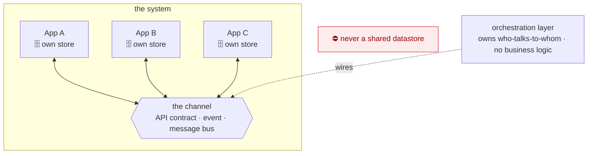

# Coral Architecture — the System

<figure class="coral-fig wide">
  
  <figcaption>A system — independent apps, coupled only by the channels between them.</figcaption>
</figure>

How separately-built **apps** compose into a **system**. This is a different bounded context from the app
spine. The architecture's own `[SCOPE-3]`/`[GROW-3]` split signal makes "one app" and "many apps
composing" separate documents.

This document **builds on** [`ARCHITECTURE.md`](./ARCHITECTURE.md). Each app in the system is internally
an app spine, with its own slices and crosscuts. System rules use the families `[CHAN-*]`, `[ORCH-*]`,
and `[SYS-TEST-*]`. The dependency points one way. This document cites app rules such as `[IDEM-5]` and
`[CONTRACT-2]`. No app-scale spine cites a system rule.

> **Nothing here is unconditional Coral policy, and it is two independent layers, not one.** This
> document holds **no kernel rule**. Sections 1 and 3 (`[CHAN-*]`, `[SYS-TEST-*]`) and `[ORCH-1..3]` are
> the **production baseline at system scale**. That is the same optional layer as
> [`PRODUCTION.md`](./PRODUCTION.md), taken by `production-baseline: true` at the `system` scale.
> `[ORCH-4]`, `[ORCH-5]` and `[ORCH-6]` are the **runtime-agent profile**, taken by
> `runtime-agent-profile: true`. **Neither adoption selects the other.** Adopting the runtime-agent
> profile brings `[ORCH-4..6]` and no `[CHAN-*]` rule. Adopting the baseline brings `[CHAN-*]` and no
> `[ORCH-4..6]`. Every section heading below says which layer it belongs to, and the
> [contract](#agent-execution-contract-system) marks the same split with `coral:scope` markers
> (`[VER-6]`).
>
> **Selecting them separately is not the same as reading them separately, and today they are not
> separable in the second sense.** `[ORCH-5]`'s own statement says the harness's tools *are* the apps'
> published channel capabilities (`[CHAN-1]`). It also depends on `[CHAN-7]` and `[CHAN-8]` for tracing
> and authentication. `[ORCH-6]` depends on `[SYS-TEST-1]`, and `[ORCH-4]` depends on `[CONFIG-1]`. All
> four are production-baseline rules. A system that adopts the runtime-agent profile **without** the
> baseline therefore gets a contract whose rules refer to rules it has not taken on. That is a defect in
> how `[ORCH-4..6]` are written, not a hidden adoption. The resolver selects nothing extra, and Coral
> will not repair it by making one layer bring in the other.
>
> **It is also not unique to these three.** 19 of Coral's 72 profile rules depend on a baseline rule in
> their own statement, across every app profile. See
> [the composition algebra](./CONVENTIONS.md#the-composition-algebra), which records the general gap and
> the three possible repairs. Making any of them self-contained means changing published rule statements.
> That is a versioned change, and it is tracked as follow-up model work rather than made silently here.
> **In practice, adopt the production baseline alongside the runtime-agent profile at system scale until
> that lands.**

**Defining tension:** the channel is the *only* coupling between apps. Keep it thin, explicit, and
versioned. Never let two apps share a datastore or reach into each other's internals. The same properties
that make a slice agent-friendly, bounded context and self-verification, must hold at the app boundary.
**Contract testing**, not integrated end-to-end runs, is therefore the system's test strategy: you verify
each app against the shared contract without standing up the whole system at once.

---

## The system at a glance

Apps never share a datastore. The **only** coupling is the channel. The orchestration layer owns which
apps connect to which.

---

## 1. The Channel  `[CHAN-*]`  (production baseline, system scale)

**`[CHAN-1]` `[review]` `{baseline}`** — Apps communicate **only through a channel**: a published, explicit
contract.

This is `[COMPOSE-1]` across a process line: depend on a published capability, never on internals. If
app B needs data app A owns, A publishes a capability on the channel and B consumes it. A published read
should be **neutral enough that consumer-specific derived logic stays in the consumer**. A producer
exposes its data, never another app's calculation (`[STATE-4]`, `[ORCH-1]`).

**`[CHAN-2]` `[guide]` `{baseline}`** — A channel is one of three forms, chosen per relationship: a
**synchronous API contract**, an **event**, or a **message bus**.

The form is part of the contract. Choose by intent:

- a point-in-time read of current data → synchronous API
- a reaction to a state change → event
- decoupled or buffered async work → message bus

When more than one fits, prefer the weakest coupling that meets the latency need, and flag the choice
(`[AGENT-2]`). The form determines delivery semantics (`[CHAN-5]`) and the error model (`[CHAN-6]`), so it
is a contract decision rather than a detail.

**A channel is not middleware.** A message bus is one of the three forms, not the definition. Two apps
exchanging requests over plain HTTP are using a channel, and every `[CHAN-*]` rule applies to them.
Requiring a broker to be "doing it properly" is the misreading this rule exists to prevent. The weakest
form that meets the need is usually the right one.

**`[CHAN-3]` `[auto]` `{baseline}`** — Apps must not share a datastore.

A shared database re-creates the shared data-access layer `[STATE-2]` forbids, at system scale. It also
destroys `[STATE-5]` ownership across the whole system. The static check is that an app's connection
config names only its own store.

**`[CHAN-4]` `[review]` `{baseline}`** — The channel contract is versioned and evolves backward-compatibly
(`[CONTRACT-2]`).

**Add** fields freely. **Never repurpose** a field. Changing a field's type or meaning is a breaking
change even under the same name. Turning `amount: 1250` into `amount: {value, currency}` is a repurpose,
not an addition. Add a new field instead. **Removing** a field requires a **version step**: a new
published version of the capability. The appendix fixes the transport spelling, which is a URL, a header,
a media type, or a schema version.

**Deprecate before removing.** Mark the field deprecated in the contract and in its broker or registry
entry. Keep it for a stated window. Remove it only once **no consumer contract still references it**,
which `[SYS-TEST-3]` confirms. Derived data published on the channel is owned by its producer
(`[STATE-4]`).

**`[CHAN-5]` `[review]` `{baseline}`** — Event and message channels are **at-least-once**: a consumer with
mutating effects must be idempotent (`[IDEM-5]`), via an idempotency key or a natural key.

The key makes the *handler* a safe no-op on redelivery even when the underlying operation is
non-idempotent, such as a relative decrement (`[IDEM-1]`). It reconciles `[IDEM-4]`, which forbids
auto-retrying a non-idempotent operation, with `[IDEM-5]`, under which the platform redelivers
regardless. Synchronous API calls are not at-least-once. The caller owns retry policy and must not
auto-retry a non-idempotent operation.

**`[CHAN-6]` `[review]` `{baseline}`** — Errors do not cross the channel as exceptions.

On a **synchronous call**, a producer failure surfaces to the caller as the consuming app's
environment-failure category — `infrastructure` under `[ERR-5]`'s default vocabulary (`[ERR-1]`). On an
**event or message channel**, an un-processable message goes to a **dead-letter** path rather than
blocking the stream. A transient failure is retried by redelivery, so the consumer must be idempotent
(`[CHAN-5]`). Each app still raises and renders within its own boundary (`[ERR-3]`).

**`[CHAN-7]` `[review]` `{baseline}`** — Propagate a correlation/trace id across the channel so a single
user action is traceable across apps.

This is `[OBS-2]` at system scale. The id travels in the contract's metadata, never in the business
payload.

**`[CHAN-8]` `[review]` `{baseline}`** — The channel boundary is a **trust boundary** (`[TRUST-1]`):
authenticate the caller or message and validate the payload on receipt.

Never trust a cross-app payload implicitly, even from a sibling app you own.

**`[CHAN-9]` `[review]` `{baseline}`** — A channel gives **no ordering and no single-delivery guarantee**
unless the contract states one.

Distinct events may arrive out of order or concurrently. A consumer that mutates shared state must
therefore be **safe under concurrency**, using the same three strategies as `[CONC-3]` at app scale:
serialize per affected key, use optimistic concurrency, or make the update commutative. This is distinct
from `[CHAN-5]` dedupe. An idempotency key suppresses the *same* event redelivered. It does **not** order
two *different* events racing on the same state.

**`[CHAN-10]` `[review]` `{baseline}`** — **Never assume a single transactional view across independently
transacting apps**, and a computation that needs a coherent moment must state how it handles the skew.

The earlier form of this rule said cross-app reads *are* eventually consistent. That is not true as a
blanket claim. A synchronous read from the app that owns the data may be strongly consistent according to
that app's own model. Calling it eventual taught agents to add reconciliation to reads that never needed
it. What the channel never provides is **atomicity across owners**: two apps, two transactions, and no
snapshot spanning both, whatever each one guarantees internally.

The failure mode is therefore composition, not staleness. Data fetched from two apps in two calls is not
a transactional snapshot, even when each call is individually authoritative. Take one of three options,
and **say which**: tolerate the skew, read from a single producer that exposes a consistent view, or
reconcile asynchronously. Event and message channels are additionally eventual by construction
(`[CHAN-5]`, `[CHAN-9]`). That is a property of those forms, not of every channel.

---

## 2. Orchestration  `[ORCH-*]`  (production baseline, system scale)

**`[ORCH-1]` `[review]` `{baseline}`** — The orchestration layer owns **topology**, meaning which apps
connect to which and over which channel form. It contains no business logic.

It is the system's composition root, `[ROOT-1]` lifted to system scale. It wires producers to consumers,
and the apps themselves hold no reference to the wider graph.

**`[ORCH-2]` `[review]` `{baseline}`** — An app publishes and consumes capabilities, and does not
hard-code its peers.

*Re-wiring* existing capabilities is an orchestration change, not an edit to a participating app.
Re-wiring covers swapping a producer, and routing an already-published capability to a new consumer.
*Publishing a new capability* is a normal change to the producer app, as a new slice in it. The producer
owns and exposes that capability (`[CHAN-1]`). Adding a consumer never requires the producer to expose
its internals.

**`[ORCH-3]` `[guide]` `{baseline}`** — Each app is independently deployable and independently observable.

Density that would overwhelm one app (`[SCOPE-2]`) lives here as a *topology* problem, keeping every app
slice-shaped and within agent competence.

### Orchestration by an agent (runtime-agent profile)

**A separate layer, and a separate adoption.** The three rules in this subsection come with the
**runtime-agent profile**, not with the production baseline. A system that never calls a model at runtime
declines them and still owes every `[CHAN-*]` rule above. A system that adopts them without the baseline
owes these and none of those. They sit here rather than in
[`appendix/agentic-app.md`](./appendix/agentic-app.md) because that page is an **addendum**, provisional
by construction, and a safety guardrail must not depend on one.

When an agent does the orchestrating, it is **not** a fourth, fuzzy channel form. It sits *above* the
channel, as a consumer and router that *chooses among* the system's published capabilities. The channel
underneath stays deterministic and contract-tested. Only the choice of which capability to call is the
agent's.

**`[ORCH-4]` `[review]` `{runtime-agent}`** — An agent may orchestrate the system **only from inside a
harness**: a deterministic, observable app that runs the agent under enforced limits.

The rule is stated here in full, so it needs nothing outside the core spine to be actionable. The harness
does all five of these:

- gives the agent **typed tools and nothing else**
- **authorizes every call**
- **gates high-risk, irreversible, or outward-facing actions behind a human**, unless bounded policy
  pre-authorizes them
- **observes every prompt, decision and result**
- **bounds the agent's context and authority to one scoped task**

Never a bare model with direct authority over your apps.

The pre-authorization clause is not a softening. A blanket human gate on every irreversible cross-app
action is routed around rather than obeyed: the actions get reclassified as reversible, and the gate then
blocks nothing. The enforceable form is an explicit bound that the harness owns and the agent cannot
widen (`[AGENTIC-5]`, `[CONFIG-1]`). Anything the policy does not classify escalates.

[`appendix/agentic-app.md`](./appendix/agentic-app.md) elaborates this as `[AGENTIC-5]`. That page is an
**addendum**, provisional by construction, so the guardrail lives here rather than depending on it.

**`[ORCH-5]` `[review]` `{runtime-agent}`** — The harness's tools **are** the apps' published channel
capabilities (`[CHAN-1]`). The agent calls them and never reaches into internals.

Every call is authorized. Irreversible cross-app actions are gated by a human unless bounded policy
pre-authorizes them (`[ORCH-4]`). Every decision and call is observed and trace-correlated (`[CHAN-7]`,
`[CHAN-8]`).

**`[ORCH-6]` `[review]` `{runtime-agent}`** — The orchestrating harness **is itself an app**: an agentic
app (`[AGENTIC-6]`) with its own contract, observability, and tests.

The pattern holds at every scale: agent-in-a-harness at slice scale, at app scale, and here at system
scale. Test it in two halves. The harness's deterministic routing, authorization, and gating are
contract-tested (`[SYS-TEST-1]`). The agent's behavior is graded by evals, never by exact match
(`[AGENTIC-11]`).

---

## 3. Contract Testing  `[SYS-TEST-*]`  (production baseline, system scale)

**`[SYS-TEST-1]` `[review]` `{baseline}`** — App-to-app behavior is verified by **contract tests, not by
standing up both apps together**. Each side is tested independently against the shared channel contract.

This is `[TEST-1]` ("assert the observable contract") lifted across the process line. It preserves
per-app independent verifiability. You never need both apps live at once, so each stays slice-sized for
an agent to reason about.

**`[SYS-TEST-2]` `[review]` `{baseline}`** — Give **every consumed channel relationship executable
compatibility verification**: an artifact, run in CI, that fails when the producer breaks the consumer.
**Consumer-driven contracts are one technique for this, not the requirement itself.**

The requirement used to name the technique, which put it at odds with `[SYS-TEST-4]` on the same page.
That rule already called a schema registry "the event-shaped form of the same idea". The spine therefore
mandated CDC and endorsed something else at the same time. What matters is the property: a verification
that **executes**, produces a pass or fail, and is wired into the gate. A documented schema nobody runs is
not verification. Neither is a hand-written integration test that exercises only the success case.

**Consumer-driven contracts** remain the reference technique because they get the direction right. The
consumer's expectations define what the producer must honor. The consumer test produces the artifact, and
the producer test verifies against it. Neither app imports the other.

These are also valid, chosen per relationship:

- **schema-registry compatibility checks** for event and stream contracts
- a **provider contract** published by the owner and verified by each consumer, where the consumers are
  many and the producer is authoritative
- **protocol conformance suites** for a standard wire format
- **generated client/server compatibility tests** where both sides are generated from one schema

Whichever technique is used, the artifact is what makes `[SYS-TEST-3]`'s release gate work. The gate can
only catch breaks for the relationships it has an artifact for. An unverified cross-app dependency is
therefore not shippable.

**`[SYS-TEST-3]` `[review]` `{baseline}`** — Contract tests are the enforcement mechanism for `[CHAN-4]`
and `[CONTRACT-2]`: a producer change that would break a downstream consumer fails the **producer's own
CI** before release.

Run the verification in the producer's pipeline, against whichever artifact `[SYS-TEST-2]` produced for
that relationship: consumer-published contracts, the registry's compatibility check, or the conformance
suite.

**`[SYS-TEST-4]` `[guide]` `{baseline}`** — Contract testing is tool-agnostic in principle, so pick
concrete tooling per stack.

- **Request/response and message buses:** [Pact](https://pact.io). It has broad multi-language support,
  which fits the language-agnostic stance. It covers HTTP *and* message pacts, with a broker for sharing
  contracts and gating provider verification.
- **JVM stacks:** Spring Cloud Contract is an alternative.
- **Pure event/stream contracts:** a **schema registry** (Avro/Protobuf/JSON Schema) with enforced
  backward/forward compatibility checks is the event-shaped form of the same idea.

Whatever the tool, the contract is a **versioned artifact** in CI. Breaking it fails the build.

**`[SYS-TEST-5]` `[review]` `{baseline}`** — A thin smoke/e2e suite over a few critical cross-app journeys
is allowed as a backstop, but it does **not** replace contract tests. Keep it tiny.

Contract tests catch contract drift cheaply and locally. Broad integrated e2e is slow and flaky, and it
erodes the independent-verifiability property (`[TEST-2]`, `[TEST-3]` at system scale).

---

## Agent Execution Contract (system)

The **complete** normative checklist for system-scale work: every `[auto]` and `[review]` rule in this
document. Sections 1–3 are the *why*, and `[guide]` rules live only there.

Every rule here is **system scale**. It binds a project that declares `system` among its scales, meaning
separately-built apps composing over a channel. A repository that ships one app has no channel to version
and no topology to wire, and it loads none of this.

**Every line is opt-in, and there are two separately selected opt-ins.** The lines under
`coral:scope:baseline` come with the **production baseline**. That is the same layer
[`PRODUCTION.md`](./PRODUCTION.md) carries at app scale, taken here at the `system` scale. The lines under
`coral:scope:runtime-agent` come with the **runtime-agent profile**. Selecting either selects nothing of
the other (`[VER-6]`). This document holds **no kernel rule**. The unconditional app-scale surface is in
[`ARCHITECTURE.md`](./ARCHITECTURE.md).

**A runtime-agent-only selection is not yet a self-contained rule set.** `[ORCH-4]`, `[ORCH-5]` and
`[ORCH-6]` cite `[CHAN-1]`, `[CHAN-7]`, `[CHAN-8]`, `[SYS-TEST-1]` and `[CONFIG-1]`, which are all
production baseline. Taking the profile alone therefore yields a contract that refers outward to rules
the project has not adopted. See the note at the top of this document. Take the baseline with it until
those statements are rewritten.

<!-- coral:contract:start -->

<!-- coral:scope:baseline -->

### Crossing an app boundary
- `[CHAN-1]` Cross an app boundary only through a published channel contract.
- `[CHAN-3]` Never share a datastore between apps.
- `[CHAN-8]` Authenticate the caller/message and validate every inbound channel payload.
- `[CHAN-7]` Propagate the correlation/trace id across the channel, in metadata not payload.

### Delivery semantics
- `[CHAN-5]` Make event/message consumers idempotent. Never auto-retry a non-idempotent sync call.
- `[CHAN-9]` Make consumers that mutate shared state safe under concurrent and out-of-order delivery.
- `[CHAN-10]` Never assume a transactional view spanning two apps. State how a cross-app computation handles the skew.
- `[CHAN-6]` Never let errors cross the channel as exceptions. Dead-letter the un-processable.

### Contract evolution
- `[CHAN-4]` Version the channel contract. Add freely, never repurpose, and deprecate before removing.

### Orchestration
- `[ORCH-1]` Put topology in the orchestration layer. Keep business logic out of the wiring.
- `[ORCH-2]` Keep apps peer-agnostic: publish and consume capabilities, never hard-code peers.

<!-- coral:scope:end -->

<!-- coral:scope:runtime-agent -->

### Orchestration by an agent, only where a model chooses which capability to call
- `[ORCH-4]` Let an agent orchestrate only from inside a harness, never as a bare model.
- `[ORCH-5]` Give the harness only published channel capabilities as tools. Authorize every call, and gate irreversible ones absent bounded pre-authorization.
- `[ORCH-6]` Treat the orchestrating harness as an app: its own contract, observability, and tests.

<!-- coral:scope:end -->

<!-- coral:scope:baseline -->

### Contract testing
- `[SYS-TEST-1]` Verify each side independently against the shared contract, not by booting both apps.
- `[SYS-TEST-2]` Give every consumed channel relationship executable compatibility verification. Consumer-driven contracts are one technique.
- `[SYS-TEST-3]` Gate producer releases on provider verification against consumer contracts.
- `[SYS-TEST-5]` Keep integrated end-to-end suites tiny. They backstop contract tests, never replace them.

<!-- coral:scope:end -->

<!-- coral:contract:end -->

---

## System appendices (later)

When this spine densifies (`[GROW-2]`), split per channel form into `appendix/`:

- `system-rest.md`: synchronous API contracts (OpenAPI + Pact request/response).
- `system-events.md`: event/stream contracts (schema registry + compatibility, message pacts).
- `system-message-bus.md`: queue/broker specifics (delivery guarantees, dead-letter, ordering).
