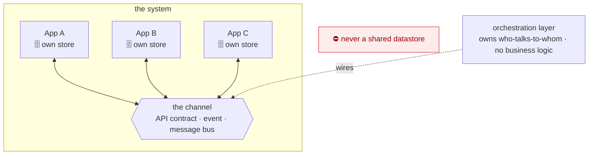

# Coral Architecture — the System

<figure class="coral-fig wide">
  
  <figcaption>A system — independent apps, coupled only by the channels between them.</figcaption>
</figure>

How separately-built **apps** compose into a **system**. This is a different bounded context from the app
spine: by the architecture's own `[SCOPE-3]`/`[GROW-3]` split signal, "one app" and "many apps composing"
are separate documents.

This document **builds on** [`ARCHITECTURE.md`](./ARCHITECTURE.md): each app in the system is internally
an app spine, with its own slices and crosscuts. System rules use the families `[CHAN-*]`, `[ORCH-*]`,
and `[SYS-TEST-*]`. The dependency points one way — this document cites app rules (`[IDEM-5]`,
`[CONTRACT-2]`); the app spine never cites a system rule.

**Defining tension:** the channel is the *only* coupling between apps. Keep it thin, explicit, and versioned;
never let two apps share a datastore or reach into each other's internals. The same properties that make
a slice agent-friendly — bounded context, self-verification — must hold at the app boundary. That is why
**contract testing**, not integrated end-to-end runs, is the system's test strategy: you verify each app
against the shared contract without standing up the whole system at once.

---

## The system at a glance

Apps never share a datastore. The **only** coupling is the channel, and the orchestration layer owns which
apps talk to which.

---

## 1. The Channel  `[CHAN-*]`

**`[CHAN-1]` `[review]`** — Apps communicate **only through a channel**: a published, explicit contract.

This is `[COMPOSE-1]` — depend on a published capability, never on internals — across a process line. If
app B needs data app A owns, A publishes a capability on the channel and B consumes it. A published read
should be **neutral enough that consumer-specific derived logic stays in the consumer**: a producer
exposes its data, never another app's calculation (`[STATE-4]`, `[ORCH-1]`).

**`[CHAN-2]` `[guide]`** — A channel is one of three forms, chosen per relationship: a **synchronous API
contract**, an **event**, or a **message bus**.

The form is part of the contract. Choose by intent: a point-in-time read of current data → synchronous
API; a reaction to a state change → event; decoupled or buffered async work → message bus. When more than
one fits, prefer the weakest coupling that meets the latency need, and flag the choice (`[AGENT-2]`). The
form determines delivery semantics (`[CHAN-5]`) and error model (`[CHAN-6]`), so it is load-bearing, not a
detail.

**A channel is not middleware.** A message bus is one of the three forms, not the definition — two apps
talking over plain HTTP are using a channel, and every `[CHAN-*]` rule applies to them. Requiring a broker
to be "doing it properly" is the misreading this rule exists to prevent; the weakest form that meets the
need is usually the right one.

**`[CHAN-3]` `[auto]`** — Apps must not share a datastore.

A shared database re-creates the shared data-access layer `[STATE-2]` forbids, at system scale, and it
destroys `[STATE-5]` ownership across the whole system. Statically: an app's connection config names only
its own store.

**`[CHAN-4]` `[review]`** — The channel contract is versioned and evolves backward-compatibly
(`[CONTRACT-2]`).

**Add** fields freely. **Never repurpose** a field — changing its type or meaning is a breaking change
even under the same name (turning `amount: 1250` into `amount: {value, currency}` is a repurpose, not an
addition; add a new field instead). **Removing** a field requires a **version step**: a new published
version of the capability, with the transport spelling — URL, header, media type, or schema version —
fixed by the appendix.

**Deprecate before removing**: mark the field deprecated in the contract and its broker/registry entry,
keep it for a stated window, and remove it only once **no consumer contract still references it**
(`[SYS-TEST-3]` confirms that). Derived data published on the channel is owned by its producer (`[STATE-4]`).

**`[CHAN-5]` `[review]`** — Event and message channels are **at-least-once**: a consumer with mutating
effects must be idempotent (`[IDEM-5]`), via an idempotency key or a natural key.

The key makes the *handler* a safe no-op on redelivery even when the underlying operation is
non-idempotent (a relative decrement, `[IDEM-1]`); it is what reconciles `[IDEM-4]` (don't auto-retry a
non-idempotent op) with `[IDEM-5]` (the platform redelivers regardless). Synchronous API calls are not
at-least-once: the caller owns retry policy and must not auto-retry a non-idempotent operation.

**`[CHAN-6]` `[review]`** — Errors do not cross the channel as exceptions.

On a **synchronous call**, a producer failure surfaces to the caller as the `infrastructure` category
(`[ERR-1]`). On an **event or message channel**, an un-processable message goes to a **dead-letter** path
rather than blocking the stream, and a transient failure is retried by redelivery — so the consumer must
be idempotent (`[CHAN-5]`). Each app still raises and renders within its own boundary (`[ERR-3]`).

**`[CHAN-7]` `[review]`** — Propagate a correlation/trace id across the channel so a single user action is
traceable across apps.

This is `[OBS-2]` at system scale. The id travels in the contract's metadata, never in the business
payload.

**`[CHAN-8]` `[review]`** — The channel boundary is a **trust boundary** (`[TRUST-1]`): authenticate the caller
or message and validate the payload on receipt.

Never trust a cross-app payload implicitly, even from a sibling app you own.

**`[CHAN-9]` `[review]`** — A channel gives **no ordering and no single-delivery guarantee** unless the contract
states one.

Distinct events may arrive out of order or concurrently, so a consumer that mutates shared state must be
**safe under concurrency** — the same three strategies as `[CONC-3]` at app scale: serialize per affected
key, use optimistic concurrency, or make the update commutative. This is distinct from `[CHAN-5]` dedupe —
an idempotency key suppresses the *same* event redelivered; it does **not** order two *different* events
racing on the same state.

**`[CHAN-10]` `[review]`** — Cross-app reads are **eventually consistent**, and a computation that needs a
coherent moment must state how it handles the skew.

Data fetched from two apps in two calls is not a transactional snapshot. Either tolerate the skew, read
from a single producer that exposes a consistent view, or reconcile asynchronously — and **say which**. Do
not assume a global snapshot the channel does not provide.

---

## 2. Orchestration  `[ORCH-*]`

**`[ORCH-1]` `[review]`** — The orchestration layer owns **topology** — which apps talk to which, over
which channel form — and contains no business logic.

It is the system's composition root, `[ROOT-1]` lifted to system scale: it wires producers to consumers,
and the apps themselves stay unaware of the wider graph.

**`[ORCH-2]` `[review]`** — An app publishes and consumes capabilities; it does not hard-code its peers.

*Re-wiring* existing capabilities — swapping a producer, routing an already-published capability to a new
consumer — is an orchestration change, not an edit to a participating app. *Publishing a new capability*
is, by contrast, a normal change to the producer app (a new slice in it), which owns and exposes it
(`[CHAN-1]`). Adding a consumer never requires the producer to expose its internals.

**`[ORCH-3]` `[guide]`** — Each app is independently deployable and independently observable.

Density that would overwhelm one app (`[SCOPE-2]`) lives here as a *topology* problem, keeping every app
slice-shaped and within agent competence.

### The orchestrating harness (an agent as the conductor)

When an agent does the orchestrating, it is **not** a fourth, fuzzy channel form. It sits *above* the channel: a
consumer/router that *chooses among* the system's published capabilities. The channel underneath stays
deterministic and contract-tested; only the choice of which capability to call is the agent's.

**`[ORCH-4]` `[review]`** — An agent may orchestrate the system **only from inside a harness** — a
deterministic, observable app that employs the agent within walls.

Stated here in full, so this rule needs nothing outside the core spine to be actionable: the harness gives
the agent **typed tools and nothing else**, **authorizes every call**, **gates irreversible or
outward-facing actions behind a human**, **observes every prompt, decision and result**, and **bounds the
agent's context and authority to one scoped task**. Never a bare model with direct authority over your
apps.

[`appendix/agentic-app.md`](./appendix/agentic-app.md) elaborates this as `[AGENTIC-5]`, but that page is
an **addendum** — provisional by construction — so the guardrail lives here rather than depending on it.

**`[ORCH-5]` `[review]`** — The harness's tools **are** the apps' published channel capabilities (`[CHAN-1]`);
the agent calls them and never reaches into internals.

Every call is authorized, irreversible cross-app actions are gated by a human, and every decision and
call is observed and trace-correlated (`[CHAN-7]`, `[CHAN-8]`).

**`[ORCH-6]` `[review]`** — The orchestrating harness **is itself an app** — an agentic app
(`[AGENTIC-6]`) with its own contract, observability, and tests.

The pattern holds at every scale: agent-in-a-harness at slice scale, app scale, and here at system scale.
Test it in two halves — the harness's deterministic routing, authorization, and gating are
contract-tested (`[SYS-TEST-1]`); the agent's behavior is graded by evals, never exact-match
(`[AGENTIC-11]`).

---

## 3. Contract Testing  `[SYS-TEST-*]`

**`[SYS-TEST-1]` `[review]`** — App-to-app behavior is verified by **contract tests, not by standing up
both apps together**; each side is tested independently against the shared channel contract.

This is `[TEST-1]` ("assert the observable contract") lifted across the process line, and it preserves
per-app independent verifiability — you never need both apps live at once, so each stays slice-sized for
an agent to reason about.

**`[SYS-TEST-2]` `[review]`** — Use **consumer-driven contracts**, and give **every consumed channel
relationship a published consumer contract**.

The consumer's expectations define the contract the producer must honor: the consumer test produces a
contract artifact, and the producer test verifies it honors that artifact, with neither app importing the
other. That artifact is what makes `[SYS-TEST-3]`'s release gate real — the gate can only catch breaks for
contracts it has, so an unverified cross-app dependency is not shippable.

**`[SYS-TEST-3]` `[review]`** — Contract tests are the enforcement mechanism for `[CHAN-4]` and
`[CONTRACT-2]`: a producer change that would break a downstream consumer fails the **producer's own CI**
before release.

Run provider verification in the producer's pipeline against the consumer-published contracts.

**`[SYS-TEST-4]` `[guide]`** — Contract testing is tool-agnostic in principle; pick concrete tooling per
stack.

- **Request/response and message buses:** [Pact](https://pact.io) — broad multi-language support (fits
  the language-agnostic stance), covers HTTP *and* message pacts, with a broker for sharing contracts and
  gating provider verification.
- **JVM stacks:** Spring Cloud Contract is an alternative.
- **Pure event/stream contracts:** a **schema registry** (Avro/Protobuf/JSON Schema) with enforced
  backward/forward compatibility checks is the event-shaped form of the same idea.

Whatever the tool, the contract is a **versioned artifact** in CI; breaking it fails the build.

**`[SYS-TEST-5]` `[review]`** — A thin smoke/e2e suite over a few critical cross-app journeys is allowed
as a backstop, but it does **not** replace contract tests — keep it tiny.

Contract tests catch contract drift cheaply and locally; broad integrated e2e is slow, flaky, and erodes
the independent-verifiability property (`[TEST-2]`, `[TEST-3]` at system scale).

---

## Agent Execution Contract (system)

The **complete** normative checklist for system-scale work: every `[auto]` and `[review]` rule in this
document. Sections 1–3 are the *why*; `[guide]` rules live only there.

<!-- coral:contract:start -->

### Crossing an app boundary
- `[CHAN-1]` Cross an app boundary only through a published channel contract.
- `[CHAN-3]` Never share a datastore between apps.
- `[CHAN-8]` Authenticate the caller/message and validate every inbound channel payload.
- `[CHAN-7]` Propagate the correlation/trace id across the channel, in metadata not payload.

### Delivery semantics
- `[CHAN-5]` Make event/message consumers idempotent; never auto-retry a non-idempotent sync call.
- `[CHAN-9]` Make consumers that mutate shared state safe under concurrent and out-of-order delivery.
- `[CHAN-10]` Treat cross-app reads as eventually consistent, and state how the skew is handled.
- `[CHAN-6]` Never let errors cross the channel as exceptions; dead-letter the un-processable.

### Contract evolution
- `[CHAN-4]` Version the channel contract; add freely, never repurpose, deprecate before removing.

### Orchestration
- `[ORCH-1]` Put topology in the orchestration layer; keep business logic out of the wiring.
- `[ORCH-2]` Keep apps peer-agnostic: publish and consume capabilities, never hard-code peers.
- `[ORCH-4]` Let an agent orchestrate only from inside a harness, never as a bare model.
- `[ORCH-5]` Give the harness only published channel capabilities as tools; authorize every call and gate irreversible ones.
- `[ORCH-6]` Treat the orchestrating harness as an app: its own contract, observability, and tests.

### Contract testing
- `[SYS-TEST-1]` Verify each side independently against the shared contract, not by booting both apps.
- `[SYS-TEST-2]` Use consumer-driven contracts; every consumed dependency has a published contract.
- `[SYS-TEST-3]` Gate producer releases on provider verification against consumer contracts.
- `[SYS-TEST-5]` Keep integrated end-to-end suites tiny; they backstop contract tests, never replace them.

<!-- coral:contract:end -->

---

## System appendices (later)

When this spine densifies (`[GROW-2]`), split per channel form into `appendix/`:

- `system-rest.md` — synchronous API contracts (OpenAPI + Pact request/response).
- `system-events.md` — event/stream contracts (schema registry + compatibility, message pacts).
- `system-message-bus.md` — queue/broker specifics (delivery guarantees, dead-letter, ordering).
