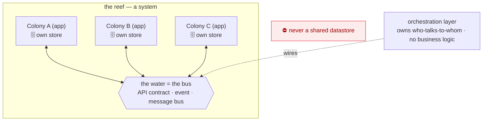

# Coral Architecture — the System (the Reef)

<figure class="coral-fig wide">
  
  <figcaption>A reef (a system) — distinct colonies (apps), coupled only by the currents between them (the bus).</figcaption>
</figure>

How separately-built **colonies (apps)** compose into a **reef (a system)**. This is a different
bounded context from the app spine — by the architecture's own `[SCOPE-3]`/`[GROW-3]` split signal,
"one colony" and "many colonies composing into a reef" are separate documents.

> **Read [`CONVENTIONS.md`](./CONVENTIONS.md) first** for the Coral model. In short here: colonies
> never fuse bodies — they interact only through **signals carried in the water**, which is the
> **bus**. A reef grows at its **edge**, accreting outward; over time reefs build up into **islands**
> (platforms others inhabit).

This document **builds on** [`ARCHITECTURE.md`](./ARCHITECTURE.md): each colony in the reef is
internally an app spine (its own polyps and symbionts). System rules use the families `[BUS-*]`,
`[ORCH-*]`, `[SYS-TEST-*]`. The dependency points one way — this document cites app rules (e.g.
`[IDEM-5]`, `[CONTRACT-2]`); the app spine never cites a system rule.

**Defining tension:** the bus (the water) is the *only* coupling between colonies. Keep it thin,
explicit, and versioned; never let two colonies share a datastore or reach into each other's bodies.
The same properties that make a polyp agent-friendly (bounded context, self-verification) must hold at
the colony boundary — which is why **contract testing**, not integrated end-to-end runs, is the reef's
test strategy: you verify each colony against the shared contract without raising the whole reef at
once.

---

## The reef at a glance

Colonies (apps) never fuse bodies and never share a datastore. The **only** coupling is the water —
the bus — and the orchestration layer owns which colonies talk to which.

---

## 1. The Bus  `[BUS-*]`

**`[BUS-1]` `[review]`** — Apps communicate **only through a bus**: a published, explicit contract.
This is `[COMPOSE-1]` (depend on a published capability, never internals) across a process line. If
app B needs data app A owns, A publishes a capability on the bus and B consumes it. A published read
should be **neutral enough that consumer-specific derived logic stays in the consumer** — a producer
exposes its data, never another app's calculation (`[STATE-4]`, `[ORCH-1]`).

**`[BUS-2]` `[guide]`** — A bus is one of three forms, chosen per relationship: a **synchronous API
contract** (request/response), an **event** (publish/subscribe notification), or an **actual message
bus** (queue/stream). The form is part of the contract. Choose by intent: a **point-in-time read** of
current data → synchronous API; a **reaction to a state change** → event; **decoupled or buffered
async work** → message bus. When more than one fits, prefer the weakest coupling that meets the
latency need, and flag the choice (`[AGENT-2]`). The form determines delivery semantics (`[BUS-5]`)
and error model (`[BUS-6]`), so it is a load-bearing decision, not a detail.

**`[BUS-3]` `[auto]`** — Apps **must not share a datastore**. A shared database re-creates the shared
data-access layer `[STATE-2]` forbids, at system scale. (Statically: an app's connection config names
only its own store.)

**`[BUS-4]` `[review]`** — The bus contract is **versioned and evolves backward-compatibly**
(`[CONTRACT-2]`). **Add** fields freely; **never repurpose** a field — changing its type or meaning is
a breaking change even under the same name (turning `amount: 1250` into `amount: {value,currency}` is
a repurpose, not an addition — add a new field instead). **Removing** a field requires a **version
step**: a new published version of the capability (the transport spelling — URL, header, media type,
or schema version — is fixed by the appendix). **Deprecate before removing**: mark the field deprecated
in the contract and its broker/registry entry, keep it for a stated window, and remove it only once
**no consumer contract still references it** (`[SYS-TEST-3]` confirms that). Derived/computed data
published on the bus is owned by its producer (`[STATE-4]`).

**`[BUS-5]` `[review]`** — Event and message buses are **at-least-once**: a consumer with mutating
effects **must** be idempotent (`[IDEM-5]`) — via an idempotency key or a natural key — because the
bus may redeliver. The key makes the *handler* a safe no-op on redelivery even when the underlying
operation is non-idempotent (e.g. a relative decrement, `[IDEM-1]`); it is what reconciles `[IDEM-4]`
(don't auto-retry a non-idempotent op) with `[IDEM-5]` (the platform redelivers regardless). Synchronous
API calls are not at-least-once; the caller owns retry policy and must not auto-retry a non-idempotent
operation (`[IDEM-4]`).

**`[BUS-6]` `[review]`** — Errors do not cross the bus as exceptions. **On a synchronous call**, a
producer failure surfaces to the caller as the `infrastructure` category (`[ERR-1]`). **On an
event/message bus**, an un-processable message goes to a **dead-letter** path rather than blocking the
stream, and a transient failure is retried by redelivery (so the consumer must be idempotent,
`[BUS-5]`). Each app still raises/renders within its own boundary (`[ERR-3]`).

**`[BUS-9]` `[review]`** — A bus gives **no ordering or single-delivery-at-a-time guarantee** unless
the contract states one. Distinct events may arrive out of order or concurrently, so a consumer that
mutates shared state must be **safe under concurrency** — serialize per affected key, use optimistic
concurrency, or make the update commutative. This is distinct from `[BUS-5]` dedupe: an idempotency
key suppresses the *same* event redelivered; it does **not** order two *different* events racing on the
same state.

**`[BUS-10]` `[review]`** — **Cross-app reads are eventually consistent.** Data fetched from two apps
in two calls is not a transactional snapshot. A computation needing a coherent moment must either
tolerate the skew, read from a single producer that exposes a consistent view, or reconcile
asynchronously — and must **state which**. Do not assume a global snapshot the bus does not provide.

**`[BUS-7]` `[review]`** — Propagate a **correlation/trace id across the bus** so a single user action
is traceable across apps. This is `[OBS-*]` at system scale; the id travels in the contract's metadata,
never in the business payload.

**`[BUS-8]` `[review]`** — The bus boundary is a **trust boundary** (`[TRUST-1]`): authenticate the
caller/message and validate the payload on receipt. Never trust a cross-app payload implicitly, even
from a sibling app.

---

## 2. Orchestration  `[ORCH-*]`

**`[ORCH-1]` `[review]`** — The **orchestration layer owns topology** — which apps talk to which, over
which bus form — and contains **no business logic**. It is the system's composition root (`[ROOT-1]`
lifted to system scale): it wires producers to consumers; the apps themselves stay unaware of the
wider graph.

**`[ORCH-2]` `[review]`** — An app **publishes and consumes capabilities; it does not hard-code its
peers**. *Re-wiring* existing capabilities — swapping a producer, routing an already-published
capability to a new consumer — is an orchestration change, not an edit to a participating app.
*Publishing a new capability* that a consumer needs is, by contrast, a normal change to the producer
app (a new slice in it), which owns and exposes it (`[BUS-1]`). Adding a consumer never requires the
producer to expose its internals — only to publish a capability.

**`[ORCH-3]` `[guide]`** — Each app is **independently deployable and independently observable**, and
agents orchestrate the harness. Density that would overwhelm one app (`[SCOPE-2]`) lives here as a
*topology* problem, keeping every app slice-shaped and within agent competence.

---

## 3. Contract Testing  `[SYS-TEST-*]`

**`[SYS-TEST-1]` `[review]`** — App-to-app behavior is verified by **contract tests, not by standing
up both apps together**. Each side is tested independently against the shared bus contract. This is
`[TEST-1]` ("assert the observable contract") lifted across the process line, and it preserves
per-app independent verifiability — you never need both apps live at once, so each stays slice-sized
for an agent to reason about.

**`[SYS-TEST-2]` `[review]`** — Use **consumer-driven contracts**: the consumer's expectations define
the contract the producer must honor; the consumer test produces a contract artifact and the producer
test verifies it honors that artifact, with neither app importing the other. **Every consumed bus
relationship must have a published consumer contract** — that artifact is what makes `[SYS-TEST-3]`'s
release gate real, so an unverified cross-app dependency is not shippable (the gate can only catch
breaks for contracts it has).

**`[SYS-TEST-3]` `[review]`** — Contract tests are the **enforcement mechanism for `[BUS-4]`/
`[CONTRACT-2]`**: a producer change that would break a downstream consumer fails the producer's own CI
before release. Run provider verification in the producer's pipeline against the consumer-published
contracts.

**`[SYS-TEST-4]` `[guide]`** — Concrete tooling (tool-agnostic in principle; pick per stack):
- **Request/response and message buses:** [Pact](https://pact.io) — broad multi-language support
  (fits the language-agnostic stance), covers HTTP *and* message pacts, with a broker for sharing
  contracts and gating provider verification.
- **JVM stacks:** Spring Cloud Contract is an alternative.
- **Pure event/stream contracts:** a **schema registry** (Avro/Protobuf/JSON Schema) with enforced
  backward/forward **compatibility checks** is the event-shaped form of the same idea.
Whatever the tool, the contract is a **versioned artifact** in CI; breaking it fails the build.

**`[SYS-TEST-5]` `[review]`** — A thin smoke/e2e suite over a few critical cross-app journeys is
allowed as a backstop, but it does **not** replace contract tests: keep it tiny: contract tests catch
contract drift cheaply and locally; broad integrated e2e is slow, flaky, and erodes the
independent-verifiability property (`[TEST-2]`, `[TEST-3]` applied at system scale).

---

## Agent Execution Contract (system)

- `[SYS-1]` Cross an app boundary only through a published bus contract — never a shared store or an
  internal reach. → `[BUS-1]` `[BUS-3]`
- `[SYS-2]` Make event/message consumers idempotent AND safe under concurrent/out-of-order delivery;
  never auto-retry a non-idempotent sync call. → `[BUS-5]` `[BUS-9]` `[IDEM-5]`
- `[SYS-3]` Version the bus contract; evolve backward-compatibly; deprecate before removing. → `[BUS-4]`
- `[SYS-4]` Authenticate and validate every inbound bus payload. → `[BUS-8]`
- `[SYS-5]` Propagate the correlation/trace id across the bus. → `[BUS-7]`
- `[SYS-6]` Put topology in the orchestration layer; keep apps peer-agnostic and business-logic-free
  at the wiring. → `[ORCH-1]` `[ORCH-2]`
- `[SYS-7]` Verify each side with consumer-driven contract tests; every consumed dependency has a
  published contract; gate releases on provider verification; keep integrated e2e tiny. → `[SYS-TEST-1..5]`

---

## System appendices (later)

When this spine densifies (`[GROW-2]`), split per bus form into `appendix/`:

- `system-rest.md` — synchronous API contracts (OpenAPI + Pact request/response).
- `system-events.md` — event/stream contracts (schema registry + compatibility, message pacts).
- `system-message-bus.md` — queue/broker specifics (delivery guarantees, dead-letter, ordering).
